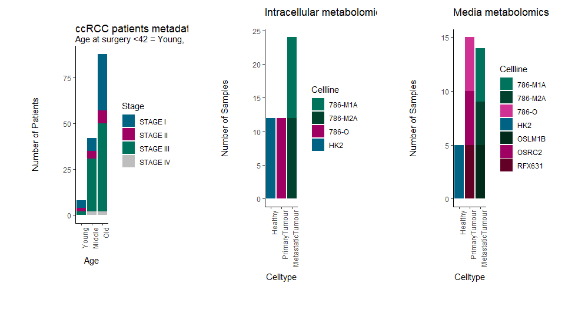

``` r
library(MetaProViz)
suppressMessages(suppressWarnings( library(tidyverse)))
```

## Example Data

clear cell Renal Cell Carcinoma (ccRCC) patients data from Hakimi et. al
including 138 matched tumour and normal tissue pairs (Hakimi et al.
2016). Cell-lines data from intra- and extracellular metabolomics data
from cell culture media from [metabolomics workbench project
PR001418](https://www.metabolomicsworkbench.org/data/DRCCMetadata.php?Mode=Project&ProjectID=PR001418).

``` r
# Create an overview of the example data
TissuePlot <- tissue_norm%>%
  column_to_rownames("Code")%>%
  filter(TISSUE_TYPE != "NORMAL")%>%
  separate(`TYPE-STAGE`, into=c("Type", "Stage"), sep="-", remove=FALSE)
TissuePlot$Count <- 1

TissuePlot$AGEFactor <- factor(TissuePlot$AGE, levels = c("Young","Middle", "Old"))

#Plot
Plot <- ggplot2::ggplot(TissuePlot, ggplot2::aes(fill=Stage, y=Count, x=AGEFactor)) + 
        ggplot2::geom_bar(position="stack", stat="identity")+
        ggplot2::scale_fill_manual(values = c("STAGE I" = "#006384"  , "STAGE II" = "#9F0162", "STAGE III" = "#00735C" , "STAGE IV" = "grey" ))+
        ggplot2::theme_classic()+
        ggplot2::ggtitle("ccRCC patients metadata")+
        ggplot2::theme(axis.text.x = ggplot2::element_text(angle = 90, hjust = 1))+
        ggplot2::labs(subtitle="Age at surgery <42 = Young,  >58 = Old, else = Middle", x = "Age", y = "Number of Patients")

Plot_Sized <-  MetaProViz:::plot_grob_superplot(input_plot=Plot, metadata_info=c(Conditions="Conditions", Superplot="Conditions"), metadata_sample=TissuePlot%>%dplyr::rename("Conditions"="AGE"), plot_name = "ccRCC patients metadata", subtitle = "Age at surgery <42 = Young,  >58 = Old, else = Middle", plot_type="Bar")
 
PlotHeight <- grid::convertUnit(Plot_Sized$height, 'cm', valueOnly = TRUE)
PlotWidth <- grid::convertUnit(Plot_Sized$width, 'cm', valueOnly = TRUE)
Plot_Sized %<>%
      {ggplot2::ggplot() + ggplot2::annotation_custom(.)} %>%
       magrittr::add(ggplot2::theme(panel.background = ggplot2::element_rect(fill = "transparent")))

ggplot2::ggsave(filename = "Tissue_MetadataPlot.svg", plot = Plot_Sized, width = PlotWidth,  height = PlotHeight, unit="cm")
 
Plot_Sized_Tissue <- Plot_Sized

###################################################################################################################################################
# Create an overview of the example data
CellPlot_Intra <- intracell_raw%>%
  column_to_rownames("Code")%>%
  filter(Conditions != "Pool")%>%
   mutate(Celltype = case_when(Conditions=="HK2" ~ 'Healthy',
                               Conditions=="786-O" ~ 'PrimaryTumour',
                               TRUE ~ 'MetastaticTumour'))

CellPlot_Intra$Count <- 1
CellPlot_Intra$CelltypeFactor <- factor(CellPlot_Intra$Celltype, levels = c("Healthy","PrimaryTumour", "MetastaticTumour"))

CellPlot_Media <- medium_raw%>%
  column_to_rownames("Code")%>%
  filter(Conditions != "Pool")%>%
  filter(Conditions != "blank")%>%
   mutate(Celltype = case_when(Conditions=="HK2" ~ 'Healthy',#https://www.mdpi.com/1422-0067/24/7/6447
                               Conditions=="786-O" ~ 'PrimaryTumour',
                               Conditions=="OSRC2" ~ 'PrimaryTumour',
                               Conditions=="RFX6" ~ 'PrimaryTumour',
                               TRUE ~ 'MetastaticTumour'))#OSLM1


#Plot
Plot <- ggplot2::ggplot(CellPlot_Intra, ggplot2::aes(fill=Conditions, y=Count, x=CelltypeFactor)) + 
        ggplot2::geom_bar(position="stack", stat="identity")+
        ggplot2::scale_fill_manual(values = c("HK2" = "#006384"  , "786-O" = "#9F0162", "786-M1A" = "#00735C", "786-M2A" = "#00422E"))+
        ggplot2::theme_classic()+
        ggplot2::ggtitle("Intracellular metabolomics")+
        ggplot2::theme(axis.text.x = ggplot2::element_text(angle = 90, hjust = 1))+
        ggplot2::labs(x = "Celltype", y = "Number of Samples",  fill ="Cellline")

Plot_Sized <-  MetaProViz:::plot_grob_superplot(input_plot=Plot, metadata_info=c(Conditions="Conditions", Superplot="Conditions"), metadata_sample=CellPlot_Intra%>%dplyr::rename("Name"="Conditions", "Conditions"="Celltype"), plot_name = "Intracellular metabolomics", subtitle = NULL, plot_type="Bar")
 
PlotHeight <- grid::convertUnit(Plot_Sized$height, 'cm', valueOnly = TRUE)
PlotWidth <- grid::convertUnit(Plot_Sized$width, 'cm', valueOnly = TRUE)
Plot_Sized %<>%
      {ggplot2::ggplot() + ggplot2::annotation_custom(.)} %>%
     magrittr::add(ggplot2::theme(panel.background = ggplot2::element_rect(fill = "transparent")))

ggplot2::ggsave(filename = "Cellline_IntraPlot.svg", plot = Plot_Sized, width = PlotWidth,  height = PlotHeight, unit="cm")
 
Plot_Sized_Intra <- Plot_Sized

###################################################################################################################################################
# Create an overview of the example data
CellPlot_Media <- medium_raw%>%
  column_to_rownames("Code")%>%
  filter(Conditions != "Pool")%>%
  filter(Conditions != "blank")%>%
   mutate(Celltype = case_when(Conditions=="HK2" ~ 'Healthy',#https://www.mdpi.com/1422-0067/24/7/6447
                               Conditions=="786-O" ~ 'PrimaryTumour',
                               Conditions=="OSRC2" ~ 'PrimaryTumour',
                               Conditions=="RFX631" ~ 'PrimaryTumour',
                               TRUE ~ 'MetastaticTumour'))#OSLM1


CellPlot_Media$Count <- 1
CellPlot_Media$CelltypeFactor <- factor(CellPlot_Media$Celltype, levels = c("Healthy","PrimaryTumour", "MetastaticTumour"))


#Plot
Plot <- ggplot2::ggplot(CellPlot_Media, ggplot2::aes(fill=Conditions, y=Count, x=CelltypeFactor)) + 
        ggplot2::geom_bar(position="stack", stat="identity")+
        ggplot2::scale_fill_manual(values = c("HK2" = "#006384"  , "786-O" = "#d03293", "OSRC2"= "#9F0162" , "RFX631"= "#630026", "786-M1A" = "#00735C", "786-M2A" = "#00422E", "OSLM1B"= "#002B1A"))+
        ggplot2::theme_classic()+
        ggplot2::ggtitle("Media metabolomics")+
        ggplot2::theme(axis.text.x = ggplot2::element_text(angle = 90, hjust = 1))+
        ggplot2::labs(x = "Celltype", y = "Number of Samples",  fill ="Cellline")

Plot_Sized <-  MetaProViz:::plot_grob_superplot(input_plot=Plot, metadata_info=c(Conditions="Conditions", Superplot="Conditions"), metadata_sample=CellPlot_Media%>%dplyr::rename("Name"="Conditions", "Conditions"="Celltype"), plot_name = "Media metabolomics", subtitle = NULL, plot_type="Bar")
 
PlotHeight <- grid::convertUnit(Plot_Sized$height, 'cm', valueOnly = TRUE)
PlotWidth <- grid::convertUnit(Plot_Sized$width, 'cm', valueOnly = TRUE)
Plot_Sized %<>%
      {ggplot2::ggplot() + ggplot2::annotation_custom(.)} %>%
       magrittr::add(ggplot2::theme(panel.background = ggplot2::element_rect(fill = "transparent")))

ggplot2::ggsave(filename = "Cellline_Media_Plot.svg", plot = Plot, width = PlotWidth,  height = PlotHeight, unit="cm")

Plot_Sized_Media <- Plot_Sized

gridExtra::grid.arrange(Plot_Sized_Tissue, Plot_Sized_Intra, Plot_Sized_Media, ncol=3)
```



## Liscence

GNU GENERAL PUBLIC LICENSE, Version 3, 29 June 2007

## References

<div id="refs" class="references csl-bib-body hanging-indent"
entry-spacing="0">

<div id="ref-Hakimi2016" class="csl-entry">

Hakimi, A Ari, Ed Reznik, Chung-Han Lee, Chad J Creighton, A Rose
Brannon, Augustin Luna, B Arman Aksoy, et al. 2016. “An Integrated
Metabolic Atlas of Clear Cell Renal Cell Carcinoma.” *Cancer Cell* 29
(1): 104–16. <https://doi.org/10.1016/j.ccell.2015.12.004>.

</div>

</div>
