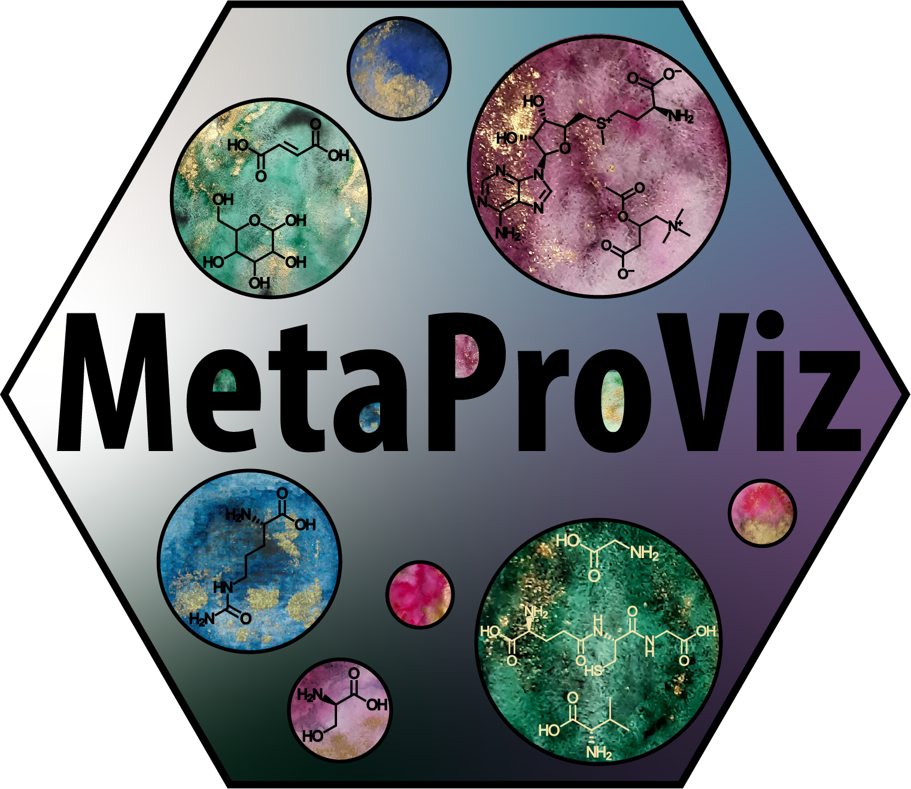
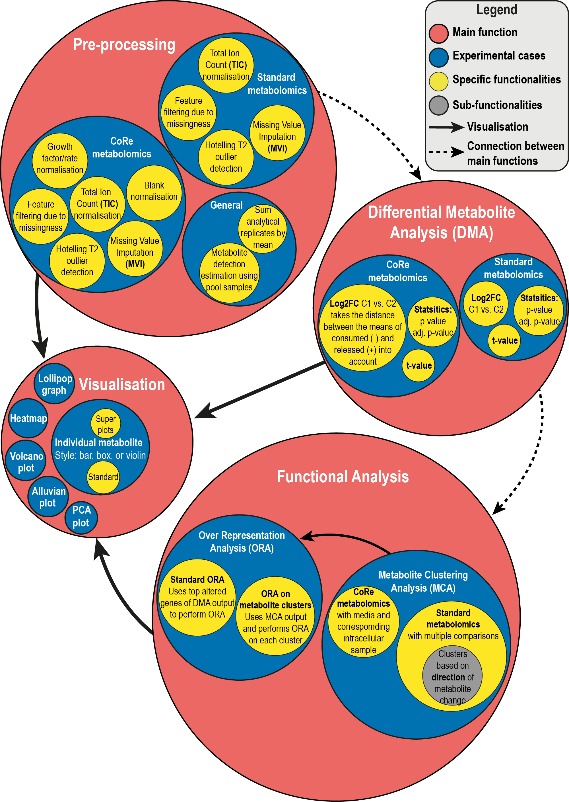

<!-- README.md is generated from README.Rmd. Please edit that file -->

```{r, include = FALSE}
#https://pkgdown.r-lib.org/reference/build_home.html
knitr::opts_chunk$set(
    collapse = TRUE,
    comment = "#>",
    fig.path = "vignettes",
    out.width = "100%"
)
```

# MetaProViz 


<!-- badges: start -->
[](https://www.tidyverse.org/lifecycle/#maturing)
[]()
[]()
[]()
[]()
[](https://github.com/ChristinaSchmidt1/MetaProViz/issues)
<!-- badges: end -->

## **Short Introduction**
**MetaProViz** (Authors. 2023. Journal. DOI: ) enables the user to pre-process metabolomics data including consumption-release (CoRe) data, perform differential analysis (DMA), do clustering based on regulatory rules (MCA) and contains different visualisation methods to extract biological interpretable graphs (**Fig.1**).\
\
<p align="center" width="100%">

</p>

# Tutorials
We have generated several tutorials showcasing the different functionalities MetaProViz offers using publicly available datasets, which are included as example data within **MetaProViz**. You can find those tutorial on the top under the "Tutorial" button, where you can follow specific user case examples for different analysis. Otherwise, you can also follow the links below:\
- [Standard metabolomics data](https://saezlab.github.io/decoupleR/articles/decoupleR.html)\
- [Consumption-Release (CoRe) metabolomics data from cell culture media](CoRe-Metabolomics.html)\
\
Here you will find a brief overview and information about the installation of the package and its dependencies.

## Installation
[MetaProViz](Link to bioconductor) is an R package distributed as part of the Bioconductor project. To install the package, start R and enter:
```{r bioconductor_install, eval=FALSE}
install.packages("BiocManager")
BiocManager::install("MetaProViz")
```

Alternatively, you can install the latest development version from [GitHub](https://github.com/ChristinaSchmidt1/MetaProViz) with:\
```{r github_install, eval=FALSE}
BiocManager::install("ChristinaSchmidt1/MetaProViz")
```

Now [MetaProViz](Link to bioconductor) can be imported as:
```{r load_library, message=FALSE}
#library(MetaProViz)

# Extra dependencies:
library(dplyr)
library(tidyverse)
```

### Dependencies
If you are using the visualisations you will need to install the following tools and cite them.\

CRAN packages

Biocmanager packages

While we have done our best to ensure all the dependencies are documented, if they aren't please let us know and we will try to resolve them.

### Windows specifications
Note if you are running Windows you might have an issue with long paths, which you can resolve in the registry on Windows 10:
Computer Configuration > Administrative Templates > System > Filesystem > Enable Win32 long paths
(If you have a different version of Windows, just google "Long paths fix" and your Windows version)

## Liscence

## Citation
Text


