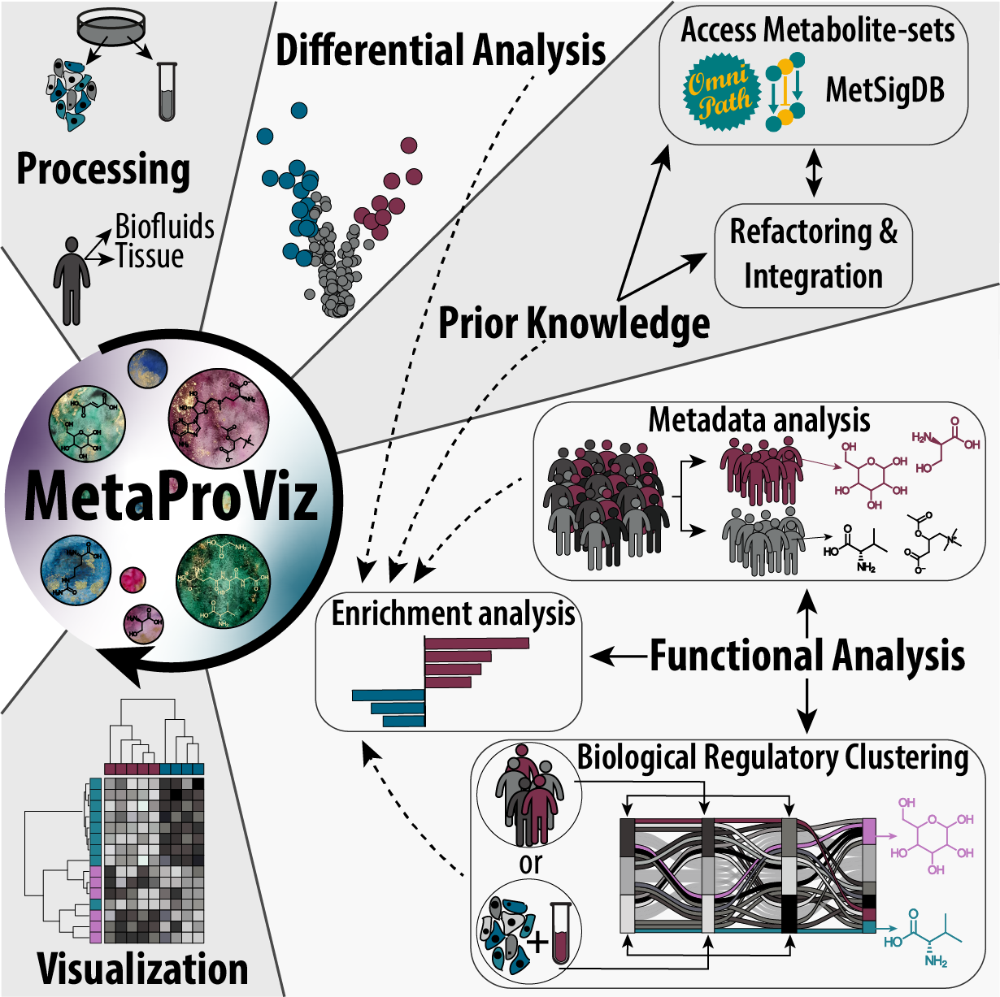

<!-- README.md is generated from README.Rmd. Please edit that file -->

```{r, include = FALSE}
#https://pkgdown.r-lib.org/reference/build_home.html
knitr::opts_chunk$set(
    collapse = TRUE,
    comment = "#>",
    fig.path = "vignettes",
    out.width = "100%"
)
```

# MetaProViz 


<!-- badges: start -->
[](https://www.tidyverse.org/lifecycle/#maturing)
[](https://github.com/saezlab/MetaProViz/issues)
<!-- badges: end -->

## **Short Introduction**
**MetaProViz** (**Meta**bolomics **Pr**ocessing, functi**o**nal analysis and **Vi**suali**z**ation), a free open-source R-package that provides mechanistic hypotheses from metabolomics data by integrating prior knowledge from literature with metabolomics. MetaProViz offers an interactive framework consisting of four modules: Processing, differential analysis, functional analysis and visualization of both intracellular and exometabolomics (=consumption-release (CoRe) data). Those modules and their functions can be used independently from each other or in combination (**Fig.1**).

\
<center>
{width=90%}
</center>
\
\
The first module, **MetaProViz**, `Processing`, allows the customized processing of raw peak metabolomics data from different experimental setups, including options to perform feature filtering due to missingness, Total Ion Count (TIC) normalisation, Missing Value Imputation (MVI) based on half-minimum and outlier detection based on Hotellin's T2. All of these pre-processing parameters can be customized and combined as needed.\
The second module of **MetaProViz**, `Differential Metabolite Analysis (DMA)`, allows the user to perform differential analysis between two conditions (e.g. Tumour versus Healthy) calculating the Log2FC, p-value, adjusted p-value and t-value, whereby the user can choose all the test statistics. The input can either be the output of the `Preprocessing` module or any DF including metabolite values and information about the conditions that should be compared.\
The third module of **MetaProViz**, `Functional Analysis`, includes different methods to create clusters of metabolites based on their distribution across the data using logical regulatory rules, prior knowledge for enrichment analysis and functions to perform over representation analysis (ORA). Here, the user can either input the output of the `Processing` or `Differential Metabolite Analysis (DMA)` module, or any other DF including Log2FC and statistics or metabolite values.\
The fourth module of **MetaProViz**, `Visualization`, can easily create customized visualizations of the output results of each of the other **MetaProViz** modules or custom files. Here we not only enable overview plots such as PCA, heatmap, Volcano plot, but also individual graphs of each metabolite as bar graphs, box plots or violin plots. Moreover, the user can provide additional information such as pathways the metabolites correspond to, the clusters the metabolites where assigned to or any other meta-information to customize the plots for color, shape or selections, thus enabling biological interpretation of the results otherwise missed in the data.


## Tutorials
We have generated several tutorials showcasing the different functionalities MetaProViz offers using publicly available datasets, which are included as example data within **MetaProViz**. You can find those tutorial on the top under the "Tutorials" button, where you can follow specific user case examples for different analysis. Otherwise, you can also follow the links below:\
- [Standard metabolomics data](https://saezlab.github.io/MetaProViz/articles/Standard%20Metabolomics.html)\
- [Consumption-Release (CoRe) metabolomics data from cell culture media](https://saezlab.github.io/MetaProViz/articles/CoRe%20Metabolomics.html)\
- [Enrichment Analysis](https://saezlab.github.io/MetaProViz/articles/EnrichmentAnalysis.html)\
- [Metadata Analysis](https://saezlab.github.io/MetaProViz/articles/Metadata%20Analysis.html)\
\
Here you will find a brief overview and information about the installation of the package and its dependencies.

## Installation
**MetaProViz** is an R package and to install the package, start R and enter:
```{r github_install, eval=FALSE}
devtools::install_github("https://github.com/saezlab/MetaProViz")
```

Now **MetaProViz** can be imported as:
```{r load_library, eval=FALSE}
library(MetaProViz)
```

### Dependencies
If you are using **MetaProViz** the following packages are required:\
```
"tidyverse"
"ggplot2"
"factoextra"
"qcc"
"hash"
"reshape"
"gridExtra"
"inflection"
"patchwork"
"clusterProfiler"
"ggupset"
"gtools"
"EnhancedVolcano"
"writexl"
"pheatmap"
"ggfortify"
```
\
While we have done our best to ensure all the dependencies are documented, if they aren't please let us know and we will try to resolve them.

### Windows specifications
Note if you are running Windows you might have an issue with long paths, which you can resolve in the registry on Windows 10:
Computer Configuration > Administrative Templates > System > Filesystem > Enable Win32 long paths
(If you have a different version of Windows, just google "Long paths fix" and your Windows version)

## Liscence
GNU GENERAL PUBLIC LICENSE, Version 3, 29 June 2007

## Citation
```
@Manual{,
  title = {MetaProViz: METabolomics pre-PRocessing, functiOnal analysis and VIZualisation},
  author = {Christina Schmidt and Dimitrios Prymidis and Julio Saez-Rodriguez and Christian Frezza},
  year = {2023},
  note = {R package version 2.1.0},
}
```


