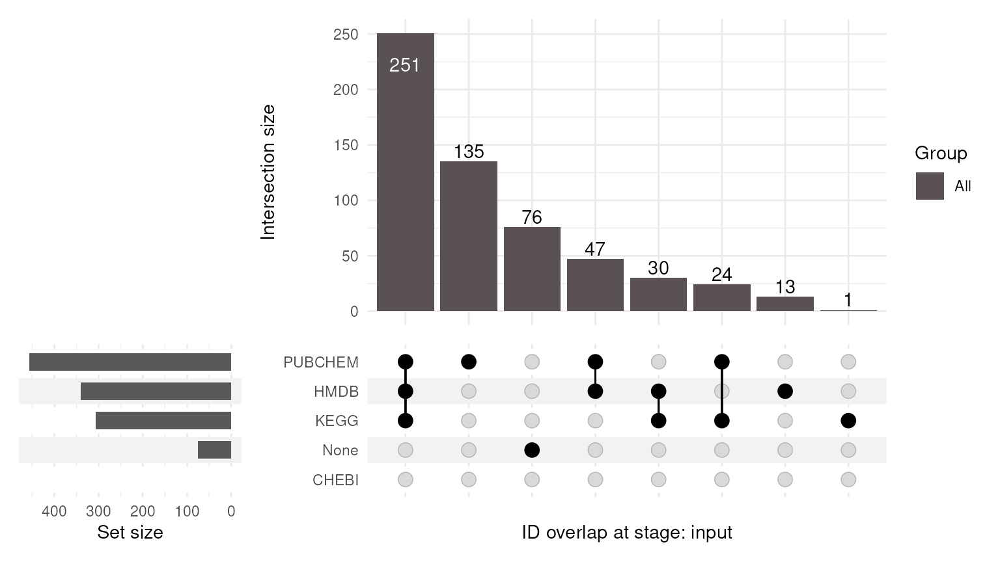
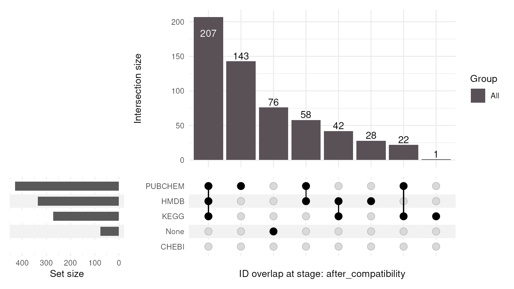
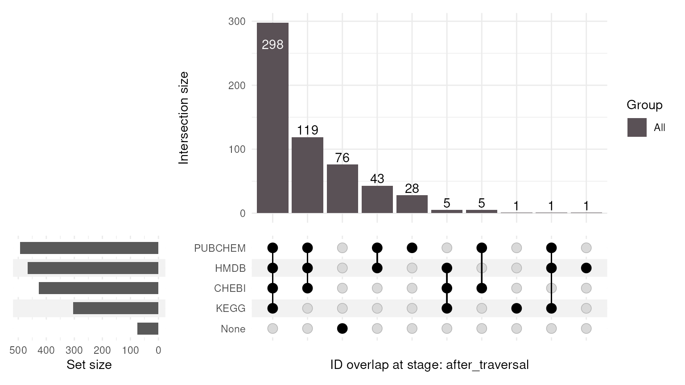
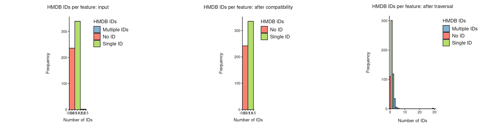
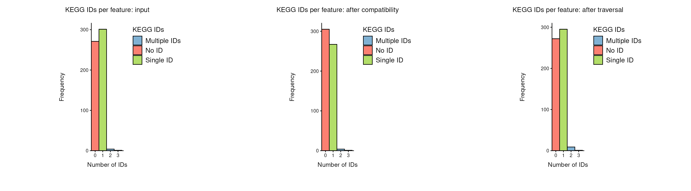
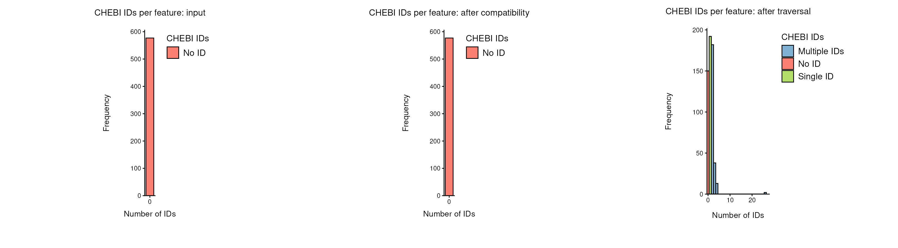
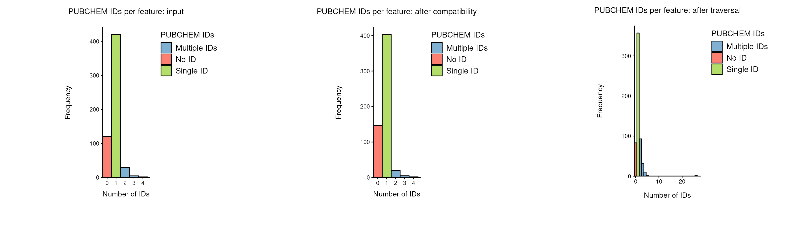

# ID Processing Workflow

This vignette demonstrates the
[`id_processing()`](https://saezlab.github.io/MetaProViz/reference/id_processing.md)
workflow for feature metadata in **MetaProViz**. The function can
quantify the current ID space, perform automatic seed-ID compatibility
handling, and expand the ID space through graph traversal.

The examples use the `tissue_meta` dataset that ships with MetaProViz.
It contains the feature metadata of the ccRCC tissue metabolomics study
by [Hakimi et al.](https://doi.org/10.1016/j.ccell.2015.12.004), where
each metabolite is annotated with IDs from several databases, pathways
and other feature information. Compatibility between the seed IDs is
checked and resolved automatically by
[`seed_id_compatibility_check()`](https://saezlab.github.io/MetaProViz/reference/seed_id_compatibility_check.md),
so the IDs need no manual cleaning first.

Fig. 1 gives an overview of the steps
[`id_processing()`](https://saezlab.github.io/MetaProViz/reference/id_processing.md)
runs. Each of the workflows below enables a different combination of
these steps: inspection only, compatibility check, translation, or
traversal.


Fig. 1: Overview of the
[`id_processing()`](https://saezlab.github.io/MetaProViz/reference/id_processing.md)
workflow.

The step *Equivalent ID* in Fig. 1, which adds the IDs of stereoisomers
(e.g. D- next to L-amino acids), is not part of
[`id_processing()`](https://saezlab.github.io/MetaProViz/reference/id_processing.md)
yet. It is currently run separately with
[`equivalent_id()`](https://saezlab.github.io/MetaProViz/reference/equivalent_id.md)
on the result of
[`id_processing()`](https://saezlab.github.io/MetaProViz/reference/id_processing.md),
as shown in the [Sample Metadata Analysis
vignette](https://saezlab.github.io/MetaProViz/articles/pkgdown/sample-metadata.html#metabolite-id-qc).

  

``` r

library(MetaProViz)
library(dplyr)
library(tibble)

data(tissue_meta)
```

The workflow-managed identifier namespaces are currently `HMDB`, `KEGG`,
`CHEBI`, and `PUBCHEM`. These columns are treated as the canonical
ID-space columns, while other metadata columns such as names, pathway
classes, or platform information are preserved across all workflow
stages. `tissue_meta` has no `CHEBI` column;
[`id_processing()`](https://saezlab.github.io/MetaProViz/reference/id_processing.md)
adds it as an empty column, which the traversal later fills.

Some features have more than one ID per namespace, stored in a single
cell.
[`id_processing()`](https://saezlab.github.io/MetaProViz/reference/id_processing.md)
splits these cells using one `delimiter` for all ID columns, so all ID
columns must use the same separator. In `tissue_meta` this is not the
case: multiple `HMDB` and `KEGG` IDs are separated by commas, whereas
multiple `PUBCHEM` IDs are separated by semicolons:

``` r

multi_id <- tissue_meta %>%
    select(Metabolite, HMDB, KEGG, PUBCHEM)

bind_rows(
    multi_id %>% filter(grepl(",", HMDB) | grepl(",", KEGG)) %>% head(4),
    multi_id %>% filter(grepl(";", PUBCHEM)) %>% head(2)
) %>%
    distinct() %>%
    preview_table(caption = "Features with multiple IDs in one cell.")
```

| Metabolite | HMDB | KEGG | PUBCHEM |
|:---|:---|:---|:---|
| celecoxib | HMDB05014 | D00567,C07589 | 2662 |
| dimethylarginine (SDMA + ADMA) | HMDB01539,HMDB03334 | C03626 | 123831 |
| epinephrine | HMDB00068 | D00095,C00788,D02149 | 5816 |
| lipitor | HMDB05006 | D00887,C06834 | 60823 |
| 3-methyl-2-oxovalerate | HMDB03736 | C00671 | 439286; 440877; 6857401 |
| 3-methylhistidine | HMDB00479 | C01152 | 92105; 64969 |

Features with multiple IDs in one cell. {.table .lightable-classic
style="font-size: 12px; font-family: Cambria; width: auto !important; margin-left: auto; margin-right: auto;"}

We therefore harmonise the separators to semicolons before running the
workflow, and set `delimiter = ";"` in all calls below. We also remove
the unnamed features (e.g. `X - 12345`), which have no IDs:

``` r

Tissue_MetaData <- tissue_meta %>%
    filter(!grepl("^X\\s*-\\s*\\d+$", Metabolite)) %>%
    mutate(across(c(HMDB, KEGG), ~ gsub(",\\s*", "; ", .x)))
```

## Inspection-only workflow

An inspection-only run quantifies the current identifier coverage and
overlap structure without changing the feature metadata. The call and
its result-inspection code are shown below for reference, but are not
evaluated in this vignette.

``` r

id_default <- id_processing(
    data = Tissue_MetaData,
    id_types = c("HMDB", "KEGG", "CHEBI", "PUBCHEM"),
    delimiter = ";",
    run_compatibility_check = FALSE,
    handle_partially_compatible = TRUE,
    handle_completely_incompatible = TRUE,
    completely_incompatible_priority = c("HMDB", "CHEBI", "PUBCHEM", "KEGG"),
    run_translation = FALSE,
    translation_from = NULL,
    translation_to = NULL,
    translation_summary = FALSE,
    run_traversal = FALSE,
    edge_table = NULL,
    compare_name_col = "Metabolite",
    save_plot = NULL,
    save_table = NULL,
    print_plot = FALSE,
    verbose = FALSE,
    path = NULL
)

names(id_default)
names(id_default$Data)
names(id_default$Plot)
names(id_default$Workflow)
preview_table(utils::head(id_default$Data$id_count_summary, 10L))
preview_table(utils::head(id_default$Data$compare_pk_summary_by_stage$input, 10L))
preview_table(utils::head(id_default$Data$count_id_tables_by_stage$input$HMDB, 10L))
```

## Compatibility-check workflow

The compatibility-only workflow can assess and handle partially or
completely incompatible IDs without traversal. It is shown, but not
evaluated, here.

``` r

id_qc <- id_processing(
    data = Tissue_MetaData,
    id_types = c("HMDB", "KEGG", "CHEBI", "PUBCHEM"),
    delimiter = ";",
    run_compatibility_check = TRUE,
    handle_partially_compatible = TRUE,
    handle_completely_incompatible = TRUE,
    completely_incompatible_priority = c("HMDB", "CHEBI", "PUBCHEM", "KEGG"),
    run_translation = FALSE,
    translation_from = NULL,
    translation_to = NULL,
    translation_summary = FALSE,
    run_traversal = FALSE,
    edge_table = NULL,
    compare_name_col = "Metabolite",
    save_plot = NULL,
    save_table = NULL,
    print_plot = FALSE,
    verbose = FALSE,
    path = NULL
)

preview_table(utils::head(id_qc$Data$input[, c("Metabolite", "HMDB", "KEGG", "CHEBI", "PUBCHEM")], 10L))
preview_table(utils::head(id_qc$Data$after_compatibility[, c("Metabolite", "HMDB", "KEGG", "CHEBI", "PUBCHEM")], 10L))
preview_table(utils::head(id_qc$Data$id_count_summary, 10L))
id_qc$Workflow$steps_run
names(id_qc$Data$compatibility)
id_qc$Workflow$result_overview_text
```

## Translation workflow

Translation can map one identifier namespace to one or more others. It
is also shown but not evaluated; translation and traversal are mutually
exclusive within one call.

``` r

id_translation <- id_processing(
    data = Tissue_MetaData,
    id_types = c("HMDB", "KEGG", "CHEBI", "PUBCHEM"),
    delimiter = ";",
    run_compatibility_check = TRUE,
    handle_partially_compatible = TRUE,
    handle_completely_incompatible = TRUE,
    completely_incompatible_priority = c("HMDB", "CHEBI", "PUBCHEM", "KEGG"),
    run_translation = TRUE,
    translation_from = "PUBCHEM",
    translation_to = c("HMDB", "KEGG"),
    translation_summary = FALSE,
    run_traversal = FALSE,
    edge_table = NULL,
    compare_name_col = "Metabolite",
    save_plot = NULL,
    save_table = NULL,
    print_plot = FALSE,
    verbose = FALSE,
    path = NULL
)

preview_table(utils::head(id_translation$Data$after_translation[, c("Metabolite", "PUBCHEM", "HMDB", "KEGG")], 10L))
preview_table(id_translation$Data$id_count_summary, caption = "Translation ID-count summary")
names(id_translation$Data$translation)
preview_table(utils::head(id_translation$Data$translation$input, 10L))
preview_table(utils::head(id_translation$Data$translation$translated_ids, 10L))
```

## Traversal workflow

This vignette runs the traversal workflow because it includes the
initial ID-space inspection and compatibility handling before expanding
the seed ID space through the RaMP mapping graph. The default
inspection-only workflow and the translation workflow remain available
through
[`id_processing()`](https://saezlab.github.io/MetaProViz/reference/id_processing.md)
when those focused analyses are needed, but are not run here.
Translation and traversal are mutually exclusive within one call.

``` r

id_traversal <- id_processing(
    data = Tissue_MetaData,
    id_types = c("HMDB", "KEGG", "CHEBI", "PUBCHEM"),
    delimiter = ";",
    run_compatibility_check = TRUE,
    handle_partially_compatible = TRUE,
    handle_completely_incompatible = TRUE,
    completely_incompatible_priority = c("HMDB", "CHEBI", "PUBCHEM", "KEGG"),
    run_translation = FALSE,
    translation_from = NULL,
    translation_to = NULL,
    translation_summary = FALSE,
    run_traversal = TRUE,
    edge_table = NULL,
    compare_name_col = "Metabolite",
    save_plot = NULL,
    save_table = NULL,
    print_plot = FALSE,
    verbose = FALSE,
    path = NULL
)
#> [id_processing] Starting workflow on 577 feature(s).
#> [id_processing] Selected namespaces: HMDB, KEGG, CHEBI, PUBCHEM
#> [id_processing] Steps enabled: compatibility=TRUE, translation=FALSE, traversal=TRUE
#> [id_processing] Defaults/assumptions: partial_auto=TRUE, complete_auto=TRUE, complete_priority=HMDB > CHEBI > PUBCHEM > KEGG
#> [id_processing] Quantifying ID space for stage 'input'.
#> Warning: `aes_string()` was deprecated in ggplot2 3.0.0.
#> ℹ Please use tidy evaluation idioms with `aes()`.
#> ℹ See also `vignette("ggplot2-in-packages")` for more information.
#> ℹ The deprecated feature was likely used in the MetaProViz package.
#>   Please report the issue at <https://github.com/saezlab/MetaProViz/issues>.
#> This warning is displayed once per session.
#> Call `lifecycle::last_lifecycle_warnings()` to see where this warning was
#> generated.
#> Warning: Using `size` aesthetic for lines was deprecated in ggplot2 3.4.0.
#> ℹ Please use `linewidth` instead.
#> ℹ The deprecated feature was likely used in the ComplexUpset package.
#>   Please report the issue at
#>   <https://github.com/krassowski/complex-upset/issues>.
#> This warning is displayed once per session.
#> Call `lifecycle::last_lifecycle_warnings()` to see where this warning was
#> generated.
#> [id_processing] Running seed_id_compatibility_check().
#> seed_id_compatibility_check() ID-handling choices:
#> - handle_partially_compatible: TRUE
#> - handle_completely_incompatible: TRUE
#> seed_id_compatibility_check() returned:
#> - ID_pair_compatibility: raw seed-ID pair QC table.
#> - data_with_compatibility: input feature table with raw compatibility flag.
#> - feature_compatibility_summary: one row per feature with QC class and counts.
#> - data_after_handling: cleaned feature table after optional automatic handling.
#> - ID_pair_compatibility_after_handling: pair QC recomputed from cleaned IDs.
#> - handling_summary_text / handling_summary_metrics: concise summary of handling choices and effects.
#> [id_processing] Quantifying ID space for stage 'after_compatibility'.
#> [id_processing] Running traverse_ids().
#> Warning: Unknown or uninitialised column: `all_seed_ids_compatible`.
#> [id_processing] Quantifying ID space for stage 'after_traversal'.
#> [id_processing] Stage 'input': HMDB total_ids=343 no_id=236 single=339 multiple=2 | KEGG total_ids=312 no_id=271 single=301 multiple=5 | CHEBI total_ids=0 no_id=577 single=0 multiple=0 | PUBCHEM total_ids=503 no_id=120 single=420 multiple=37
#> [id_processing] Stage 'after_compatibility': HMDB total_ids=335 no_id=242 single=335 multiple=0 | KEGG total_ids=278 no_id=305 single=267 multiple=5 | CHEBI total_ids=0 no_id=577 single=0 multiple=0 | PUBCHEM total_ids=466 no_id=147 single=403 multiple=27
#> [id_processing] Stage 'after_traversal': HMDB total_ids=747 no_id=110 single=301 multiple=166 | KEGG total_ids=316 no_id=272 single=295 multiple=10 | CHEBI total_ids=774 no_id=150 single=192 multiple=235 | PUBCHEM total_ids=733 no_id=83 single=357 multiple=137
#> [id_processing] Workflow steps run: initial_exploration -> compatibility_check -> traversal. Returned Data tables: input, after_compatibility, after_traversal. Returned Plot stages: input, after_compatibility, after_traversal. Final stage 'after_traversal' contains 577 feature(s).
#> [id_processing] Suggestion: equivalent_id() is not part of this workflow yet. If you want additional ambiguity-aware within-namespace expansion, run it afterwards on the final feature metadata.
```

### Inspecting traversal results

[`id_processing()`](https://saezlab.github.io/MetaProViz/reference/id_processing.md)
returns a list with three parts:

- **`Data`**: the result tables.
  - `input`, `after_compatibility` and `after_traversal`: the feature
    metadata after each stage. They keep all rows and columns of the
    input (here plus the `CHEBI` column, which was added because
    `tissue_meta` has none); only the ID columns change.
  - `id_count_summary`: one row per stage and ID type with the number of
    features without, with one and with several IDs.
  - `compare_pk_summary_by_stage`: for each stage, one row per feature
    with a flag for every ID type it has. These are the data behind the
    overlap plots below.
  - `count_id_tables_by_stage`: for each stage and ID type, the feature
    metadata with the number of IDs per feature (`entry_count`,
    `id_label`). These are the data behind the IDs-per-feature plots
    below.
  - `compatibility`: the quality control (QC) of the compatibility
    check. `feature_summary` has one row per feature,
    `pairs_before_handling` and `pairs_after_handling` one row per pair
    of seed IDs of a feature.
  - `traversal`: `prior_knowledge_edges`, the ID mapping graph that was
    used for the traversal (one row per mapping between two IDs).
- **`Plot`**: the overlap
  ([`compare_pk()`](https://saezlab.github.io/MetaProViz/reference/compare_pk.md))
  and IDs-per-feature
  ([`count_id()`](https://saezlab.github.io/MetaProViz/reference/count_id.md))
  plots of each stage.
- **`Workflow`**: the settings, the steps that were run, and a message
  per stage.

In most cases, the feature metadata after traversal is what you continue
with, and the other tables explain how it was created. As examples, we
compare three of these tables between the input and the end of the
workflow (after traversal): the feature metadata, the ID coverage per
feature, and the ID counts per ID type.

#### Feature metadata

We pick four features that show the typical outcomes:

``` r

example_features <- c(
    "1,2-propanediol",
    "1-arachidonoylglycerophosphoethanolamine*",
    "1,3-dihydroxyacetone",
    "1-oleoylglycerophosphoinositol*"
)
id_columns <- c("Metabolite", "HMDB", "KEGG", "CHEBI", "PUBCHEM")

preview_table(
    id_traversal$Data$input %>%
        filter(Metabolite %in% example_features) %>%
        select(all_of(id_columns)),
    caption = "Input: IDs of the example features."
)
```

| Metabolite                                 | HMDB      | KEGG   | CHEBI | PUBCHEM |
|:-------------------------------------------|:----------|:-------|:------|:--------|
| 1,2-propanediol                            | HMDB01881 | C00583 | NA    | NA      |
| 1,3-dihydroxyacetone                       | HMDB01882 | C00184 | NA    | 670     |
| 1-arachidonoylglycerophosphoethanolamine\* | HMDB11517 | NA     | NA    | NA      |
| 1-oleoylglycerophosphoinositol\*           | NA        | NA     | NA    | NA      |

Input: IDs of the example features. {.table .lightable-classic
style="font-size: 12px; font-family: Cambria; width: auto !important; margin-left: auto; margin-right: auto;"}

``` r

preview_table(
    id_traversal$Data$after_traversal %>%
        filter(Metabolite %in% example_features) %>%
        select(all_of(id_columns)),
    caption = "After traversal: IDs of the same features."
)
```

| Metabolite | HMDB | KEGG | CHEBI | PUBCHEM |
|:---|:---|:---|:---|:---|
| 1,2-propanediol | HMDB0001881 | C02912 | CHEBI:28972 | CID259994 |
| 1,3-dihydroxyacetone | HMDB0001882 | C00184 | CHEBI:16016 | CID670 |
| 1-arachidonoylglycerophosphoethanolamine\* | HMDB0011517 | NA | CHEBI:64395 | CID42607465 |
| 1-oleoylglycerophosphoinositol\* | NA | NA | NA | NA |

After traversal: IDs of the same features. {.table .lightable-classic
style="font-size: 12px; font-family: Cambria; width: auto !important; margin-left: auto; margin-right: auto;"}

The traversal follows the mappings between ID types and adds every ID it
reaches from the seed IDs of a feature. All IDs are also written in a
standard format, e.g. HMDB IDs with seven digits (`HMDB01881` becomes
`HMDB0001881`), ChEBI IDs with the `CHEBI:` prefix and PubChem IDs with
the `CID` prefix.

- *1-arachidonoylglycerophosphoethanolamine\** only had an HMDB ID; the
  traversal adds a ChEBI and a PubChem ID.
- *1,3-dihydroxyacetone* had HMDB, KEGG and PubChem IDs that all
  describe the same molecule, and it gains a ChEBI ID.
- *1-oleoylglycerophosphoinositol\** has no ID at all, so there is
  nothing to start the traversal from, and it stays without IDs.
- *1,2-propanediol* gets a different KEGG ID than it had in the input.
  This is the result of the compatibility check, which is the QC step
  before the traversal. Its HMDB and KEGG IDs could not be linked to
  each other, so they likely describe different molecules:

``` r

preview_table(
    id_traversal$Data$compatibility$pairs_before_handling %>%
        filter(Metabolite == "1,2-propanediol") %>%
        select(Metabolite, seed1_type, seed1_id, seed2_type, seed2_id,
               pair_compatible, compatibility_path, n_seed_ids, all_seed_ids_compatible),
    caption = "Compatibility check of the seed IDs of 1,2-propanediol."
)
```

| Metabolite | seed1_type | seed1_id | seed2_type | seed2_id | pair_compatible | compatibility_path | n_seed_ids | all_seed_ids_compatible |
|:---|:---|:---|:---|:---|:---|:---|---:|:---|
| 1,2-propanediol | HMDB | HMDB0001881 | KEGG | C00583 | FALSE | no_match | 2 | FALSE |

Compatibility check of the seed IDs of 1,2-propanediol. {.table
.lightable-classic
style="font-size: 12px; font-family: Cambria; width: auto !important; margin-left: auto; margin-right: auto;"}

Each row is one pair of seed IDs of a feature. `pair_compatible` tells
whether the two IDs could be linked through the mapping graph, and
`compatibility_path` how: `direct` (one ID maps to the other),
`secondary` (via a third ID) or `no_match`. `all_seed_ids_compatible` is
`TRUE` if all pairs of the feature are compatible. Features where no
pair is compatible are *completely incompatible*. For those,
[`id_processing()`](https://saezlab.github.io/MetaProViz/reference/id_processing.md)
keeps only the ID type that comes first in
`completely_incompatible_priority` (here HMDB) and removes the others.
The traversal then starts from the HMDB ID alone and adds the KEGG ID
that belongs to it.

#### ID coverage per feature

The table returned by
[`compare_pk()`](https://saezlab.github.io/MetaProViz/reference/compare_pk.md)
flags for each feature which ID types it has (`1`) or lacks (`0`). The
column `None` is `1` for features without any ID:

``` r

preview_table(
    id_traversal$Data$compare_pk_summary_by_stage$input %>%
        filter(Metabolite %in% example_features),
    caption = "Input: ID types per feature."
)
```

| Metabolite                                 | HMDB | KEGG | CHEBI | PUBCHEM | None | Group |
|:-------------------------------------------|-----:|-----:|------:|--------:|-----:|:------|
| 1,2-propanediol                            |    1 |    1 |     0 |       0 |    0 | All   |
| 1,3-dihydroxyacetone                       |    1 |    1 |     0 |       1 |    0 | All   |
| 1-arachidonoylglycerophosphoethanolamine\* |    1 |    0 |     0 |       0 |    0 | All   |
| 1-oleoylglycerophosphoinositol\*           |    0 |    0 |     0 |       0 |    1 | All   |

Input: ID types per feature. {.table .lightable-classic
style="font-size: 12px; font-family: Cambria; width: auto !important; margin-left: auto; margin-right: auto;"}

``` r

preview_table(
    id_traversal$Data$compare_pk_summary_by_stage$after_traversal %>%
        filter(Metabolite %in% example_features),
    caption = "After traversal: ID types per feature."
)
```

| Metabolite                                 | HMDB | KEGG | CHEBI | PUBCHEM | None | Group |
|:-------------------------------------------|-----:|-----:|------:|--------:|-----:|:------|
| 1,2-propanediol                            |    1 |    1 |     1 |       1 |    0 | All   |
| 1,3-dihydroxyacetone                       |    1 |    1 |     1 |       1 |    0 | All   |
| 1-arachidonoylglycerophosphoethanolamine\* |    1 |    0 |     1 |       1 |    0 | All   |
| 1-oleoylglycerophosphoinositol\*           |    0 |    0 |     0 |       0 |    1 | All   |

After traversal: ID types per feature. {.table .lightable-classic
style="font-size: 12px; font-family: Cambria; width: auto !important; margin-left: auto; margin-right: auto;"}

Here the gain is easier to see than in the ID columns: two of the
example features now have all four ID types and one has three, so they
can be linked to resources that use any of them.

#### ID counts per ID type

`id_count_summary` adds this up over all features. For every ID type,
`n_no_id`, `n_single_id` and `n_multiple_ids` count the features
without, with one and with several IDs, and `n_total_ids` counts all
IDs. The table also has `delta_*` columns with the change compared to
the previous stage and to the input, which we leave out here:

``` r

preview_table(
    id_traversal$Data$id_count_summary %>%
        filter(stage %in% c("input", "after_traversal")) %>%
        select(namespace, stage, n_features, n_no_id, n_single_id, n_multiple_ids, n_total_ids) %>%
        arrange(namespace, desc(stage == "input")),
    caption = "Input and after traversal: number of features without, with one and with several IDs per ID type."
)
```

| namespace | stage | n_features | n_no_id | n_single_id | n_multiple_ids | n_total_ids |
|:---|:---|---:|---:|---:|---:|---:|
| CHEBI | input | 577 | 577 | 0 | 0 | 0 |
| CHEBI | after_traversal | 577 | 150 | 192 | 235 | 774 |
| HMDB | input | 577 | 236 | 339 | 2 | 343 |
| HMDB | after_traversal | 577 | 110 | 301 | 166 | 747 |
| KEGG | input | 577 | 271 | 301 | 5 | 312 |
| KEGG | after_traversal | 577 | 272 | 295 | 10 | 316 |
| PUBCHEM | input | 577 | 120 | 420 | 37 | 503 |
| PUBCHEM | after_traversal | 577 | 83 | 357 | 137 | 733 |

Input and after traversal: number of features without, with one and with
several IDs per ID type. {.table .lightable-classic
style="font-size: 12px; font-family: Cambria; width: auto !important; margin-left: auto; margin-right: auto;"}

For every ID type, the rows *input* and *after_traversal* are directly
below each other. The traversal reduces the number of features without
ID for every ID type and adds many IDs, most of all for ChEBI, which was
not in the input at all. At the same time, more features have several
IDs of one type, e.g. IDs of stereoisomers or other closely related
molecules that the mapping graph links to the same feature. The next
section shows the same numbers for every stage as plots.

## Traversal workflow: comparison across stages

The following plots compare the input, compatibility-handled, and
traversal-expanded ID spaces.

### Identifier overlap

For each stage,
[`compare_pk()`](https://saezlab.github.io/MetaProViz/reference/compare_pk.md)
shows the identifier overlap between the four managed namespaces:

``` r

# "after_compatibility" -> "After compatibility"
stage_label <- function(stage) {
    stage <- gsub("_", " ", stage)
    paste0(toupper(substr(stage, 1, 1)), substring(stage, 2))
}

for (stage in names(id_traversal$Plot$compare_pk_by_stage)) {
    cat("\n\n### ", stage_label(stage), "\n\n", sep = "")
    print(id_traversal$Plot$compare_pk_by_stage[[stage]])
}
```

#### Input



#### After compatibility



#### After traversal



### IDs per feature

[`count_id()`](https://saezlab.github.io/MetaProViz/reference/count_id.md)
shows the number of IDs per feature.
[`id_processing()`](https://saezlab.github.io/MetaProViz/reference/id_processing.md)
returns the plain
[`count_id()`](https://saezlab.github.io/MetaProViz/reference/count_id.md)
plots, so we call
[`count_id()`](https://saezlab.github.io/MetaProViz/reference/count_id.md)
on the metadata of each stage to show its standard MetaProViz figure
(`Plot_Sized`). For each ID type, the three stages are shown next to
each other: input, after compatibility check and after traversal.

``` r

id_counts <- id_traversal$Data$id_count_summary

# Short description of the ID counts of one ID type across the stages
count_text <- function(id_type) {
    x <- id_counts %>% filter(namespace == id_type)
    n <- function(stage, column) x[[column]][x$stage == stage]
    with_id <- function(stage) n(stage, "n_single_id") + n(stage, "n_multiple_ids")
    describe <- function(stage) {
        sprintf(
            "%i without, %i with one and %i with several %s IDs",
            n(stage, "n_no_id"), n(stage, "n_single_id"), n(stage, "n_multiple_ids"), id_type
        )
    }

    text <- if (with_id("input") == 0L) {
        sprintf(
            "The input has no %s IDs, so the compatibility check has nothing to check and does not change them either. All %s IDs are added by the traversal: afterwards there are %s.",
            id_type, id_type, describe("after_traversal")
        )
    } else {
        removed <- with_id("input") - with_id("after_compatibility")
        sprintf(
            "In the input there are %s. %s After traversal there are %s.",
            describe("input"),
            if (removed > 0L) {
                sprintf(
                    "The compatibility check removes the %s IDs of %i feature(s), because they did not match the other IDs of the feature.",
                    id_type, removed
                )
            } else {
                "The compatibility check does not remove any of them."
            },
            describe("after_traversal")
        )
    }

    sprintf(
        "%s In total, %i of %i features have at least one %s ID after traversal, compared to %i in the input.\n\n",
        text, with_id("after_traversal"), n("input", "n_features"), id_type, with_id("input")
    )
}

for (id_type in c("HMDB", "KEGG", "CHEBI", "PUBCHEM")) {
    cat("\n\n### ", id_type, "\n\n", sep = "")
    stage_plots <- lapply(names(id_traversal$Plot$count_id_by_stage), function(stage) {
        count_id(
            data = id_traversal$Data[[stage]],
            column = id_type,
            delimiter = ";",
            title_prefix = sprintf("%s IDs per feature: %s", id_type, tolower(stage_label(stage))),
            save_plot = NULL,
            save_table = NULL,
            print_plot = FALSE
        )$Plot_Sized
    })
    gridExtra::grid.arrange(grobs = stage_plots, ncol = 3)
    cat("\n\n", count_text(id_type), sep = "")
}
```

#### HMDB



In the input there are 236 without, 339 with one and 2 with several HMDB
IDs. The compatibility check removes the HMDB IDs of 6 feature(s),
because they did not match the other IDs of the feature. After traversal
there are 110 without, 301 with one and 166 with several HMDB IDs. In
total, 467 of 577 features have at least one HMDB ID after traversal,
compared to 341 in the input.

#### KEGG



In the input there are 271 without, 301 with one and 5 with several KEGG
IDs. The compatibility check removes the KEGG IDs of 34 feature(s),
because they did not match the other IDs of the feature. After traversal
there are 272 without, 295 with one and 10 with several KEGG IDs. In
total, 305 of 577 features have at least one KEGG ID after traversal,
compared to 306 in the input.

#### CHEBI



The input has no CHEBI IDs, so the compatibility check has nothing to
check and does not change them either. All CHEBI IDs are added by the
traversal: afterwards there are 150 without, 192 with one and 235 with
several CHEBI IDs. In total, 427 of 577 features have at least one CHEBI
ID after traversal, compared to 0 in the input.

#### PUBCHEM



In the input there are 120 without, 420 with one and 37 with several
PUBCHEM IDs. The compatibility check removes the PUBCHEM IDs of 27
feature(s), because they did not match the other IDs of the feature.
After traversal there are 83 without, 357 with one and 137 with several
PUBCHEM IDs. In total, 494 of 577 features have at least one PUBCHEM ID
after traversal, compared to 457 in the input.

## Summary

``` r

coverage <- id_counts %>%
    filter(stage %in% c("input", "after_traversal")) %>%
    mutate(n_with_id = n_single_id + n_multiple_ids) %>%
    select(namespace, stage, n_with_id, n_total_ids) %>%
    tidyr::pivot_wider(names_from = stage, values_from = c(n_with_id, n_total_ids)) %>%
    transmute(
        `ID type` = namespace,
        `Features with ID (input)` = n_with_id_input,
        `Features with ID (after traversal)` = n_with_id_after_traversal,
        `IDs (input)` = n_total_ids_input,
        `IDs (after traversal)` = n_total_ids_after_traversal
    )

no_id_input <- sum(id_traversal$Data$compare_pk_summary_by_stage$input$None)
no_id_after <- sum(id_traversal$Data$compare_pk_summary_by_stage$after_traversal$None)

preview_table(coverage, caption = "ID coverage of the input and after traversal.")
```

| ID type | Features with ID (input) | Features with ID (after traversal) | IDs (input) | IDs (after traversal) |
|:---|---:|---:|---:|---:|
| CHEBI | 0 | 427 | 0 | 774 |
| HMDB | 341 | 467 | 343 | 747 |
| KEGG | 306 | 305 | 312 | 316 |
| PUBCHEM | 457 | 494 | 503 | 733 |

ID coverage of the input and after traversal. {.table .lightable-classic
style="font-size: 12px; font-family: Cambria; width: auto !important; margin-left: auto; margin-right: auto;"}

Starting from 577 features, the workflow increased the number of IDs
over all four ID types from 1158 to 2570. The largest gains are for
ChEBI, which was not in the input, and for HMDB and PubChem. KEGG gains
the least. The number of features without any ID stays at 76: the
traversal can only start from an existing ID, so features without any ID
need manual annotation.

This matters when the data are linked to prior knowledge. Every resource
uses its own ID type, e.g. KEGG pathways use KEGG IDs and many
metabolite-protein resources use HMDB or ChEBI IDs. A feature can only
be found in a resource if it has an ID of the right type, so the more
features carry each ID type, the more features can be mapped, and the
more complete the pathway or metabolite sets that are tested in an
enrichment analysis. At the same time, features with several IDs of one
type can map to several entries of the same resource and inflate an
enrichment analysis. How to check and resolve this is shown in the
[Prior Knowledge
vignette](https://saezlab.github.io/MetaProViz/articles/pkgdown/prior-knowledge.html).

## Session information

``` r

sessionInfo()
#> R version 4.6.1 (2026-06-24)
#> Platform: x86_64-pc-linux-gnu
#> Running under: Ubuntu 24.04.4 LTS
#> 
#> Matrix products: default
#> BLAS:   /usr/lib/x86_64-linux-gnu/openblas-pthread/libblas.so.3 
#> LAPACK: /usr/lib/x86_64-linux-gnu/openblas-pthread/libopenblasp-r0.3.26.so;  LAPACK version 3.12.0
#> 
#> locale:
#>  [1] LC_CTYPE=en_US.UTF-8       LC_NUMERIC=C              
#>  [3] LC_TIME=en_US.UTF-8        LC_COLLATE=en_US.UTF-8    
#>  [5] LC_MONETARY=en_US.UTF-8    LC_MESSAGES=en_US.UTF-8   
#>  [7] LC_PAPER=en_US.UTF-8       LC_NAME=C                 
#>  [9] LC_ADDRESS=C               LC_TELEPHONE=C            
#> [11] LC_MEASUREMENT=en_US.UTF-8 LC_IDENTIFICATION=C       
#> 
#> time zone: Etc/UTC
#> tzcode source: system (glibc)
#> 
#> attached base packages:
#> [1] stats     graphics  grDevices utils     datasets  methods   base     
#> 
#> other attached packages:
#> [1] tibble_3.3.1      dplyr_1.2.1       MetaProViz_4.99.0 BiocStyle_2.40.0 
#> 
#> loaded via a namespace (and not attached):
#>   [1] RColorBrewer_1.1-3          rstudioapi_0.19.0          
#>   [3] jsonlite_2.0.0              magrittr_2.0.5             
#>   [5] ggbeeswarm_0.7.3            farver_2.1.2               
#>   [7] rmarkdown_2.32              fs_2.1.0                   
#>   [9] ragg_1.5.2                  vctrs_0.7.3                
#>  [11] memoise_2.0.1               rstatix_1.1.0              
#>  [13] htmltools_0.5.9             S4Arrays_1.12.1            
#>  [15] progress_1.2.3              curl_8.0.0                 
#>  [17] ComplexUpset_1.3.3          decoupleR_2.17.0           
#>  [19] broom_1.0.13                cellranger_1.1.0           
#>  [21] SparseArray_1.12.3          Formula_1.2-6              
#>  [23] sass_0.4.10                 parallelly_1.48.0          
#>  [25] bslib_0.12.0                htmlwidgets_1.6.4          
#>  [27] desc_1.4.3                  plyr_1.8.9                 
#>  [29] httr2_1.3.0                 lubridate_1.9.5            
#>  [31] cachem_1.1.0                igraph_2.3.4               
#>  [33] lifecycle_1.0.5             pkgconfig_2.0.3            
#>  [35] Matrix_1.7-6                R6_2.6.1                   
#>  [37] fastmap_1.2.0               MatrixGenerics_1.24.0      
#>  [39] digest_0.6.39               colorspace_2.1-3           
#>  [41] patchwork_1.3.2             S4Vectors_0.50.3           
#>  [43] textshaping_1.0.5           GenomicRanges_1.64.0       
#>  [45] RSQLite_3.53.3              ggpubr_1.0.0               
#>  [47] labeling_0.4.3              timechange_0.4.0           
#>  [49] polyclip_1.10-7             httr_1.4.9                 
#>  [51] abind_1.4-8                 compiler_4.6.1             
#>  [53] bit64_4.8.6                 withr_3.0.3                
#>  [55] S7_0.2.2                    backports_1.5.1            
#>  [57] BiocParallel_1.46.0         viridis_0.6.5              
#>  [59] carData_3.0-6               DBI_1.3.0                  
#>  [61] logger_0.4.3                OmnipathR_4.1.0            
#>  [63] ggforce_0.5.0               R.utils_2.13.0             
#>  [65] ggsignif_0.6.4              cosmosR_1.20.0             
#>  [67] MASS_7.3-66                 rappdirs_0.3.4             
#>  [69] DelayedArray_0.38.2         sessioninfo_1.2.4          
#>  [71] scatterplot3d_0.3-45        gtools_3.9.5               
#>  [73] tools_4.6.1                 vipor_0.4.7                
#>  [75] otel_0.2.0                  beeswarm_0.4.0             
#>  [77] zip_3.0.2                   R.oo_1.27.1                
#>  [79] glue_1.8.1                  grid_4.6.1                 
#>  [81] checkmate_2.3.4             reshape2_1.4.5             
#>  [83] generics_0.1.4              gtable_0.3.6               
#>  [85] tzdb_0.5.0                  R.methodsS3_1.8.2          
#>  [87] tidyr_1.3.2                 hms_1.1.4                  
#>  [89] tidygraph_1.3.1             xml2_1.6.0                 
#>  [91] car_3.1-5                   XVector_0.52.0             
#>  [93] BiocGenerics_0.58.1         ggrepel_0.9.8              
#>  [95] pillar_1.11.1               stringr_1.6.0              
#>  [97] limma_3.68.5                later_1.4.8                
#>  [99] splines_4.6.1               tweenr_2.0.3               
#> [101] lattice_0.22-9              bit_4.6.0                  
#> [103] tidyselect_1.2.1            knitr_1.52                 
#> [105] gridExtra_2.3.1             bookdown_0.48              
#> [107] IRanges_2.46.0              Seqinfo_1.2.0              
#> [109] SummarizedExperiment_1.42.0 svglite_2.2.2              
#> [111] stats4_4.6.1                xfun_0.61                  
#> [113] graphlayouts_1.2.5          Biobase_2.72.0             
#> [115] statmod_1.5.2               factoextra_2.2.0           
#> [117] matrixStats_1.5.0           pheatmap_1.0.13            
#> [119] stringi_1.8.9               yaml_2.3.12                
#> [121] kableExtra_1.4.1            evaluate_1.0.5             
#> [123] codetools_0.2-20            tcltk_4.6.1                
#> [125] ggraph_2.2.2                qvalue_2.44.0              
#> [127] hash_2.2.6.4                BiocManager_1.30.27        
#> [129] Polychrome_1.6.2            cli_3.6.6                  
#> [131] systemfonts_1.3.2           jquerylib_0.1.4            
#> [133] EnhancedVolcano_1.31.0      Rcpp_1.1.2                 
#> [135] readxl_1.5.0.1              XML_3.99-0.25              
#> [137] parallel_4.6.1              ggfortify_0.4.24           
#> [139] pkgdown_2.2.1               ggplot2_4.0.3              
#> [141] readr_2.2.0                 blob_1.3.0                 
#> [143] prettyunits_1.2.0           viridisLite_0.4.3          
#> [145] scales_1.4.0                writexl_2.0.1              
#> [147] inflection_1.3.7            purrr_1.2.2                
#> [149] crayon_1.5.3                rlang_1.3.0                
#> [151] rvest_1.0.5
```
