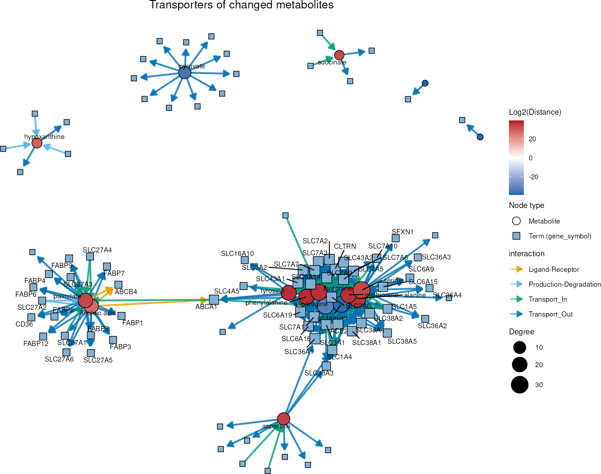
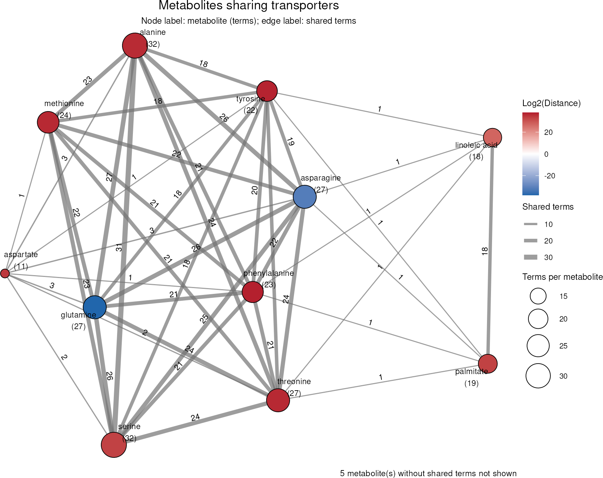
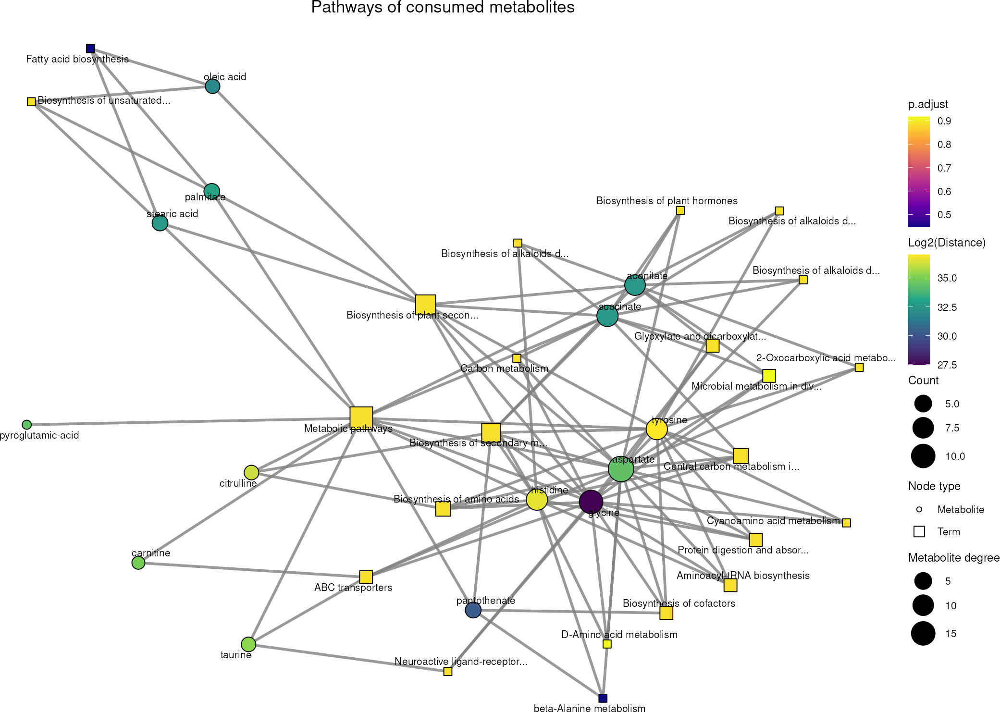
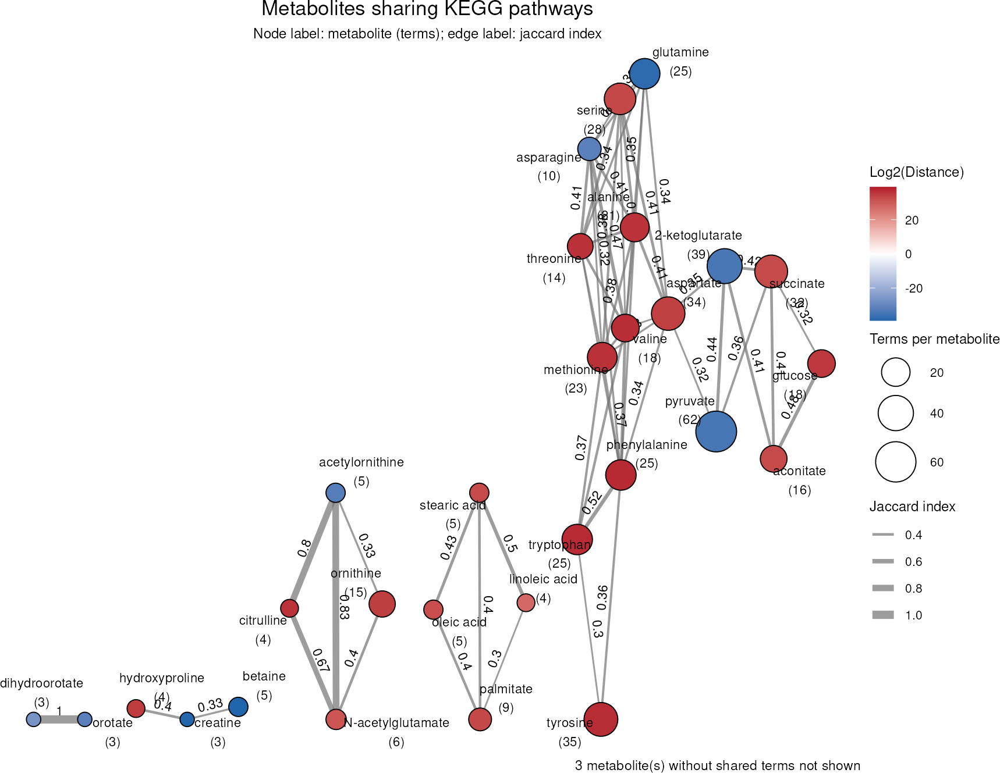
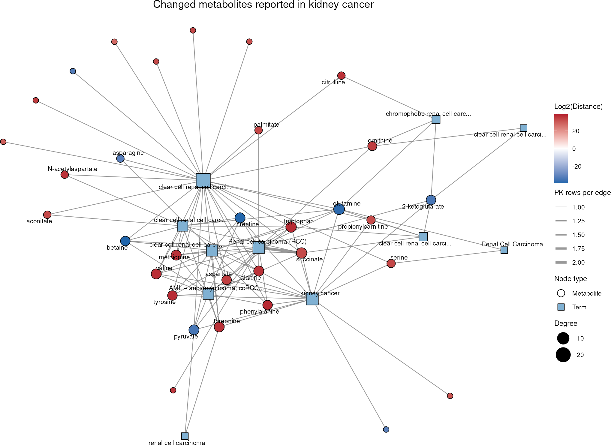
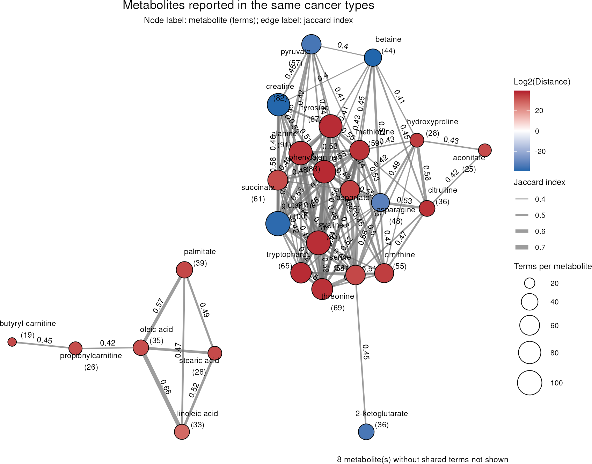

# Prior Knowledge Networks

Differential metabolite analysis, metabolite clustering and enrichment
analysis result in lists of metabolites and pathways. Prior knowledge
(PK) networks help to interpret such lists by showing how the
metabolites are connected, e.g. to proteins, pathways or diseases.  
  
In this tutorial we showcase how to use **MetaProViz**:  

- to plot measured metabolites together with the PK terms they are
  linked to using
  [`viz_pk_network()`](https://saezlab.github.io/MetaProViz/reference/viz_pk_network.md).  
- to connect metabolites that share PK terms using
  [`viz_shared_pk_network()`](https://saezlab.github.io/MetaProViz/reference/viz_shared_pk_network.md).  
- to use different PK resources from MetSigDB, here MetalinksDB, KEGG
  and MACdb, and to map node and edge attributes to the plots.  

The networks can be made for any set of metabolites, e.g. the results of
[`dma()`](https://saezlab.github.io/MetaProViz/reference/dma.md) on any
kind of metabolomics data, a metabolite cluster from
[`mca_2cond()`](https://saezlab.github.io/MetaProViz/reference/mca_2cond.md)
or
[`mca_core()`](https://saezlab.github.io/MetaProViz/reference/mca_core.md),
or simply a list of metabolites of interest. Here we use the results of
the consumption-release (CoRe) example data, which are explained in
detail in the [CoRe Metabolomics
vignette](https://saezlab.github.io/MetaProViz/articles/pkgdown/core-metabolomics.html).  
  
First if you have not done yet, install the required dependencies and
load the libraries:

``` r

# 1. Install MetaProViz from Bioconductor devel:
# if (!requireNamespace("BiocManager", quietly = TRUE)) install.packages("BiocManager")
# BiocManager::install(version = "devel")
# BiocManager::install("MetaProViz")
# 2. Install the latest development version from GitHub using devtools
# remotes::install_github("saezlab/MetaProViz") # Install Rtools if you haven’t done this yet, using the appropriate version (e.g.windows or macOS).

library(MetaProViz)

# dependencies that need to be loaded:
library(magrittr)
library(dplyr)
library(tibble)
```

  
  

## Preparing the example results

We reproduce the results of the [CoRe Metabolomics
vignette](https://saezlab.github.io/MetaProViz/articles/pkgdown/core-metabolomics.html)
that are needed for the networks, using the same parameters, but without
plots and saved files. Please see that vignette for an explanation of
each step.  
  
`1.` We load the CoRe example data, the mapping of the metabolites to
KEGG and HMDB IDs and the KEGG pathways:

``` r

data(medium_raw)
Media <- medium_raw %>%
    column_to_rownames("Code")

data(cellular_meta)
MappingInfo <- cellular_meta %>%
    column_to_rownames("Metabolite")

KEGG_Pathways <- metsigdb_kegg()
```

`2.` We pre-process the data, remove the outliers and compare all cell
lines to HK2 cells with
[`dma()`](https://saezlab.github.io/MetaProViz/reference/dma.md):

``` r

Media_input <- Media %>%
    subset(!Conditions == "Pool", select = -c(1:3))
Media_Metadata <- Media %>%
    subset(!Conditions == "Pool", select = c(1:3))

PreProcessing_res <- processing(
    data = Media_input,
    metadata_sample = Media_Metadata,
    metadata_info = c(
        Conditions = "Conditions",
        Biological_Replicates = "Biological_Replicates",
        core_norm_factor = "GrowthFactor",
        core_media = "blank"
    ),
    featurefilt = "Modified",
    cutoff_featurefilt = 0.8,
    tic = TRUE,
    mvi = TRUE,
    mvi_percentage = 50,
    hotellins_confidence = 0.99,
    core = TRUE,
    save_plot = NULL,
    save_table = NULL,
    print_plot = FALSE
)

Media_Preprocessed <- PreProcessing_res[["DF"]][["Preprocessing_output"]] %>%
    subset(!Outliers == "Outlier_filtering_round_1")

DMA_Annova <- dma(
    data = Media_Preprocessed[, -c(1:6)],
    metadata_sample = Media_Preprocessed[, c(1:4)],
    metadata_info = c(Conditions = "Conditions", Numerator = NULL, Denominator = "HK2"),
    pval = "aov",
    padj = "fdr",
    metadata_feature = MappingInfo,
    core = TRUE,
    save_plot = NULL,
    save_table = NULL,
    print_plot = FALSE
)

DMA_HK2_vs_786M1A <- DMA_Annova[["dma"]][["HK2_vs_786-M1A"]]
```

`3.` We perform ORA on the metabolites that are consumed by both,
786-M1A and HK2 cells:

``` r

ORA_input <- DMA_HK2_vs_786M1A[complete.cases(DMA_HK2_vs_786M1A), -1] %>%
    remove_rownames() %>%
    column_to_rownames("KEGGCompound")

DM_ORA_HK2_vs_786M1A <- cluster_ora(
    data = ORA_input,
    metadata_info = c(ClusterColumn = "core_specific", PathwayTerm = "term", PathwayFeature = "Metabolite"),
    remove_background = FALSE,
    input_pathway = KEGG_Pathways,
    pathway_name = "KEGG",
    min_gssize = 3,
    max_gssize = 1000,
    save_table = NULL
)

MC_ORA_HK2_vs_786M1A_Consumed <- DM_ORA_HK2_vs_786M1A[["DF"]][["Consumed"]]
```

`4.` We load the metabolite-protein interactions of MetalinksDB (Farr et
al. 2024), select the metabolites that are present in kidney, blood or
urine and known to be extracellular, and remove duplicated
metabolite-protein pairs originating from different PK resources:

``` r

MetaLinksDB <- metsigdb_metalinks(
    cell_location = c("Extracellular"),
    tissue_location = c("Kidney", "All Tissues"),
    biospecimen_location = c("Blood", "Urine"),
    save_table = NULL
)

MetaLinksDB_Select <- MetaLinksDB %>%
    tidyr::unite("UniquePair", c("hmdb", "gene_symbol"), sep = "_", remove = FALSE) %>%
    distinct(UniquePair, .keep_all = TRUE)
```

  
  

## Going deeper with prior knowledge networks

In the [CoRe Metabolomics
vignette](https://saezlab.github.io/MetaProViz/articles/pkgdown/core-metabolomics.html)
we have found metabolites that change between 786-M1A and HK2 cells
([`dma()`](https://saezlab.github.io/MetaProViz/reference/dma.md)),
grouped them by their consumption and release behaviour
([`mca_core()`](https://saezlab.github.io/MetaProViz/reference/mca_core.md))
and tested them for enriched pathways
([`cluster_ora()`](https://saezlab.github.io/MetaProViz/reference/cluster_ora.md)).
The results are lists of metabolites and pathways. To understand them,
it helps to look at how these metabolites are connected through prior
knowledge (PK): Which proteins can transport them? Which metabolites
drive an enriched pathway? Have they been reported in kidney cancer
before?  
  
`MetaProViz` offers two network plots for this, which work with any PK
table in long format, such as the MetSigDB resources loaded by the
`metsigdb_*()` functions:

- [`viz_pk_network()`](https://saezlab.github.io/MetaProViz/reference/viz_pk_network.md)
  plots the measured metabolites together with the PK terms they are
  linked to (e.g. proteins, pathways or cancer types). It shows *which*
  terms connect the metabolites.
- [`viz_shared_pk_network()`](https://saezlab.github.io/MetaProViz/reference/viz_shared_pk_network.md)
  only plots the metabolites and connects two metabolites if they are
  linked to the same terms. It shows *how similar* the metabolites are
  in the PK, and the edge weight can be the number of shared terms
  (`similarity = "shared"`) or the Jaccard index (`"jaccard"`) (Jaccard
  1901). Metabolites without any shared term are not plotted, but listed
  in the results.

Both functions use the same `metadata_info`: `InputID` and `PriorID`
name the ID columns used to match the metabolites in our data to the PK,
`PriorTerm` the PK column that holds the terms and `InputLabel` the
metabolite names. Further entries map columns to the node colours and
sizes and the edge colours, line types, widths and directions (see
[`?viz_pk_network`](https://saezlab.github.io/MetaProViz/reference/viz_pk_network.md)).
Hence, the same `metadata_info` can be passed to both functions.  
  
Here we use the metabolites that change significantly between 786-M1A
and HK2 cells and colour them by their `Log2(Distance)`. A positive
`Log2(Distance)` means that the metabolite has a higher CoRe value in
HK2 than in 786-M1A cells, i.e. 786-M1A cells consume more or release
less of it, and a negative value means the opposite:

``` r

DMA_Significant <- DMA_HK2_vs_786M1A %>%
    filter(p.adj < 0.05)
```

  

### Transporters of the changed metabolites (MetalinksDB)

As we look at metabolites consumed from or released into the medium,
transporters are the obvious proteins to start with. We select the
transporter-metabolite interactions of MetalinksDB (Farr et al. 2024)
from the `MetaLinksDB_Select` table we created above.
[`metsigdb_metalinks()`](https://saezlab.github.io/MetaProViz/reference/metsigdb_metalinks.md)
provides the columns `interaction` (e.g. “Transport_In” or
“Transport_Out”) and `direction`, which we use to colour and orient the
edges.

``` r

MetaLinks_Transporters <- MetaLinksDB_Select %>%
    filter(interaction_family == "Transporter-metabolite")

MetaLinks_Info <- c(
    InputID = "HMDB",
    InputLabel = "Metabolite",
    PriorID = "hmdb",
    PriorTerm = "gene_symbol",
    MetaboliteColor = "Log2(Distance)",
    EdgeColor = "interaction",
    EdgeDirection = "direction"
)

Transporter_Network <- viz_pk_network(
    feature_metadata = DMA_Significant,
    input_pk = MetaLinks_Transporters,
    metadata_info = MetaLinks_Info,
    plot_name = "Transporters of changed metabolites",
    seed = 123,
    save_plot = NULL
)
```



The amino acids alanine, serine, asparagine, glutamine, threonine,
methionine, phenylalanine and tyrosine form one dense cluster, as they
are transported by the same solute carriers, such as SLC1A5 (ASCT2),
SLC7A5 (LAT1) and SLC38A2 (SNAT2). The fatty acids palmitate and
linoleic acid are linked to fatty acid transporters and binding proteins
of the SLC27A and FABP families, and pyruvate to monocarboxylate
transporters such as SLC16A1. Note that these links are prior knowledge
and were not measured here: that the changed consumption and release of
these metabolites is due to these transporters is a hypothesis, which
needs to be supported by literature or experiments. Metabolites without
an HMDB ID or without a transporter in MetalinksDB are listed in
`Transporter_Network[["DF"]][["unmatched_features"]]`.

With
[`viz_shared_pk_network()`](https://saezlab.github.io/MetaProViz/reference/viz_shared_pk_network.md)
we can summarise this network on the metabolite level: two metabolites
are connected if they share transporters, and the edge label shows how
many. The number beneath each metabolite is its total number of
transporters.

``` r

Transporter_Shared <- viz_shared_pk_network(
    feature_metadata = DMA_Significant,
    input_pk = MetaLinks_Transporters,
    metadata_info = MetaLinks_Info,
    similarity = "shared",
    plot_name = "Metabolites sharing transporters",
    seed = 123,
    save_plot = NULL
)
```



Alanine and serine share 31 transporters and asparagine and glutamine 26
of their 27 transporters, so these amino acids are hardly
distinguishable by their transporters. Palmitate and linoleic acid share
18 transporters with each other, but only single ones with the amino
acids. Pyruvate, succinate and hypoxanthine have transporters, but none
in common with the other changed metabolites, and are therefore not
shown. Changes in the consumption or release of the amino acid cluster
may hence point to a change in the activity of the same transporters.

  

### Metabolites behind the pathway enrichment (KEGG)

In the ORA of the metabolites consumed by both cell lines above, many
KEGG pathways (Kanehisa and Goto 2000) have a similar, non-significant
p-value.
[`viz_pk_network()`](https://saezlab.github.io/MetaProViz/reference/viz_pk_network.md)
shows which metabolites these pathways are based on. We only plot the
pathways with at least three metabolites in the cluster and use the ORA
results as `term_metadata` to colour the pathways by their adjusted
p-value and size them by the number of cluster metabolites. For this,
the pathway column of the ORA results needs to have the same name as
`PriorTerm`.

``` r

ORA_Consumed <- MC_ORA_HK2_vs_786M1A_Consumed %>%
    dplyr::rename("term" = "ID") %>%
    filter(Count >= 3)

DMA_Consumed <- DMA_HK2_vs_786M1A %>%
    filter(core_specific == "Consumed")

KEGG_Info <- c(
    InputID = "KEGG.ID",
    InputLabel = "Metabolite",
    PriorID = "MetaboliteID",
    PriorTerm = "term",
    MetaboliteColor = "Log2(Distance)",
    TermColor = "p.adjust",
    TermSize = "Count"
)

KEGG_Network <- viz_pk_network(
    feature_metadata = DMA_Consumed,
    input_pk = KEGG_Pathways %>% filter(term %in% ORA_Consumed$term),
    metadata_info = KEGG_Info,
    term_metadata = ORA_Consumed,
    id_type = "KEGG",
    label_mode = "all",
    label_max_chars = 30,
    plot_name = "Pathways of consumed metabolites",
    seed = 123,
    save_plot = NULL
)
```



Aspartate is linked to 19 and glycine to 15 of the 23 pathways, so most
pathways in the ORA results are based on the same few metabolites and do
not carry independent information. The two pathways with the lowest
adjusted p-value stand out: Fatty acid biosynthesis is based on
palmitate, stearic acid and oleic acid, and beta-Alanine metabolism on
aspartate, histidine and pantothenate.

Next, we use all KEGG pathways to see which of the significantly changed
metabolites take part in the same pathways. As some metabolites, like
amino acids, are part of many pathways, the raw number of shared
pathways would mainly connect these hubs. The Jaccard index instead
divides the shared pathways by all pathways of both metabolites, and
with `threshold = 0.3` we only keep metabolite pairs that share at least
30% of their pathways.

``` r

KEGG_Shared <- viz_shared_pk_network(
    feature_metadata = DMA_Significant,
    input_pk = KEGG_Pathways,
    metadata_info = KEGG_Info,
    similarity = "jaccard",
    threshold = 0.3,
    id_type = "KEGG",
    plot_name = "Metabolites sharing KEGG pathways",
    seed = 123,
    save_plot = NULL
)
```



The metabolites split into modules that correspond to known parts of
metabolism: the fatty acids (palmitate, stearic acid, oleic acid and
linoleic acid), the urea cycle (ornithine, citrulline, N-acetylglutamate
and acetylornithine), pyrimidine synthesis (orotate and dihydroorotate)
and a large module of amino acids that is connected to the TCA cycle
intermediates, pyruvate and glucose.

Note that this connects *metabolites* by the pathways they share. To
connect *pathways* by the metabolites they share, use
[`cluster_pk()`](https://saezlab.github.io/MetaProViz/reference/cluster_pk.md)
(see the [Prior Knowledge
vignette](https://saezlab.github.io/MetaProViz/articles/pkgdown/prior-knowledge.html)),
which also accepts ORA results and then only uses the metabolites in the
cluster.

  

### Previous reports in kidney cancer (MACdb)

MACdb (Sun et al. 2023) collects metabolite-cancer associations reported
in published studies and identifies metabolites by PubChem IDs. Our data
has HMDB and KEGG IDs, so we first translate the KEGG IDs into PubChem
IDs with
[`translate_id()`](https://saezlab.github.io/MetaProViz/reference/translate_id.md).
One KEGG ID can map to several PubChem IDs, which are then separated by
“,” in the `pubchem` column; `id_sep = ","` makes the network functions
use all of them.

``` r

DMA_Significant_PubChem <- translate_id(
    data = DMA_Significant %>% filter(!is.na(KEGG.ID)),
    metadata_info = c(InputID = "KEGG.ID", grouping_variable = "Metabolite"),
    from = "kegg",
    to = "pubchem",
    save_table = NULL
)[["TranslatedDF"]]

MACdb <- metsigdb_macdb()
#> Warning: There were 3 warnings in `mutate()`.
#> The first warning was:
#> ℹ In argument: `case_control_p-value = as.numeric(`case_control_p-value`)`.
#> Caused by warning:
#> ! NAs introduced by coercion
#> ℹ Run `dplyr::last_dplyr_warnings()` to see the 2 remaining warnings.
```

As our cells are a model of clear cell renal cell carcinoma, we plot the
associations with kidney cancers:

``` r

MACdb_Kidney <- MACdb %>%
    filter(grepl("renal|kidney|RCC", term, ignore.case = TRUE))

MACdb_Info <- c(
    InputID = "pubchem",
    InputLabel = "Metabolite",
    PriorID = "Metabolite_PubchemID",
    PriorTerm = "term",
    MetaboliteColor = "Log2(Distance)"
)

MACdb_Network <- viz_pk_network(
    feature_metadata = DMA_Significant_PubChem,
    input_pk = MACdb_Kidney,
    metadata_info = MACdb_Info,
    id_type = "PubChem",
    id_sep = ",",
    label_max_chars = 30,
    plot_name = "Changed metabolites reported in kidney cancer",
    seed = 123,
    save_plot = NULL
)
```



Almost all of the 35 changed metabolites with a PubChem ID (32) have
been associated with kidney cancers before, most often glutamine (8 of
the 11 kidney cancer terms), succinate and tryptophan (7 each). Note
that the MACdb terms are the cancer types as named in each study, so
similar cancer types appear several times.

Across all cancer types in MACdb, metabolites that are often reported
together may form a panel of markers. We again use the Jaccard index and
keep the metabolite pairs that share at least 40% of their cancer types:

``` r

MACdb_Shared <- viz_shared_pk_network(
    feature_metadata = DMA_Significant_PubChem,
    input_pk = MACdb,
    metadata_info = MACdb_Info,
    similarity = "jaccard",
    threshold = 0.4,
    id_type = "PubChem",
    id_sep = ",",
    plot_name = "Metabolites reported in the same cancer types",
    seed = 123,
    save_plot = NULL
)
```



The fatty acids together with the acylcarnitines butyryl-carnitine and
propionylcarnitine form a group that is separate from the amino acids
and central carbon metabolites. The most similar pairs are phenylalanine
and tyrosine (Jaccard index 0.73) and alanine and valine (0.71). As
amino acids are measured in many studies, they share many cancer types,
which illustrates how the coverage of the prior knowledge shapes these
networks.

Keep in mind that prior knowledge is biased towards well-studied
metabolites and proteins: a metabolite without links is not necessarily
unconnected, and metabolites with many links appear more central. The
networks therefore point to connections worth following up, but do not
show that they are active in our cells. All tables behind the plots,
including the metabolites that could not be matched, are returned in the
`DF` element of the results.

  
  

## Session information

    #> R version 4.6.1 (2026-06-24)
    #> Platform: x86_64-pc-linux-gnu
    #> Running under: Ubuntu 24.04.4 LTS
    #> 
    #> Matrix products: default
    #> BLAS:   /usr/lib/x86_64-linux-gnu/openblas-pthread/libblas.so.3 
    #> LAPACK: /usr/lib/x86_64-linux-gnu/openblas-pthread/libopenblasp-r0.3.26.so;  LAPACK version 3.12.0
    #> 
    #> locale:
    #>  [1] LC_CTYPE=en_US.UTF-8       LC_NUMERIC=C               LC_TIME=en_US.UTF-8        LC_COLLATE=en_US.UTF-8    
    #>  [5] LC_MONETARY=en_US.UTF-8    LC_MESSAGES=en_US.UTF-8    LC_PAPER=en_US.UTF-8       LC_NAME=C                 
    #>  [9] LC_ADDRESS=C               LC_TELEPHONE=C             LC_MEASUREMENT=en_US.UTF-8 LC_IDENTIFICATION=C       
    #> 
    #> time zone: Etc/UTC
    #> tzcode source: system (glibc)
    #> 
    #> attached base packages:
    #> [1] stats     graphics  grDevices utils     datasets  methods   base     
    #> 
    #> other attached packages:
    #> [1] tibble_3.3.1      dplyr_1.2.1       magrittr_2.0.5    MetaProViz_4.99.0 BiocStyle_2.40.0 
    #> 
    #> loaded via a namespace (and not attached):
    #>   [1] RColorBrewer_1.1-3          jsonlite_2.0.0              magick_2.9.1                ggbeeswarm_0.7.3           
    #>   [5] farver_2.1.2                rmarkdown_2.32              fs_2.1.0                    ragg_1.5.2                 
    #>   [9] vctrs_0.7.3                 memoise_2.0.1               tinytex_0.61                rstatix_1.1.0              
    #>  [13] htmltools_0.5.9             S4Arrays_1.12.1             progress_1.2.3              curl_8.0.0                 
    #>  [17] ComplexUpset_1.3.3          decoupleR_2.17.0            broom_1.0.13                cellranger_1.1.0           
    #>  [21] SparseArray_1.12.3          Formula_1.2-6               sass_0.4.10                 parallelly_1.48.0          
    #>  [25] bslib_0.12.0                htmlwidgets_1.6.4           desc_1.4.3                  plyr_1.8.9                 
    #>  [29] httr2_1.3.0                 lubridate_1.9.5             cachem_1.1.0                igraph_2.3.4               
    #>  [33] lifecycle_1.0.5             pkgconfig_2.0.3             Matrix_1.7-6                R6_2.6.1                   
    #>  [37] fastmap_1.2.0               MatrixGenerics_1.24.0       digest_0.6.39               ggnewscale_0.5.2           
    #>  [41] colorspace_2.1-3            patchwork_1.3.2             S4Vectors_0.50.3            textshaping_1.0.5          
    #>  [45] GenomicRanges_1.64.0        RSQLite_3.53.3              ggpubr_1.0.0                labeling_0.4.3             
    #>  [49] timechange_0.4.0            polyclip_1.10-7             httr_1.4.9                  abind_1.4-8                
    #>  [53] compiler_4.6.1              bit64_4.8.6                 withr_3.0.3                 S7_0.2.2                   
    #>  [57] backports_1.5.1             BiocParallel_1.46.0         viridis_0.6.5               carData_3.0-6              
    #>  [61] DBI_1.3.0                   logger_0.4.3                OmnipathR_4.1.0             ggforce_0.5.0              
    #>  [65] R.utils_2.13.0              ggsignif_0.6.4              cosmosR_1.20.0              MASS_7.3-66                
    #>  [69] rappdirs_0.3.4              DelayedArray_0.38.2         sessioninfo_1.2.4           scatterplot3d_0.3-45       
    #>  [73] gtools_3.9.5                tools_4.6.1                 vipor_0.4.7                 otel_0.2.0                 
    #>  [77] beeswarm_0.4.0              zip_3.0.2                   R.oo_1.27.1                 glue_1.8.1                 
    #>  [81] grid_4.6.1                  checkmate_2.3.4             reshape2_1.4.5              generics_0.1.4             
    #>  [85] gtable_0.3.6                tzdb_0.5.0                  R.methodsS3_1.8.2           tidyr_1.3.2                
    #>  [89] hms_1.1.4                   tidygraph_1.3.1             xml2_1.6.0                  car_3.1-5                  
    #>  [93] XVector_0.52.0              BiocGenerics_0.58.1         ggrepel_0.9.8               pillar_1.11.1              
    #>  [97] stringr_1.6.0               limma_3.68.5                later_1.4.8                 splines_4.6.1              
    #> [101] tweenr_2.0.3                lattice_0.22-9              bit_4.6.0                   tidyselect_1.2.1           
    #> [105] knitr_1.52                  gridExtra_2.3.1             bookdown_0.48               IRanges_2.46.0             
    #> [109] Seqinfo_1.2.0               SummarizedExperiment_1.42.0 stats4_4.6.1                xfun_0.61                  
    #> [113] graphlayouts_1.2.5          Biobase_2.72.0              statmod_1.5.2               factoextra_2.2.0           
    #> [117] matrixStats_1.5.0           pheatmap_1.0.13             stringi_1.8.9               yaml_2.3.12                
    #> [121] evaluate_1.0.5              codetools_0.2-20            tcltk_4.6.1                 ggraph_2.2.2               
    #> [125] qvalue_2.44.0               hash_2.2.6.4                BiocManager_1.30.27         Polychrome_1.6.2           
    #> [129] cli_3.6.6                   systemfonts_1.3.2           jquerylib_0.1.4             EnhancedVolcano_1.31.0     
    #> [133] Rcpp_1.1.2                  readxl_1.5.0.1              XML_3.99-0.25               parallel_4.6.1             
    #> [137] ggfortify_0.4.24            pkgdown_2.2.1               ggplot2_4.0.3               readr_2.2.0                
    #> [141] blob_1.3.0                  prettyunits_1.2.0           viridisLite_0.4.3           scales_1.4.0               
    #> [145] writexl_2.0.1               inflection_1.3.7            purrr_1.2.2                 crayon_1.5.3               
    #> [149] rlang_1.3.0                 rvest_1.0.5

Farr, Elias, Daniel Dimitrov, Christina Schmidt, et al. 2024.
“MetalinksDB: A Flexible and Contextualizable Resource of
Metabolite-Protein Interactions.” *Briefings in Bioinformatics*, no. 4
(May). <https://doi.org/10.1093/bib/bbae347>.

Jaccard, Paul. 1901. *Étude Comparative de La Distribution Florale Dans
Une Portion Des Alpes Et Du Jura*.
<https://doi.org/10.5169/SEALS-266450>.

Kanehisa, M, and S Goto. 2000. “KEGG: Kyoto Encyclopedia of Genes and
Genomes.” *Nucleic Acids Research* 28 (1): 27–30.
<https://doi.org/10.1093/nar/28.1.27>.

Sun, Y, X Zheng, G Wang, et al. 2023. “MACdb: A Curated Knowledgebase
for Metabolic Associations Across Human Cancers.” *Molecular Cancer
Research* 21 (7): 691–97.
<https://doi.org/10.1158/1541-7786.MCR-22-0909>.
