# Prior Knowledge - Access & Integration

  
In this tutorial we showcase how to use **MetaProViz** prior
knowledge:  
- 1. [to understand the metabolite IDs assigned to measured
data.](#sect1)

\- 2. [to access metabolite prior knowledge and metabolite-gene prior
knowledge.](#sect2)

\- 3. [to link experimental data to prior knowledge - the Do’s and
Don’ts.](#sect3)

\- 4. [to translate metabolite IDs and assess the resulting mapping
ambiguities.](#sect4)

\- 5. [to assess how well your measured metabolites cover the pathways
of a prior knowledge resource.](#sect5)

  
This tutorial is focused on *your data*: how to connect measured
metabolites to prior knowledge and what can go wrong on the way. If you
are interested in the prior knowledge resources themselves, e.g. how
large and redundant they are and how their terms cluster, have a look at
the follow-up vignette
[MetSigDB](https://saezlab.github.io/MetaProViz/articles/pkgdown/metsigdb.html).  
  
First if you have not done yet, install the required dependencies and
load the libraries:

``` r

# 1. Install MetaProViz from Bioconductor devel:
# if (!requireNamespace("BiocManager", quietly = TRUE)) install.packages("BiocManager")
# BiocManager::install(version = "devel")
# BiocManager::install("MetaProViz")
# 2. Install the latest development version from GitHub using devtools
# remotes::install_github("saezlab/MetaProViz") # Install Rtools if you haven’t done this yet, using the appropriate version (e.g.windows or macOS).

library(MetaProViz)

library(magrittr)
library(rlang)
library(purrr)
library(dplyr)
library(stringr)
library(tibble)

# Please install the Biocmanager Dependencies:
# BiocManager::install("clusterProfiler")
# BiocManager::install("EnhancedVolcano")
# BiocManager::install("cosmosR")
```

## Loading the example data

  

As part of the **MetaProViz** package you can load the example feature
metadata using [`data()`](https://rdrr.io/r/utils/data.html):  
`1.` Metadata of cell line experiment **(CellLine)**  
This example dataset is publicly available on [metabolomics workbench
project
PR001418](https://www.metabolomicsworkbench.org/data/DRCCMetadata.php?Mode=Project&ProjectID=PR001418)
and includes metabolic profiles of human renal epithelial cells HK2 and
clear cell renal cell carcinoma (ccRCC) cell lines cultured in Plasmax
cell culture media (Sciacovelli et al. 2022).  

``` r

# Load the feature metadata of the cell line experiment:
data(cellular_meta)

FeatureMetadata_Cells <- cellular_meta %>%
    column_to_rownames("Metabolite")
```

  
`2.` Metadata of Biocrates kit **(Biocrates)**  
Here we use the Biocrates kit feature information of the [“MxP® Quant
500 XL kit”](https://biocrates.com/mxp-quant-500-xl/) that covers more
than 1,000 metabolites from various biochemical classes.

``` r

# Load the feature metadata of the Biocrates kit:
data(biocrates_features)
FeatureMetadata_Biocrates <- biocrates_features
```

  
  

## Metabolite IDs in measured data

***Assigning Metabolite IDs to measured data***  
The difficulty with assigning metabolite IDs to measured data is the
uncertainty in the detection of metabolites. Indeed, structural isomers
(both constitutional isomers and stereoisomers), as for example
enantiomers, are often not differentiated during detection. This leads
to loss of information and hence uncertainty in assigning metabolite
IDs.  
One example is the metabolite Alanine, which can occur in its L- or D-
form. If in an experiment those enantiomers have not been distinguished,
the correct way would be to either assign two metabolite IDs (L- and
D-Alanine) or a more general Alanine ID without chiral information. Yet,
in reality this is not as trivial:  

| TrivialName        | HMDB        | ChEBI | KEGG   | PubChem  |
|:-------------------|:------------|:------|:-------|:---------|
| D-Alanine          | HMDB0001310 | 15570 | C00133 | 71080    |
| L-Alanine          | HMDB0000161 | 16977 | C00041 | 5950     |
| Alanine            | NA          | 16449 | C01401 | 602      |
| Alanine zwitterion | NA          | 66916 | NA     | 57383916 |

Available Alanine IDs in HMDB, ChEBI, KEGG and PubChem. {.table
.lightable-classic
style="font-size: 12px; font-family: Cambria; width: auto !important; margin-left: auto; margin-right: auto;"}

  
Indeed, depending on the database, the Alanine metabolite can have
different IDs available:  

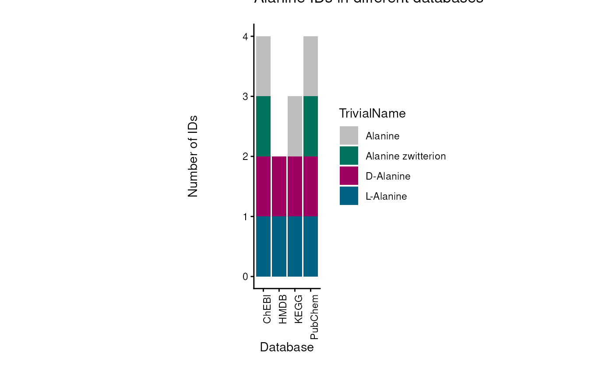

  
For instance, if we want to assign a HMDB ID, we have to assign both
“HMDB0001310” and “HMDB0000161” to the metabolite Alanine. For ChEBI we
could assign only one, “16449”, but this may lead to other problems as
this ChEBI ID is not specific and may not be part of certain metabolic
pathways. The reason for this is that substrate chirality is critical to
enzymatic processes, and enzymes are stereoselective, favouring one
particular enantiomer (e.g. D-sugars, L-amino acids, etc.).  
To showcase the severity of this problem, we can look at the occurrence
of those metabolite IDs in metabolic pathways across different
databases. To do so, we searched for those metabolite IDs in the RaMP
database (Braisted et al. 2023) and extracted the pathways they are part
of:  

| TrivialName        | ID          | Database | PathwayCount |
|:-------------------|:------------|:---------|-------------:|
| L-Alanine          | 16977       | ChEBI    |           44 |
| L-Alanine          | 5950        | PubChem  |           44 |
| L-Alanine          | C00041      | KEGG     |           44 |
| L-Alanine          | HMDB0000161 | HMDB     |           44 |
| D-Alanine          | 15570       | ChEBI    |            3 |
| D-Alanine          | 71080       | PubChem  |            3 |
| D-Alanine          | C00133      | KEGG     |            3 |
| D-Alanine          | HMDB0001310 | HMDB     |            3 |
| Alanine zwitterion | 57383916    | PubChem  |            0 |
| Alanine zwitterion | 66916       | ChEBI    |            0 |
| Alanine            | 16449       | ChEBI    |            4 |
| Alanine            | 602         | PubChem  |            4 |
| Alanine            | C01401      | KEGG     |            4 |

Alanine IDs mapped to pathways from WikiPathways, KEGG and Reactome
using RaMP. {.table .lightable-classic
style="font-size: 12px; font-family: Cambria; width: auto !important; margin-left: auto; margin-right: auto;"}

  

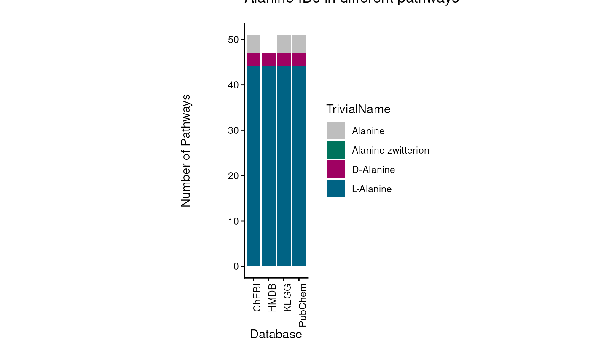

  
This showcases that if we choose the unspecific ChEBI ID for Alanine
(ChEBI ID 16449), because experimentally the distinction was not
possible, we will not map to any pathway, even though the metabolite is
part of many pathways. Hence, we recommend to assign multiple IDs to a
measured peak where specificity in detection is not given.  

  
Yet, many metabolomics studies do not report multiple IDs, but rather
one ID per measured peak. In some cases the chosen ID correctly
represents the degree of ambiguity in the detection, e.g. “Alanine
zwitterion”, whilst in other cases a specific ID is chosen that has not
been detected with this specificity, e.g. “L-Alanine”. In both cases
this can lead to missed mappings to prior knowledge and hence a loss of
information as discussed above.  
The function
[`equivalent_id()`](https://saezlab.github.io/MetaProViz/reference/equivalent_id.md)
helps with this: for each measured ID it adds the IDs of equivalent
metabolites (e.g. other enantiomers) that may not have been
distinguished in the measurement.  

``` r

# Example Cell-line data:
Input_HMDB <- FeatureMetadata_Cells %>%
    dplyr::filter(!HMDB == "NA") %>% # ID in the measured data we want to use, hence we remove NA's
    dplyr::select("HMDB", "Pathway") # only keep relevant columns

# Add equivalent IDs:
FeatureMetadata_Cells_AddIDs <- equivalent_id(
    data = Input_HMDB,
    metadata_info = c(InputID = "HMDB"), # ID in the measured data, here we use the HMDB ID
    from = "hmdb"
)
#> Warning in equivalent_id(data = Input_HMDB, metadata_info = c(InputID =
#> "HMDB"), : The following IDs are duplicated and removed: HMDB0000725,
#> HMDB0002013, HMDB0000267, HMDB0000755
#> chebi is used to find additional potential IDs for hmdb.
```

| HMDB | Pathway | PotentialAdditionalIDs |
|:---|:---|:---|
| HMDB0000014 | Pyrimidine metabolism | NA |
| HMDB0000033 | Not assigned | NA |
| HMDB0000043 | Not assigned | HMDB0059606 |
| HMDB0000045 | Purine metabolism | NA |
| HMDB0000050 | Purine metabolism | HMDB0004401, HMDB0004402, HMDB0004421 |
| HMDB0000052 | Alanine, aspartate and glutamate metabolism | HMDB0001006 |
| HMDB0000056 | Pyrimidine metabolism | NA |

Preview of the DF `FeatureMetadata_Cells_AddIDs` including new columns
with potential additional HMDB IDs assigned using the equivalent_id()
function. {.table .lightable-classic
style="font-size: 12px; font-family: Cambria; width: auto !important; margin-left: auto; margin-right: auto;"}

  
The Biocrates kit, which we will use in the rest of this tutorial, has
already done this for us: where the measurement is not specific,
multiple HMDB IDs are assigned to one feature (e.g. the two HMDB IDs of
L- and D-Alanine).

## Accessing Prior Knowledge

Metabolite prior knowledge (PK) is essential for the interpretation of
metabolomics data. It can be used to perform pathway enrichment analysis
and compound class enrichment analysis, and specific PK databases can be
used to study the connection of metabolites to receptors or
transporters. Since the quality and content of the PK will dictate the
success of the downstream analysis and biological interpretation, it is
important to ensure the PK is used correctly.  
Specifically in metabolite PK, the many different PK databases and
resources pose several issues. Indeed, the metabolite identifiers
(e.g. KEGG, HMDB, PubChem, etc.) are not standardized across databases,
and the same metabolite can have multiple identifiers in different
databases. This is known as the many-to-many mapping problem. Moreover,
metabolic pathways that are the basis of the PK databases also include
co-factors such as ions or other small molecules that are not only part
of most reactions, but often cannot be detected in experimentally
acquired data (e.g. H2O, CO2, etc).  
To address these issues and provide a standardized way to access and
integrate metabolite PK, we provide access to several prior knowledge
resources from which molecules such as water have been removed. We term
this collection of metabolite sets MetSigDB (Metabolite signature
database).  
In this section we load the resources we need for this tutorial.
MetSigDB contains further resources (Reactome, WikiPathways, MACdb),
which are introduced and compared in the [MetSigDB
vignette](https://saezlab.github.io/MetaProViz/articles/pkgdown/metsigdb.html).

### KEGG pathway-metabolite sets

KEGG pathways are loaded via the KEGG API using the package `KEGGREST`
and can be used to perform pathway analysis (Kanehisa and Goto 2000).
**(KEGG_Pathways)**  

``` r

# This will use KEGGREST to query the KEGG API to load the pathways:
KEGG_Pathways <- metsigdb_kegg()
```

  

| Description | MetaboliteID | term | Metabolite | pubchem | compound_names |
|:---|:---|:---|:---|:---|:---|
| map00010 | C00022 | Glycolysis / Gluconeogenesis | Pyruvate | 3324 | Pyruvate…. |
| map00010 | C00024 | Glycolysis / Gluconeogenesis | Acetyl-CoA | 3326 | Acetyl-C…. |
| map00010 | C00031 | Glycolysis / Gluconeogenesis | D-Glucose | 3333 | D-Glucos…. |
| map00030 | C00022 | Pentose phosphate pathway | Pyruvate | 3324 | Pyruvate…. |
| map00030 | C00031 | Pentose phosphate pathway | D-Glucose | 3333 | D-Glucos…. |
| map00030 | C00085 | Pentose phosphate pathway | D-Fructose 6-phosphate | 3385 | D-Fructo…. |

Preview of the DF `KEGG_Pathways`. {.table .lightable-classic
style="font-size: 12px; font-family: Cambria; width: auto !important; margin-left: auto; margin-right: auto;"}

### Chemical class-metabolite sets

The chemical class-metabolite sets are based on the classification of
metabolites into chemical classes, which can be used to perform compound
class enrichment analysis.  
The chemical class-metabolite sets were curated by RaMP-DB, which used
ClassyFire (Braisted et al. 2023). Here we access them via OmnipathR.  

``` r

ChemicalClass_MetabSet <- metsigdb_chemicalclass()
#> Cached file loaded from: ~/.cache/RaMP-ChemicalClass_Metabolite.rds
```

  

| class_source_id | common_name | ClassyFire_class | ClassyFire_super_class | ClassyFire_sub_class |
|:---|:---|:---|:---|:---|
| HMDB0000001 | 3-Methylhistidine; 1-Methylhistidine | Carboxylic acids and derivatives | Organic acids and derivatives | Amino acids, peptides, and analogues |
| HMDB0000479 | 3-Methylhistidine; 1-Methylhistidine | Carboxylic acids and derivatives | Organic acids and derivatives | Amino acids, peptides, and analogues |
| HMDB0000005 | 2-Ketobutyric acid | Keto acids and derivatives | Organic acids and derivatives | Short-chain keto acids and derivatives |
| HMDB0000008 | 2-Hydroxybutyric acid | Hydroxy acids and derivatives | Organic acids and derivatives | Alpha hydroxy acids and derivatives |
| HMDB0000010 | 2-Methoxyestrone | Steroids and steroid derivatives | Lipids and lipid-like molecules | Estrane steroids |
| HMDB0000172 | L-Isoleucine | Carboxylic acids and derivatives | Organic acids and derivatives | Amino acids, peptides, and analogues |
| HMDB0000174 | L-Fucose | Organooxygen compounds | Organic oxygen compounds | Carbohydrates and carbohydrate conjugates |
| HMDB0000175 | Inosinic acid | Purine nucleotides | Nucleosides, nucleotides, and analogues | Purine ribonucleotides |
| HMDB0000176 | Maleic acid | Carboxylic acids and derivatives | Organic acids and derivatives | Dicarboxylic acids and derivatives |
| HMDB0000783 | Propionylglycine | Carboxylic acids and derivatives | Organic acids and derivatives | Amino acids, peptides, and analogues |
| HMDB0000784 | Azelaic acid | Fatty Acyls | Lipids and lipid-like molecules | Fatty acids and conjugates |
| HMDB0000785 | N-Acetyl-7-O-acetylneuraminic acid | Organooxygen compounds | Organic oxygen compounds | Carbohydrates and carbohydrate conjugates |
| HMDB0000786 | Alloxan; Oxypurinol | Imidazopyrimidines | Organoheterocyclic compounds | Purines and purine derivatives |

Preview of the DF `ChemicalClass_MetabSet`. {.table .lightable-classic
style="font-size: 12px; font-family: Cambria; width: auto !important; margin-left: auto; margin-right: auto;"}

### Create pathway-metabolite sets

The function
[`make_gene_metab_set()`](https://saezlab.github.io/MetaProViz/reference/make_gene_metab_set.md)
can be used to convert gene names to metabolite names by using a PK
network of metabolic reactions called CosmosR (Dugourd et al. 2021).
This function is useful if you want to perform pathway enrichment
analysis on available gene-sets such as the Hallmarks gene-sets from
MSigDB (Castanza et al. 2022). Moreover, it enables you to perform
combined pathway enrichment analysis on metabolite-gene sets, if you
have other data types such as proteomics measuring the enzyme
expression.  
The Hallmarks (Liberzon et al. 2015) gene-sets and the Gaude (Gaude and
Frezza 2016) gene-sets are available in the package `MetaProViz` and can
be loaded using `data(hallmarks)` and `data(gaude_pathways)`
respectively.  

``` r

# Load the example gene-sets:
data(hallmarks)
Hallmark_Pathways <- hallmarks

data(gaude_pathways)
Gaude_Pathways <- gaude_pathways
```

  

| term                          | gene   |
|:------------------------------|:-------|
| HALLMARK_BILE_ACID_METABOLISM | GSTK1  |
| HALLMARK_BILE_ACID_METABOLISM | ABCG4  |
| HALLMARK_GLYCOLYSIS           | LDHC   |
| HALLMARK_GLYCOLYSIS           | ARPP19 |
| HALLMARK_GLYCOLYSIS           | LDHC   |
| HALLMARK_GLYCOLYSIS           | ARPP19 |
| HALLMARK_GLYCOLYSIS           | CENPA  |

Preview of the DF `Hallmark_Pathways` including gene-sets usable for
pathway enrichment analysis. {.table .lightable-classic
style="font-size: 12px; font-family: Cambria; width: auto !important; margin-left: auto; margin-right: auto;"}

  

| gene     | term              | UniqueGene           |
|:---------|:------------------|:---------------------|
| CPT1A    | Carnitine shuttle | Unique               |
| CPT1B    | Carnitine shuttle | Unique               |
| CPT1C    | Carnitine shuttle | Unique               |
| CPT2     | Carnitine shuttle | Unique               |
| CRAT     | Carnitine shuttle | Unique               |
| SLC22A4  | Carnitine shuttle | In multiple Pathways |
| SLC22A5  | Carnitine shuttle | In multiple Pathways |
| SLC25A20 | Carnitine shuttle | In multiple Pathways |
| ACO1     | Citric Acid Cycle | Unique               |
| ACO2     | Citric Acid Cycle | Unique               |
| GOT1     | Citric Acid Cycle | In multiple Pathways |

Preview of the DF `Gaude_Pathways` including gene-sets usable for
pathway enrichment analysis. {.table .lightable-classic
style="font-size: 12px; font-family: Cambria; width: auto !important; margin-left: auto; margin-right: auto;"}

  
Now we can use the function
[`make_gene_metab_set()`](https://saezlab.github.io/MetaProViz/reference/make_gene_metab_set.md)
to translate the gene names to metabolite names.

``` r

# Translate gene names to metabolite names
Hallmarks_GeneMetab <- make_gene_metab_set(
    input_pk = Hallmark_Pathways,
    metadata_info = c(Target = "gene"),
    pk_name = "Hallmarks"
)

Gaude_GeneMetab <- make_gene_metab_set(
    input_pk = Gaude_Pathways,
    metadata_info = c(Target = "gene"),
    pk_name = "Gaude"
)
```

  

| term                | feature     |
|:--------------------|:------------|
| HALLMARK_GLYCOLYSIS | ME2         |
| HALLMARK_GLYCOLYSIS | LDHC        |
| HALLMARK_GLYCOLYSIS | FKBP4       |
| HALLMARK_GLYCOLYSIS | HMDB0000241 |
| HALLMARK_GLYCOLYSIS | HMDB0000570 |
| HALLMARK_GLYCOLYSIS | HMDB0000122 |

Preview of the DF `Hallmarks_GeneMetab` including gene-metabolite-sets
usable for pathway enrichment analysis. {.table .lightable-classic
style="font-size: 12px; font-family: Cambria; width: auto !important; margin-left: auto; margin-right: auto;"}

  
Given that we have the gene-metabolite-sets, we can now also run
enrichment analysis on combined data types, including both the
metabolite Log2FC and the gene Log2FC from e.g. transcriptomics or
proteomics data. Yet, it is important to keep in mind that generally we
detect fewer metabolites than genes and hence this may bias the results
obtained from combined enrichment analysis.

### MetaLinksDB metabolite-receptor & metabolite-transporter sets

The MetaLinks database is a manually curated database of
metabolite-receptor and metabolite-transporter sets that can be used to
study the connection of metabolites and receptors or transporters (Farr
et al. 2024).  

``` r

MetaLinksDB <- metsigdb_metalinks()
```

  

| metabolite | protein_name | type | mor | transport_direction | combined_score | mode_of_regulation | protein_type_clean | receptor_class |
|:---|:---|:---|---:|:---|---:|:---|:---|:---|
| Pentadecanal | NA | Production-Degradation | 1 | NA | NA | Activating | NA | NA |
| Adenosine triphosphate | NA | Production-Degradation | -1 | NA | NA | Inhibiting | NA | NA |
| 3-Oxooctadecanoyl-CoA | NA | Production-Degradation | 1 | NA | NA | Activating | NA | NA |
| Malonyl-CoA | NA | Production-Degradation | -1 | NA | NA | Inhibiting | NA | NA |
| Triiodothyronine sulfate | NA | Production-Degradation | 1 | NA | NA | Activating | NA | NA |
| Adenosine monophosphate | NA | Production-Degradation | -1 | NA | NA | Inhibiting | NA | NA |

Preview of the DF `MetaLinksDB` including metabolite-receptor sets.
{.table .lightable-classic
style="font-size: 12px; font-family: Cambria; width: auto !important; margin-left: auto; margin-right: auto;"}

| metabolite | protein_name | gene_symbol | uniprot | hmdb | type | mor | transport_direction | protein_type | source | experiment_score | combined_score | mode_of_regulation | protein_type_clean | receptor_class | interaction_family | interaction_annotation_status | interaction_mechanism | regulation_polarity | transport_direction_label | transport_mode | evidence_class | experiment_evidence_present | combined_confidence_tier | interaction_detail | interaction | direction | term_specific |
|:---|:---|:---|:---|:---|:---|---:|:---|:---|:---|---:|---:|:---|:---|:---|:---|:---|:---|:---|:---|:---|:---|:---|:---|:---|:---|:---|:---|
| D-Fructose | NA | SLC5A10 | A0PJK1 | HMDB0000660 | Production-Degradation | 1 | out | “transporter” | recon | NA | NA | Activating | transporter | NA | Transporter-metabolite | transporter_with_pd_edge | Transport | Positive (activating) | Export/Secretion | Efflux transporter | Metabolic knowledgebase | No/Unknown | Unknown | Efflux transporter; Positive (activating) | Transport_Out | to_term | transporter_Production-Degradation |
| Heneicosanoic acid | NA | FABP12 | A6NFH5 | HMDB0002345 | Production-Degradation | 1 | out | “other_protein” | recon | NA | NA | Activating | other_protein | NA | Transporter-metabolite | transporter_with_pd_edge | Transport | Positive (activating) | Export/Secretion | Efflux transporter | Metabolic knowledgebase | No/Unknown | Unknown | Efflux transporter; Positive (activating) | Transport_Out | to_term | other_protein_Production-Degradation |
| L-Glutamic acid | NA | GRM8 | O00222 | HMDB0000148 | Ligand-Receptor | 1 | NA | “gpcr” | CellPhoneDB | 0 | 986 | Activating | gpcr | GPCR | Receptor-metabolite | source_annotations_concordant_or_incomplete | Ligand-receptor signaling | Positive (activating) | Not specified | NA | Cell-cell communication resource | No/Unknown | Very high | GPCR; Positive (activating) | Ligand-Receptor | to_term | gpcr_Ligand-Receptor |
| 12-HETE | NA | GPR31 | O00270 | HMDB0006111 | Ligand-Receptor | 0 | NA | “gpcr” | Stitch | 0 | 907 | Binding | gpcr | GPCR | Receptor-metabolite | source_annotations_concordant_or_incomplete | Ligand-receptor signaling | Neutral (binding) | Not specified | NA | Chemical-protein interaction resource | No/Unknown | Very high | GPCR; Neutral (binding) | Ligand-Receptor | to_term | gpcr_Ligand-Receptor |

Preview of the metabolite-receptor and metabolite-transporter sets.
{.table .lightable-classic
style="font-size: 12px; font-family: Cambria; width: auto !important; margin-left: auto; margin-right: auto;"}

### Comparison of PK coverage

We have now loaded a number of different PK sources (details above) and
aim to compare the overlap in coverage between these PK sources to
understand if there are certain genes or metabolites covered by one PK
resource but not the others. As an example, we will compare the
resources containing gene-metabolite sets (Hallmarks, Gaude,
MetaLinksDB) using the
[`compare_pk()`](https://saezlab.github.io/MetaProViz/reference/compare_pk.md)
function, which generates a combined data table and visualises it as an
upset plot. The upset plot shows the overlap of coverage, similar to how
a Venn diagram works, but enables us to visualise many combinations
clearly.

``` r

# Compare the PK resources
pk_comp_res <- compare_pk(
    data = list(
        Hallmarks = as.data.frame(Hallmarks_GeneMetab[["GeneMetabSet"]]),
        Gaude = as.data.frame(Gaude_GeneMetab[["GeneMetabSet"]]),
        MetalinksDB = as.data.frame(MetaLinksDB)
    )
)
#> Warning: `aes_string()` was deprecated in ggplot2 3.0.0.
#> ℹ Please use tidy evaluation idioms with `aes()`.
#> ℹ See also `vignette("ggplot2-in-packages")` for more information.
#> ℹ The deprecated feature was likely used in the MetaProViz package.
#>   Please report the issue at <https://github.com/saezlab/MetaProViz/issues>.
#> This warning is displayed once per session.
#> Call `lifecycle::last_lifecycle_warnings()` to see where this warning was
#> generated.
#> Warning: Using `size` aesthetic for lines was deprecated in ggplot2 3.4.0.
#> ℹ Please use `linewidth` instead.
#> ℹ The deprecated feature was likely used in the ComplexUpset package.
#>   Please report the issue at
#>   <https://github.com/krassowski/complex-upset/issues>.
#> This warning is displayed once per session.
#> Call `lifecycle::last_lifecycle_warnings()` to see where this warning was
#> generated.
```

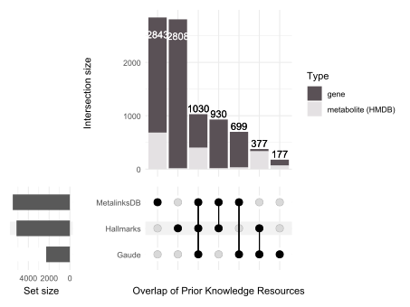

  
The table includes all features of the three PK resources we decided to
compare. Additionally, it includes a column for each PK resource with
value 1 if the feature is present in the PK resource and 0 if it is not.
The column “Type” specifies which ID type the feature corresponds to,
here either metabolite (HMDB) or gene, which is used for visualisation
purposes in the upset plot.  

| Feature | Hallmarks | Gaude | MetalinksDB | Type | None |
|:--------|----------:|------:|------------:|:-----|-----:|
| FABP4   |         1 |     0 |           1 | gene |    0 |
| ADIPOQ  |         1 |     0 |           0 | gene |    0 |
| PPARG   |         1 |     0 |           1 | gene |    0 |
| LIPE    |         1 |     0 |           1 | gene |    0 |
| DGAT1   |         1 |     1 |           1 | gene |    0 |
| LPL     |         1 |     1 |           1 | gene |    0 |
| CPT2    |         1 |     1 |           1 | gene |    0 |
| CD36    |         1 |     0 |           1 | gene |    0 |

Preview of the DF `pk_comp_res$summary_table` showing coverage of
features (genes or metabolites) across PK sources. {.table
.lightable-classic
style="font-size: 12px; font-family: Cambria; width: auto !important; margin-left: auto; margin-right: auto;"}

  
The upset plot shows that MetaLinksDB has unique genes and metabolites
not present in the other resources. This is to be expected, since
MetaLinksDB focuses on receptors, transporters and metabolic enzymes,
whilst Gaude and Hallmarks focus on pathways.  
Since Gaude only focuses on metabolic enzymes of pathways, it contains a
low number of genes and hence has a small amount of unique genes and
metabolites. In this regard it makes sense that Hallmarks includes many
unique genes, since Hallmarks also includes other genes and pathways not
related to metabolism. Between Hallmarks and Gaude we observe a high
overlap of metabolites. This can be explained since both gene-sets are
assigned metabolites by using the same metabolic reaction network in the
backend of
[`make_gene_metab_set()`](https://saezlab.github.io/MetaProViz/reference/make_gene_metab_set.md),
and it is important to keep in mind that this network dictates the
gene-metabolite associations added.

## Linking experimental data to prior knowledge

Now that we have loaded the prior knowledge and inspected the overlap of
genes and metabolites between the different PK resources, in this
section we want to link our experimental data to the PK.  
Whichever resource the experimental data resembles, we recommend to
follow this overall approach:  
  
1. Determine the metabolite identifiers from the experimental data and
inspect their coverage.  
2. Select the metabolite identifiers from the experimental data, which
can be used to link to the PK of interest.  
3. Connect the metabolite identifiers to the PK and assess the
overlap.  

  
Here one can select any combination of experimental data and PK. This
selection should be based on the experimental data at hand and the
biological research question.  
For this tutorial, we will focus on the combination of the Biocrates
experimental data and the MetaLinksDB PK. The reason for using the
landscape of metabolites included in the Biocrates kit is that Biocrates
has assigned multiple types of metabolite IDs to each measurement (LIPID
MAPS, HMDB, ChEBI) and, where needed, multiple IDs of one type to one
measurement (e.g. the two HMDB IDs of L- and D-Alanine).

### Determine identifiers and inspect coverage

First we determine the identifiers and inspect the coverage.  
In experimentally acquired data, different metabolite IDs can be used to
describe a metabolite. In the Biocrates data the available metabolite
identifiers that could be linked to PK resources are mostly ChEBI, HMDB,
and LIPID MAPS (LIMID). We now select these metabolite identifier
columns to count the coverage and look at the combinations of the
coverage grouped by the class of metabolite. This helps us to understand
what to expect when linking the data to prior knowledge.  

``` r

pk_comp_res_biocft <- compare_pk(
    data = list(Biocft = FeatureMetadata_Biocrates),
    metadata_info = list(Biocft = c("CHEBI", "HMDB", "LIMID")),
    plot_name = "Overlap of BioCrates Columns",
    print_plot = FALSE
)
```

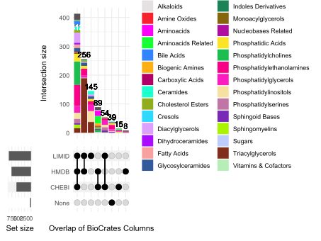

  

| TrivialName | CHEBI | HMDB | LIMID | None | Class               |
|:------------|------:|-----:|------:|-----:|:--------------------|
| 1-Met-His   |     1 |    1 |     0 |    0 | Aminoacids Related  |
| 3-IAA       |     1 |    1 |     0 |    0 | Indoles Derivatives |
| 3-IPA       |     1 |    1 |     0 |    0 | Indoles Derivatives |
| 3-Met-His   |     1 |    1 |     0 |    0 | Aminoacids Related  |
| 5-AVA       |     1 |    1 |     1 |    0 | Aminoacids Related  |
| AABA        |     1 |    1 |     1 |    0 | Aminoacids Related  |
| AbsAcid     |     1 |    1 |     1 |    0 | Hormones            |
| Ac-Orn      |     1 |    1 |     0 |    0 | Aminoacids Related  |

Preview of the DF `pk_comp_res_biocft$summary_table` showing coverage of
identifiers. {.table .lightable-classic
style="font-size: 12px; font-family: Cambria; width: auto !important; margin-left: auto; margin-right: auto;"}

  
These results tell us that:  

- Less than half of the metabolites have ***CHEBI+HMDB+LIMID (n=413)***,
  which isn’t great, but probably higher than we would have expected.  

- If you relied only upon:  

  - CHEBI: then you would miss at least 256 metabolites with HMDB+LIMID

  - HMDB: then you would miss at least 54 metabolites with CHEBI+LIMID

  - LIMID: then you would miss at least 89 metabolites with CHEBI+HMDB

However, there are two things to note about these observations.

The first is that these numbers are minimums; the real values are a
little higher once you add, for instance, metabolites with just CHEBI or
just LIMID. So actually, relying upon only LIMID means we miss 151
Biocrates metabolites (89 with only HMDB/ChEBI + 15 with only CHEBI + 8
with only HMDB and 39 with no LIMID/CHEBI/HMDB identifiers).

The second point is more nuanced but just as important: there is no
direct 1:1 relationship between the number of Biocrates metabolites
with, for instance, a ChEBI ID, and the number of unique ChEBI IDs that
they map to. The upset plot treats each Biocrates metabolite as an
individual entry and categorises whether it has a ChEBI, HMDB, LIMID ID,
etc. However, it does not consider what those ChEBI, HMDB or LIMID IDs
actually are. So it is possible that the number of metabolites is
higher, or lower, than the number of unique IDs due to multi-mapping.

For example, assume we have 3 Biocrates metabolites with only HMDB IDs.
These count as 3 entries in the upset plot. But two of these Biocrates
metabolites could both map to the same HMDB ID, whereas the third
Biocrates metabolite could map to 6 different HMDB IDs. In this case,
there are 3 Biocrates metabolites with HMDB IDs but 7 unique HMDB IDs.
Hence, it is important to keep this in mind when interpreting the upset
plot.

### Select identifiers to link to PK of interest

We have inspected the experimental coverage of the metabolite IDs from
the Biocrates kit. Next, we have to choose which metabolite identifier
to use to link to the PK of choice. Often this choice is dictated by the
prior knowledge resource, as most of them use a specific identifier.  
Here we will use MetaLinksDB, which uses HMDB IDs as metabolite
identifiers, hence it is best to use the HMDB IDs to link the Biocrates
features to the resource. Noteworthy, in some cases the Biocrates
metabolites have multiple HMDB IDs listed per metabolite. We can count
them using
[`count_id()`](https://saezlab.github.io/MetaProViz/reference/count_id.md):  

``` r

# Count entries and record NA information
result_bioc_hmdb_count <- count_id(FeatureMetadata_Biocrates, "HMDB", delimiter = ", ")
```

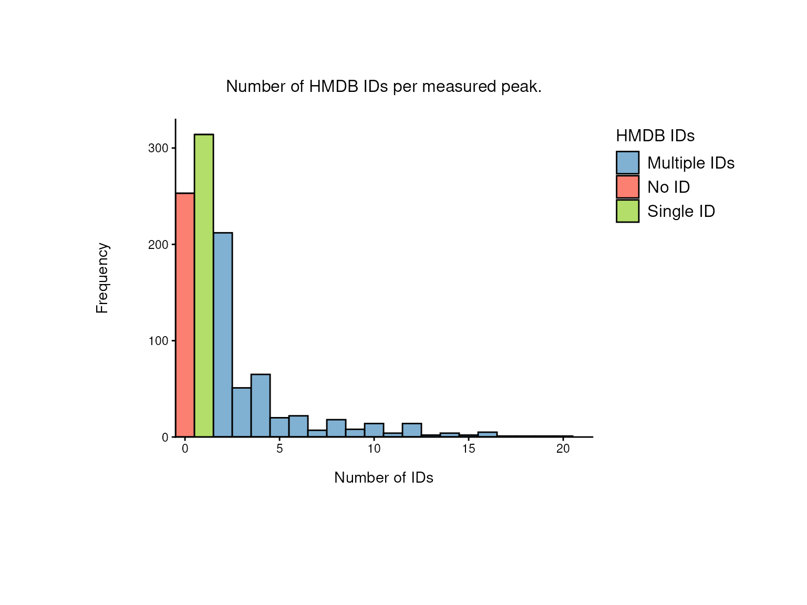

``` r

# Access the processed data:
processed_df_bioc_hmdb_count <- result_bioc_hmdb_count$Table
```

From this plot we can make a few observations:  
1. The number of Biocrates features without any HMDB ID is very high
(n=253).  
2. Whilst a number of Biocrates features have only a single HMDB ID
associated with them (n=314), the majority of Biocrates metabolites
actually have multiple entries (n=452).  
3. For those with multiple, this ranges from 2-20 HMDB IDs per Biocrates
feature!  

With so many Biocrates features linked to multiple HMDB IDs there are
different ways to deal with this (e.g. select a single HMDB ID in cases
where we have multiple). We discuss the pros and cons of this in section
[3.4 Are multiple metabolite IDs helpful or a hindrance?](#sect3_4). For
now, we proceed with making the connections to the PK using all HMDB
IDs, which the MetaProViz function
[`checkmatch_pk_to_data()`](https://saezlab.github.io/MetaProViz/reference/checkmatch_pk_to_data.md)
has been designed to handle.

### Make connection to PK and assess overlap

Here we connect the experimental Biocrates table to the MetaLinksDB PK
via the HMDB IDs using the
[`checkmatch_pk_to_data()`](https://saezlab.github.io/MetaProViz/reference/checkmatch_pk_to_data.md)
function.  

``` r

Biocrates_to_MetalinksDB <- checkmatch_pk_to_data(
    data = FeatureMetadata_Biocrates,
    input_pk = MetaLinksDB,
    metadata_info = c(InputID = "HMDB", PriorID = "hmdb", grouping_variable = NULL)
)
#> Warning in checkmatch_pk_to_data(data = FeatureMetadata_Biocrates, input_pk =
#> MetaLinksDB, : 253 NA values were removed from column HMDB
#> Warning in checkmatch_pk_to_data(data = FeatureMetadata_Biocrates, input_pk =
#> MetaLinksDB, : 4 duplicated IDs were removed from column HMDB
#> No metadata_info grouping_variable provided. If this was not intentional, please check your input.
#> Warning in checkmatch_pk_to_data(data = FeatureMetadata_Biocrates, input_pk =
#> MetaLinksDB, : 35390 duplicated IDs were removed from PK column hmdb
#> data has multiple IDs per measurement = TRUE. input_pk has multiple IDs per entry = FALSE.
#> data has 762 unique entries with 2027 unique HMDB IDs. Of those IDs, 176 match, which is 8.68278243709916%.
#> input_pk has 1116 unique entries with 1116 unique hmdb IDs. Of those IDs, 176 are detected in the data, which is 15.7706093189964%.
#> Warning in checkmatch_pk_to_data(data = FeatureMetadata_Biocrates, input_pk =
#> MetaLinksDB, : There are cases where multiple detected IDs match to multiple
#> prior knowledge IDs of the same category
```

  
This returns some warning messages and three tables:  

- `data_summary`: a summary table with the links to the prior knowledge,
  including pointers if any action is required. Any NA values or
  duplicates of the InputID (e.g. ‘HMDB’) are removed from this table.

- `GroupingVariable_summary`: an extended version of the summary, where
  the grouping variable is taken into account, e.g. for
  pathway-metabolite sets this would include duplicated InputIDs as they
  are in multiple pathways.

- `data_long`: an all-versus-all comparison to enable checking on a
  case-by-case basis.

In some cases we expect only one input ID to be linked to one entry in
the PK. But this won’t always be the case, and as already discussed in
the last section, in many cases here we have multiple HMDB IDs per
single Biocrates feature.
[`checkmatch_pk_to_data()`](https://saezlab.github.io/MetaProViz/reference/checkmatch_pk_to_data.md)
has been designed with this in mind: by default it splits any comma
separated values in the InputID (or PriorID) into separate entities,
counts the number of links between these, and reports this to the user.

Let’s take a look at the results:

| HMDB | matches | original_count | matches_count | GroupingVariable | Count_FeatureIDs_to_GroupingVariable | Group_Conflict_Notes | Unique_GroupingVariable_count | ActionRequired | InputID_select | Action_Specific |
|:---|:---|---:|---:|:---|:---|:---|---:|:---|:---|:---|
| HMDB0000001 | NA | 1 | 0 | NA | NA | None | 0 | None | HMDB0000001 | None |
| HMDB0000033 | NA | 1 | 0 | NA | NA | None | 0 | None | HMDB0000033 | None |
| HMDB0000036 | HMDB0000036 | 1 | 1 | OneGroup | 1 | None | 1 | None | HMDB0000036 | None |
| HMDB0000043 | HMDB0000043 | 1 | 1 | OneGroup | 1 | None | 1 | None | HMDB0000043 | None |
| HMDB0000056 | HMDB0000056 | 1 | 1 | OneGroup | 1 | None | 1 | None | HMDB0000056 | None |
| HMDB0000062 | HMDB0000062 | 1 | 1 | OneGroup | 1 | None | 1 | None | HMDB0000062 | None |
| HMDB0000063 | HMDB0000063 | 1 | 1 | OneGroup | 1 | None | 1 | None | HMDB0000063 | None |
| HMDB0000072, HMDB0000958 | NA | 2 | 0 | NA, NA | NA, NA | None | 0 | None | HMDB0000072 | None |

Preview of the DF `data_summary` showing coverage of identifiers (some
columns hidden) {.table .lightable-classic
style="font-size: 12px; font-family: Cambria; width: auto !important; margin-left: auto; margin-right: auto;"}

  
For a few metabolite classes of the Biocrates kit, every metabolite has
a HMDB ID and a corresponding entry in MetaLinksDB. For a number of
other classes, however, we see that they are not represented in the
MetaLinksDB PK at all, either because there is no HMDB ID associated
with the Biocrates metabolite, or because MetaLinksDB does not include
the HMDB ID of that metabolite.  
This poor coverage could be a concern if we are interested in analysing
many of these classes, since it means that our experimental results for
e.g. Phosphatidylglycerols will not be linked to PK. In any case we need
to keep this in mind for downstream analysis and the interpretation of
results, so that we don’t overinterpret results that, for instance,
include a large number of amino acids, or falsely assume that the
absence of Phosphatidylinositols in our PK integration results means
that they are not present or important in our data.

### Are multiple metabolite IDs helpful or a hindrance?

Let’s turn back to the number of HMDB IDs we have in the Biocrates data
and ask ourselves: is it helpful or detrimental to have multiple IDs? To
answer this, we take only the first HMDB ID of each feature with
multiple HMDB IDs, repeat the matching and compare the number of
matches.

``` r

# Number of matches using all HMDB IDs:
MultipleIDs <- Biocrates_to_MetalinksDB$data_summary %>%
    summarise(total_matches_count = sum(matches_count, na.rm = TRUE)) %>%
    mutate(Name = "MultipleIDs")

# Extract first ID:
extract_first_id <- function(id_col) {
    map_chr(as.character(id_col), function(x) {
        # Check for NA or empty string
        if (is.na(x) || x == "") {
            return(NA)
        }
        # Split on comma (adjust the delimiter if needed)
        parts <- unlist(strsplit(x, split = ","))
        # Return the first value after trimming any whitespace
        return(trimws(parts[1]))
    })
}

# Create a copy of the df
FeatureMetadata_Biocrates_singleHMDB <- FeatureMetadata_Biocrates
# Get the first entry of each HMDB ID
FeatureMetadata_Biocrates_singleHMDB$HMDB_single <- extract_first_id(FeatureMetadata_Biocrates$HMDB)

# Visually check that the single ID function has worked:
result_bioc_hmdb_count_single <- count_id(FeatureMetadata_Biocrates_singleHMDB, "HMDB_single")
```

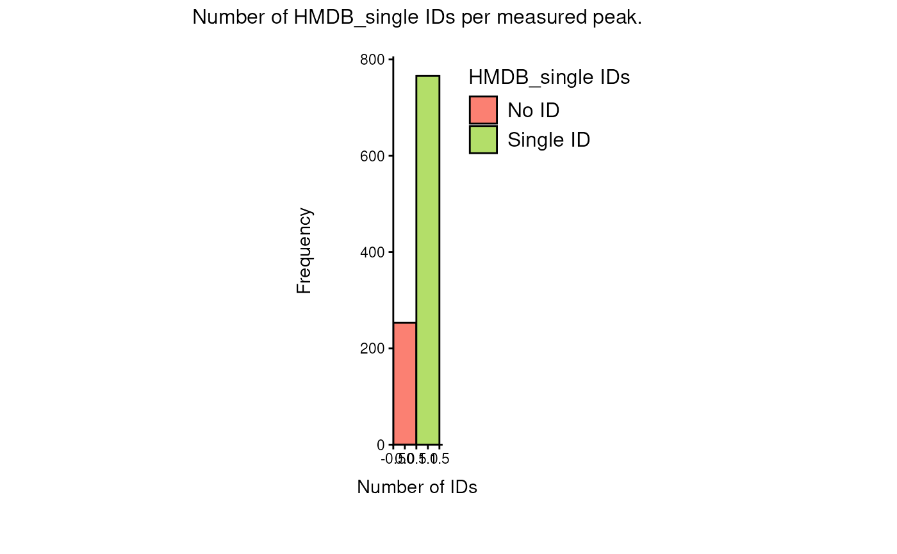

``` r


# Check the matches:
Biocrates_to_MetalinksDB_singleHMDB <- checkmatch_pk_to_data(
    data = FeatureMetadata_Biocrates_singleHMDB,
    input_pk = MetaLinksDB,
    metadata_info = c(InputID = "HMDB_single", PriorID = "hmdb", grouping_variable = NULL)
)
#> Warning in checkmatch_pk_to_data(data = FeatureMetadata_Biocrates_singleHMDB, :
#> 253 NA values were removed from column HMDB_single
#> Warning in checkmatch_pk_to_data(data = FeatureMetadata_Biocrates_singleHMDB, :
#> 49 duplicated IDs were removed from column HMDB_single
#> No metadata_info grouping_variable provided. If this was not intentional, please check your input.
#> Warning in checkmatch_pk_to_data(data = FeatureMetadata_Biocrates_singleHMDB, :
#> 35390 duplicated IDs were removed from PK column hmdb
#> data has multiple IDs per measurement = FALSE. input_pk has multiple IDs per entry = FALSE.
#> data has 717 unique entries with 717 unique HMDB_single IDs. Of those IDs, 147 match, which is 20.5020920502092%.
#> input_pk has 1116 unique entries with 1116 unique hmdb IDs. Of those IDs, 147 are detected in the data, which is 13.1720430107527%.

# Number of matches using a single HMDB ID:
SingleIDs <- Biocrates_to_MetalinksDB_singleHMDB$data_summary %>%
    summarise(total_matches_count = sum(matches_count, na.rm = TRUE)) %>%
    mutate(Name = "SingleID")

# Compare:
bind_rows(MultipleIDs, SingleIDs) %>%
    preview_table(caption = "Comparison of IDs found in the MetaLinksDB PK when having multiple versus a single HMDB ID in the measured data.", row.names = FALSE)
```

| total_matches_count | Name        |
|--------------------:|:------------|
|                 208 | MultipleIDs |
|                 147 | SingleID    |

Comparison of IDs found in the MetaLinksDB PK when having multiple
versus a single HMDB ID in the measured data. {.table .lightable-classic
style="font-size: 12px; font-family: Cambria; width: auto !important; margin-left: auto; margin-right: auto;"}

This shows that using multiple HMDB IDs has resulted in more metabolites
from Biocrates being linked to MetaLinksDB than would have been possible
if we only used the first HMDB ID available to us. Hence, while having
multiple IDs for a single detected peak may add complexity, we recommend
against prematurely dropping any IDs until you have mapped to the PK or
have thoroughly assessed what impact the removal may have.

### Deeper investigation of MetaLinksDB metabolite-protein interactions

Now that we have investigated the coverage of metabolite ID annotations
and their matches to prior knowledge, we can go a step further and look
into the interactions of the measured metabolites with transporters,
receptors and metabolic enzymes. For that, we subset MetaLinksDB by the
“interaction_family” column, which contains one of the following
categories: “Other protein-metabolite”, “Transporter-metabolite”,
“Receptor-metabolite”, and “Enzyme-metabolite”, and visualise each
subset using the
[`viz_pk_network()`](https://saezlab.github.io/MetaProViz/reference/viz_pk_network.md)
function.

Due to the number of Biocrates features and the size of MetaLinksDB,
these visualisations quickly become convoluted. Hence, we only
investigate the amino acid subset of the Biocrates features.

``` r

# Get MetaLinksDB subsets based on interaction_family:
metalinks_receptor <- MetaLinksDB %>% filter(interaction_family == "Receptor-metabolite")
metalinks_transporter <- MetaLinksDB %>% filter(interaction_family == "Transporter-metabolite")
metalinks_metabolic_enzyme <- MetaLinksDB %>% filter(interaction_family == "Enzyme-metabolite")

# Subset biocrates_features to amino acids:
biocrates_amino_acids <- biocrates_features %>%
    filter(
        Class %in% c("Aminoacids Related", "Aminoacids")
    )

# Columns to match the Biocrates features to MetaLinksDB and to style the network:
metalinks_info <- c(
    InputID = "HMDB",
    InputLabel = "TrivialName",
    PriorID = "hmdb",
    PriorTerm = "gene_symbol",
    EdgeColor = "interaction",
    EdgeLinetype = "mode_of_regulation",
    EdgeDirection = "direction"
)
```

Plot the metabolite-protein interaction network of the Biocrates amino
acids and MetaLinksDB receptors:

``` r

# receptor-network
biocrates_metalinks_receptor <- viz_pk_network(
    feature_metadata = biocrates_amino_acids,
    input_pk = metalinks_receptor,
    metadata_info = metalinks_info,
    id_sep = ",",  # biocrates_features has possibly multiple HMDB IDs per feature, separated by ", "
    label_mode = "reduced",
    plot_name = "biocrates_aminoacids_to_metalinks_receptor_network",
    save_plot = NULL
)
```

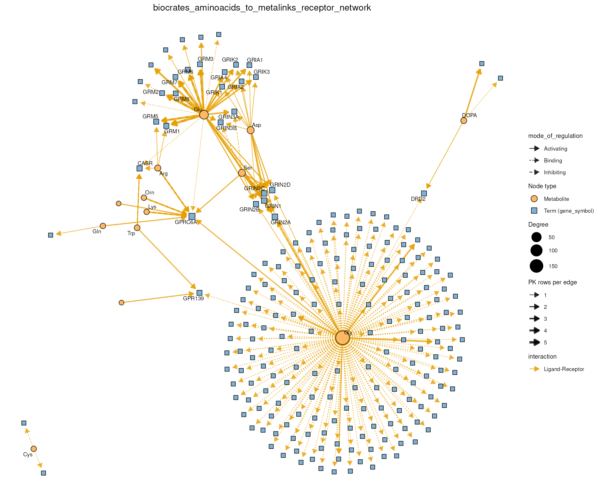

While the network above shows the specific interactions of metabolites
with proteins,
[`viz_shared_pk_network()`](https://saezlab.github.io/MetaProViz/reference/viz_shared_pk_network.md)
shows how the metabolites share interactions with the same proteins. It
takes the same inputs:

``` r

# receptor-sharing
biocrates_metalinks_receptor_shared <- viz_shared_pk_network(
    feature_metadata = biocrates_amino_acids,
    input_pk = metalinks_receptor,
    metadata_info = metalinks_info,
    id_sep = ",",
    plot_name = "biocrates_aminoacids_sharing_metalinks_receptors",
    save_plot = NULL
)
```

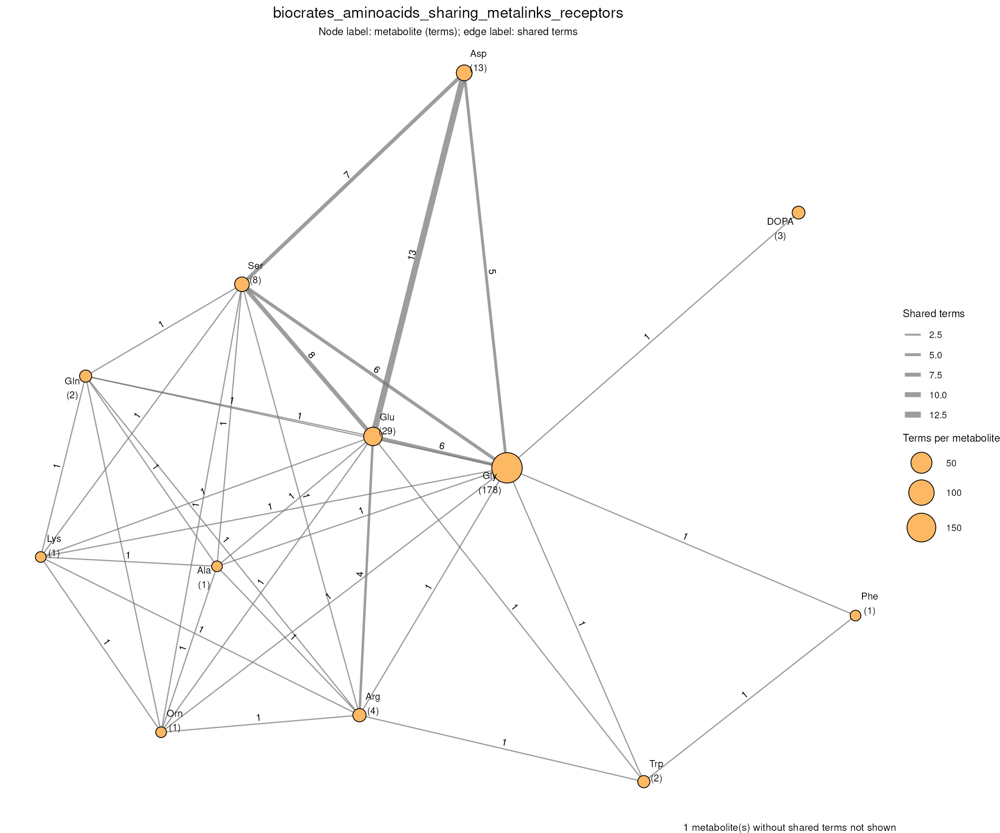

Plot the metabolite-protein interaction network of the Biocrates amino
acids and MetaLinksDB transporters, and how the amino acids share
transporters:

``` r

# transporter-network
biocrates_metalinks_transporter <- viz_pk_network(
    feature_metadata = biocrates_amino_acids,
    input_pk = metalinks_transporter,
    metadata_info = metalinks_info,
    id_sep = ",",
    label_mode = "reduced",
    plot_name = "biocrates_aminoacids_to_metalinks_transporter_network",
    save_plot = NULL
)
```

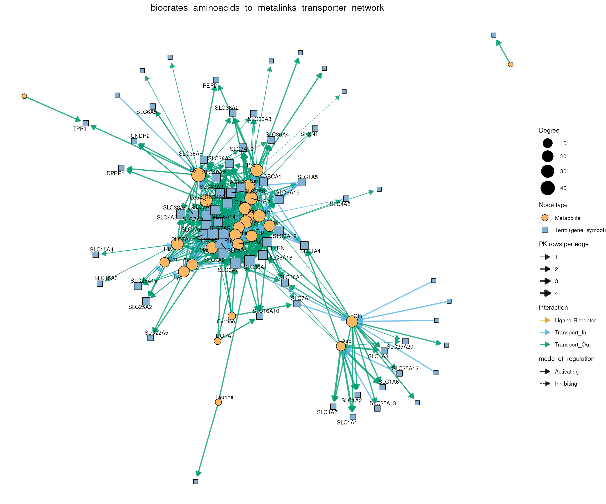

``` r


# Most amino acids share some transporters. To focus on the strongly
# overlapping pairs we use the Jaccard index with a threshold and omit
# the edge labels, as the edge width shows the Jaccard index as well:
biocrates_metalinks_transporter_shared <- viz_shared_pk_network(
    feature_metadata = biocrates_amino_acids,
    input_pk = metalinks_transporter,
    metadata_info = metalinks_info,
    similarity = "jaccard",
    threshold = 0.5,
    edge_labels = FALSE,
    id_sep = ",",
    plot_name = "biocrates_aminoacids_sharing_metalinks_transporters",
    save_plot = NULL
)
```

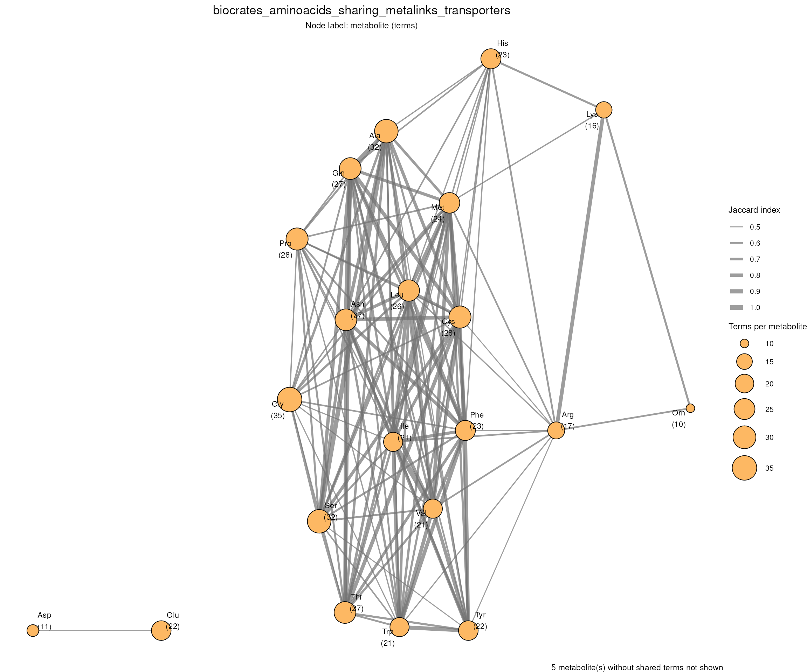

Plot the metabolite-protein interaction network of the Biocrates amino
acids and MetaLinksDB metabolic enzymes, and how the amino acids share
metabolic enzymes:

``` r

# metabolic-enzyme-network
biocrates_metalinks_metabolic_enzyme <- viz_pk_network(
    feature_metadata = biocrates_amino_acids,
    input_pk = metalinks_metabolic_enzyme,
    metadata_info = metalinks_info,
    id_sep = ",",
    label_mode = "reduced",
    plot_name = "biocrates_aminoacids_to_metalinks_metabolic_enzyme_network",
    save_plot = NULL
)
```

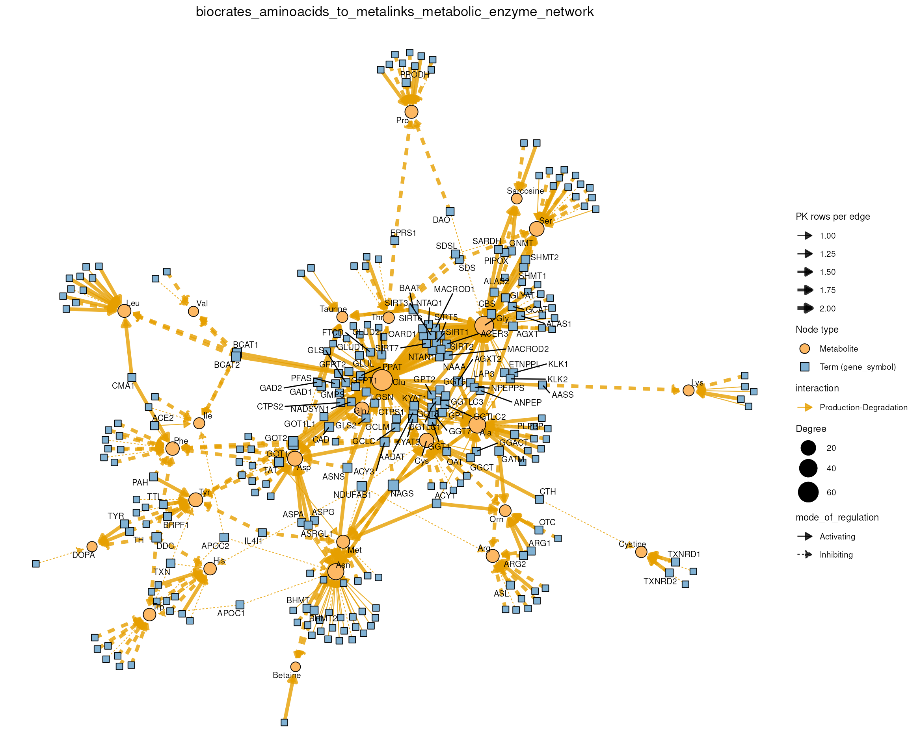

``` r


biocrates_metalinks_metabolic_enzyme_shared <- viz_shared_pk_network(
    feature_metadata = biocrates_amino_acids,
    input_pk = metalinks_metabolic_enzyme,
    metadata_info = metalinks_info,
    id_sep = ",",
    plot_name = "biocrates_aminoacids_sharing_metalinks_metabolic_enzymes",
    save_plot = NULL
)
```

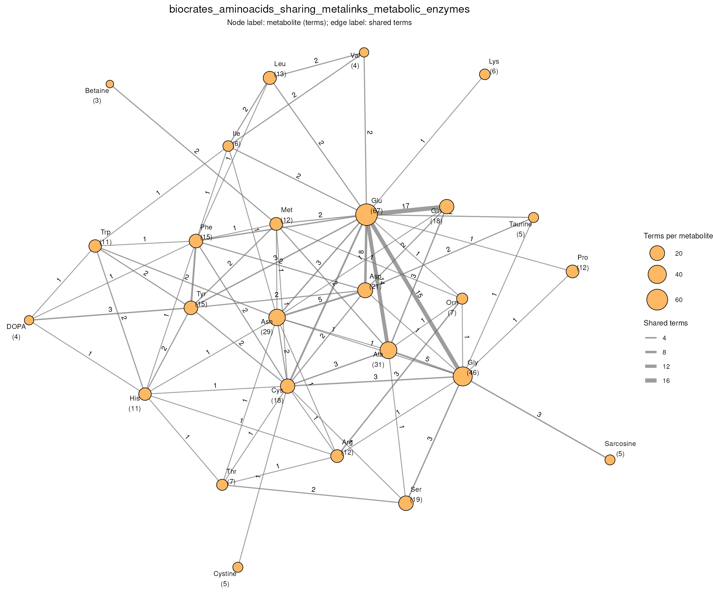

In the sharing networks, the number beneath each metabolite is its total
number of interacting proteins and the edge labels show the number of
shared proteins. For example, in the receptor subset of MetaLinksDB, we
observe many interactions for Glutamic acid (Glu) and Glycine (Gly).
Indeed, the corresponding sharing plot shows that Gly and Glu share 6
proteins which they interact with. Additionally, we see that Glu and Asp
(Aspartic acid) share 13 receptors, which are all 13 receptors of Asp,
while Glu interacts with 29 receptors, hinting at a possibly higher
receptor specificity of Aspartic acid in comparison to a more versatile
interaction profile of Glutamic acid. As the raw number of shared
proteins favours metabolites with many interactions,
[`viz_shared_pk_network()`](https://saezlab.github.io/MetaProViz/reference/viz_shared_pk_network.md)
can also use the Jaccard index (Jaccard 1901) as edge weight (parameter
`similarity`), as we did for the transporters above. More examples are
shown in the [CoRe Metabolomics
vignette](https://saezlab.github.io/MetaProViz/articles/pkgdown/core-metabolomics.html).
Note, however, that metabolite-protein interactions have various
interaction properties and binding mechanisms, and that prior knowledge
resources are always biased towards well-studied small molecules and
proteins. Therefore, the overlap graph hints at shared protein
interactions, but does not show that two metabolites interact with those
proteins in the same way.

## Translate IDs

  

**Important Information:** Translating IDs between databases, e.g. KEGG
to HMDB, is a non-trivial task, and it is expected for one original ID
to link to many translated IDs, and vice versa. We discuss the
implications throughout this section and leave it to user discretion to
select the most appropriate ID based on their research question and
data.

  

In section 3 we could connect the Biocrates features to MetaLinksDB
directly, because both use HMDB IDs. This is not always the case: the
KEGG pathways we loaded in section 2 use KEGG IDs, which the Biocrates
kit does not provide. Across the different prior knowledge resources
(see also tables above) specific metabolite IDs are used, and hence,
depending on the prior knowledge resource, a specific metabolite ID is
required.  
If we want to convert or ‘translate’ those IDs to another commonly used
type of ID, for instance because our measured data uses another type of
ID, we can make use of the
[`translate_id()`](https://saezlab.github.io/MetaProViz/reference/translate_id.md)
function. This is based on
[OmnipathR](https://www.bioconductor.org/packages/release/bioc/html/OmnipathR.html)
and RaMP-DB (Braisted et al. 2023) in the backend and currently supports
ID translation of metabolites to and from the following formats:  
- KEGG  
- HMDB  
- ChEBI  
- PubChem  
  
As an example, we translate the KEGG pathways we loaded with
[`metsigdb_kegg()`](https://saezlab.github.io/MetaProViz/reference/metsigdb_kegg.md)
into HMDB and PubChem IDs:  

``` r

KEGG_Pathways_Translated <- translate_id(
    data = KEGG_Pathways,
    metadata_info = c(InputID = "MetaboliteID", grouping_variable = "term"),
    from = c("kegg"),
    to = c("hmdb", "pubchem")
)
```

  

| Description | MetaboliteID | term | Metabolite | pubchem | compound_names | hmdb |
|:---|:---|:---|:---|:---|:---|:---|
| map00010 | C00022 | Glycolysis / Gluconeogenesis | Pyruvate | 1060, 107735 | Pyruvate…. | HMDB0000243 |
| map00010 | C00024 | Glycolysis / Gluconeogenesis | Acetyl-CoA | 444493, 181 | Acetyl-C…. | HMDB0001206, HMDB0247926 |
| map00010 | C00031 | Glycolysis / Gluconeogenesis | D-Glucose | 64689, 5793, 107526 | D-Glucos…. | HMDB0000122, HMDB0304632, HMDB0000516, HMDB0003340, HMDB0006564, HMDB0062170 |
| map00053 | C06316 | Ascorbate and aldarate metabolism | Dehydro-D-arabinono-1,4-lactone |  | Dehydro-…. |  |
| map00053 | C14899 | Ascorbate and aldarate metabolism | 3-Dehydro-L-gulonate 6-phosphate |  | 3-Dehydr…. |  |
| map00120 | C05465 | Primary bile acid biosynthesis | Taurochenodeoxycholate | 387316, 9548902 | Tauroche…. | HMDB0000951 |
| map00120 | C05466 | Primary bile acid biosynthesis | Glycochenodeoxycholate | 53477907, 12544 | Glycoche…. | HMDB0000637, HMDB0006898, HMDB0004013 |
| map00120 | C05467 | Primary bile acid biosynthesis | 3alpha,7alpha,12alpha-Trihydroxy-5beta-24-oxocholestanoyl-CoA | 440690, 25195379, 44263311 | 3alpha,7…. | HMDB0006891 |

Translation of KEGG IDs in KEGG pathways to HMDB & PubChem IDs {.table
.lightable-classic
style="font-size: 12px; font-family: Cambria; width: auto !important; margin-left: auto; margin-right: auto;"}

  
Here we can immediately see that, despite the ID translation, some of
the translations between the KEGG MetaboliteID and the HMDB or PubChem
IDs have failed, resulting in NA values. To get a better understanding
of the combinations of these, let’s visualise the translation for each
of the ID types.  

``` r

pk_comp_res_keggtrans <- compare_pk(
    data = list(kegg_translated = KEGG_Pathways_Translated$TranslatedDF),
    metadata_info = list(kegg_translated = c("hmdb", "pubchem")),
    plot_name = "IDs available after KEGG ID Translation"
)
```

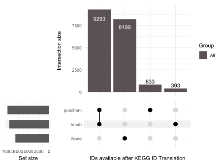

  
From the previous table it also becomes apparent that the translation of
IDs is not a one-to-one mapping, but rather a one-to-many mapping. In
fact, it is very common that an ID from one format has a genuine
one-to-many relationship with the other format (e.g. one KEGG ID maps to
multiple HMDB IDs) or even a many-to-many relationship, where some of
the IDs of the new format link back to multiple IDs of the original
format (e.g. two different KEGG IDs map to multiple HMDB IDs, some of
which are shared between them).  
This comes with many implications for the analysis, which are discussed
in the next section.

### Mapping problems

The complexities of translating metabolite IDs are demonstrated here
(Fig. 2). The relationships between original IDs (e.g. KEGG) and
translated IDs (e.g. HMDB) can be quite complex, and in fact we
encounter the following mappings:  

- `one-to-none`: no match was found for the original ID.
- `one-to-one`: a single, unique match was found for the original ID.
- `one-to-many`: multiple matches were found for the original ID,
  i.e. it is ambiguously mapped.
- `many-to-many`: considers the relationship from the translated IDs
  back to the original IDs, where a translated ID ambiguously maps back
  to multiple different original IDs.

For enrichment analysis, the translation from KEGG IDs to HMDB IDs
increases the pathway size, i.e. how many metabolites are in the pathway
“Glycolysis / Gluconeogenesis - Homo sapiens (human)”, which would in
turn inflate/deflate the enrichment results. Hence, it is desirable to
keep the number of metabolites in a pathway consistent.  


Fig. 2: Mapping problems in prior knowledge metabolite-sets when
translating metabolite IDs.

  

Because of this complexity, the output of
[`translate_id()`](https://saezlab.github.io/MetaProViz/reference/translate_id.md)
includes not only the translation table showcased above, but also
information about the mapping ambiguity as well as a summary of the
relationships between the original and translated IDs.  
Indeed, the translation of KEGG to HMDB and PubChem includes multiple
data frames, including a summary of the mapping occurrences:  

``` r

names(KEGG_Pathways_Translated)
#> [1] "TranslatedDF"             "TranslatedDF_MappingInfo"
#> [3] "Mappingsummary_hmdb"      "Mappingsummary_pubchem"
```

  

| term | many_to_many | one_to_many | one_to_none | one_to_one | total | to_many | to_none | to_one | to_total | from_many | from_one | from_total | many_to_one | scope |
|:---|---:|---:|---:|---:|---:|---:|---:|---:|---:|---:|---:|---:|---:|:---|
| Glycolysis / Gluconeogenesis | 12 | 23 | 6 | 13 | 54 | 12 | 6 | 13 | 31 | 6 | 37 | 43 | 0 | group |
| Citrate cycle (TCA cycle) | 0 | 17 | 3 | 9 | 29 | 8 | 3 | 9 | 20 | 0 | 27 | 27 | 0 | group |
| Pentose phosphate pathway | 20 | 17 | 10 | 16 | 63 | 11 | 10 | 16 | 37 | 10 | 34 | 44 | 0 | group |
| Ascorbate and aldarate metabolism | 10 | 39 | 26 | 15 | 90 | 16 | 26 | 15 | 57 | 5 | 55 | 60 | 0 | group |
| Fatty acid biosynthesis | 0 | 14 | 46 | 6 | 66 | 6 | 46 | 6 | 58 | 0 | 21 | 21 | 0 | group |
| Fatty acid elongation | 8 | 48 | 11 | 3 | 70 | 25 | 11 | 3 | 39 | 4 | 52 | 56 | 0 | group |

Mappingsummary_hmdb {.table .lightable-classic
style="font-size: 12px; font-family: Cambria; width: auto !important; margin-left: auto; margin-right: auto;"}

  
  
We can also extract a long version of the summary that includes a row
for each mapping occurrence, which can be useful for downstream
analysis. Yet, this can become very large depending on the amount of
many-to-many mappings, hence it is not generated by default. Within
[`translate_id()`](https://saezlab.github.io/MetaProViz/reference/translate_id.md)
you can set the parameter `summary = TRUE`, or, in case you have a data
frame that includes both the original and the translated ID, you can use
the function
[`mapping_ambiguity()`](https://saezlab.github.io/MetaProViz/reference/mapping_ambiguity.md)
to generate this long summary as well as the mapping summary in
general.  

``` r

# Option 1:
KEGG_Pathways_TranslatedSum <- translate_id(
    data = KEGG_Pathways,
    metadata_info = c(InputID = "MetaboliteID", grouping_variable = "term"),
    from = c("kegg"),
    to = c("hmdb", "pubchem"),
    summary = TRUE
)
```

  

``` r

# Option 2:
MappingProblems <- mapping_ambiguity(
    data =
        KEGG_Pathways_Translated[["TranslatedDF"]] %>%
        dplyr::rename("KEGG" = "MetaboliteID") %>%
        dplyr::select(Description, KEGG, term, Metabolite, hmdb),
    from = "KEGG",
    to = "hmdb",
    grouping_variable = "term",
    summary = TRUE
)
```

  

| KEGG | hmdb | term | KEGG_to_hmdb | Count(KEGG_to_hmdb) | hmdb_to_KEGG | Count(hmdb_to_KEGG) | Mapping |
|:---|:---|:---|:---|---:|:---|---:|:---|
| C00002 | HMDB0000538 | Bacterial secretion system | C00002 –\> HMDB0000538, HMDB0257997 | 2 | HMDB0000538 –\> C00002 | 1 | one-to-many |
| C00002 | HMDB0000538 | Biosynthesis of cofactors | C00002 –\> HMDB0000538, HMDB0257997 | 2 | HMDB0000538 –\> C00002 | 1 | one-to-many |
| C00024 | HMDB0247926 | Ethylbenzene degradation | C00024 –\> HMDB0001206, HMDB0247926 | 2 | HMDB0247926 –\> C00024 | 1 | one-to-many |
| C00024 | HMDB0247926 | Fatty acid degradation | C00024 –\> HMDB0001206, HMDB0247926 | 2 | HMDB0247926 –\> C00024 | 1 | one-to-many |

Long summary of mapping problems taking into account both directions,
from-to-to and to-to-from. {.table .lightable-classic
style="font-size: 12px; font-family: Cambria; width: auto !important; margin-left: auto; margin-right: auto;"}

  
The table shows that the KEGG ID C00002 maps to 3 different HMDB IDs,
and that one of those HMDB IDs, HMDB0000538, maps back to one KEGG ID;
hence this mapping is one-to-many. The other two HMDB IDs are also in
the table, together with the number of KEGG IDs they map to.
Additionally, we have passed `grouping_variable = "term"` as we have
pathways, which means each of those mappings is checked within a pathway
and across pathways (e.g. C00002 is shown twice, for two different
terms).  

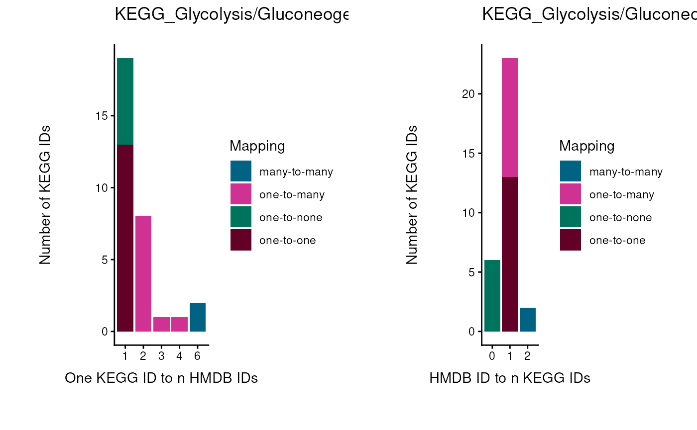

  
In fact, to perform enrichment analysis we need a column source
(e.g. term), and we want to keep the metabolite IDs across pathways
consistent, avoid ambiguous mapping (many-to-many mapping) as much as
possible, and have this metabolite ID selection guided by the IDs
available in our measured input data (Fig. 3). Hence, we can use the
measured metabolite IDs to guide the selection of PK IDs. This is
crucial to circumvent inflation or deflation of metabolite-sets, which
in turn affects the enrichment analysis results.  
This is something we are currently working on and hope to provide within
the next release, so stay tuned.  


Fig. 3: Mapping problems in prior knowledge metabolite-sets when
translating metabolite IDs and the connection to detected (measured
input) metabolites.

  

## Pathway coverage of the measured data

Thanks to the translation, the KEGG pathways now carry HMDB IDs, which
means we can finally connect them to the Biocrates features. A useful
question before any enrichment analysis is: *how well does my measured
feature space cover each pathway?* A pathway of which we measure only a
small fraction of metabolites may appear changed because of a single
outlier metabolite, whilst a well-covered pathway requires many
metabolites to change.  
  
To answer this question in the context of the whole resource, we use
[`cluster_pk()`](https://saezlab.github.io/MetaProViz/reference/cluster_pk.md).
It computes the similarity between all pairs of pathways based on their
shared metabolites, clusters similar pathways, and shows the result as a
graph in which each node is a pathway and each edge connects two
pathways that share metabolites. Here we only use it as a canvas for our
coverage information; the parameters and the interpretation of these
graphs for all MetSigDB resources are explained in detail in the
[MetSigDB
vignette](https://saezlab.github.io/MetaProViz/articles/pkgdown/metsigdb.html).

### Compute the pathway coverage

First, we count the metabolites per pathway and determine for each KEGG
metabolite whether at least one of its translated HMDB IDs is measured
on the Biocrates kit. In line with section [3.4](#sect3_4), we use all
HMDB IDs of the Biocrates features, not only the first one.

``` r

kegg_translated <- KEGG_Pathways_Translated[["TranslatedDF"]] %>%
    group_by(term) %>%
    mutate(n_metabolites_in_pathway = n()) %>% # number of metabolites per pathway term
    ungroup()

# All HMDB IDs measured on the Biocrates kit (multiple IDs per feature are split):
biocrates_hmdb <- FeatureMetadata_Biocrates %>%
    dplyr::filter(!is.na(HMDB), HMDB != "") %>%
    tidyr::separate_rows(HMDB, sep = ",") %>%
    dplyr::mutate(HMDB = stringr::str_trim(HMDB)) %>%
    dplyr::pull(HMDB) %>%
    unique()

# Is each KEGG metabolite detected via any of its translated HMDB IDs?
kegg_metabolite_matches <- kegg_translated %>%
    dplyr::mutate(kegg_row_id = dplyr::row_number()) %>%
    dplyr::select(kegg_row_id, term, n_metabolites_in_pathway, hmdb) %>%
    tidyr::separate_rows(hmdb, sep = ",") %>%
    dplyr::mutate(hmdb = stringr::str_trim(hmdb)) %>%
    dplyr::group_by(kegg_row_id, term, n_metabolites_in_pathway) %>%
    dplyr::summarise(detected_in_biocrates = any(hmdb %in% biocrates_hmdb), .groups = "drop")

# Pathway coverage: what percentage of the metabolites of each KEGG pathway is measured?
pathway_coverage <- kegg_metabolite_matches %>%
    dplyr::group_by(term) %>%
    dplyr::summarise(
        pct_metabolites_detected = 100 * sum(detected_in_biocrates) / dplyr::first(n_metabolites_in_pathway),
        .groups = "drop"
    )
```

| term                                    | pct_metabolites_detected |
|:----------------------------------------|-------------------------:|
| Non-alcoholic fatty liver disease       |                    100.0 |
| Serotonin receptor agonists/antagonists |                    100.0 |
| Leishmaniasis                           |                     75.0 |
| Mineral absorption                      |                     70.0 |
| Amphetamine addiction                   |                     66.7 |
| Cholesterol metabolism                  |                     66.7 |
| Cocaine addiction                       |                     66.7 |
| GABAergic synapse                       |                     66.7 |
| Protein digestion and absorption        |                     62.5 |
| Glutamatergic synapse                   |                     60.0 |

KEGG pathways with the highest coverage by the Biocrates kit. {.table
.lightable-classic
style="font-size: 12px; font-family: Cambria; width: auto !important; margin-left: auto; margin-right: auto;"}

### Visualise the coverage in the pathway graph

Next, we cluster the KEGG pathways once with
[`cluster_pk()`](https://saezlab.github.io/MetaProViz/reference/cluster_pk.md).
We then draw the same graph twice with
[`viz_graph()`](https://saezlab.github.io/MetaProViz/reference/viz_graph.md):
first with node sizes representing the pathway size (number of
metabolites), then with node sizes representing the coverage by the
Biocrates kit. As the clustering is identical, only the node sizes
differ between the two plots.

``` r

set.seed(123)
kegg_clustering <- cluster_pk(
    kegg_translated,
    metadata_info = c(metabolite_column = "MetaboliteID", pathway_column = "term"),
    similarity = "jaccard",
    input_format = "long",
    threshold = 0.4, # only pathways with a similarity above 0.4 are considered for clustering
    clust = "community", # Louvain community detection determines which pathways form a cluster
    save_plot = NULL,
    print_plot = FALSE
)

# Node sizes: pathway size
pathway_size <- kegg_translated %>% dplyr::distinct(term, n_metabolites_in_pathway)
pathway_size <- setNames(pathway_size$n_metabolites_in_pathway, pathway_size$term)
attr(pathway_size, "label") <- "n_metabolites_in_pathway"

# Node sizes: coverage by the Biocrates kit
pathway_coverage_size <- setNames(pathway_coverage$pct_metabolites_detected, pathway_coverage$term)
attr(pathway_coverage_size, "label") <- "pct_metabolites_detected"
```

``` r

set.seed(123)
kegg_graph_size <- viz_graph(
    similarity_matrix = kegg_clustering$similarity_matrix,
    clusters = kegg_clustering$clusters,
    plot_threshold = 0.5, # only pathway-pathway edges with at least 0.5 similarity are plotted
    min_degree = 1,
    node_sizes = pathway_size,
    show_density = TRUE, # coloured background behind clusters
    save_plot = NULL,
    print_plot = TRUE,
    plot_name = "KEGG_pathway_size"
)
```

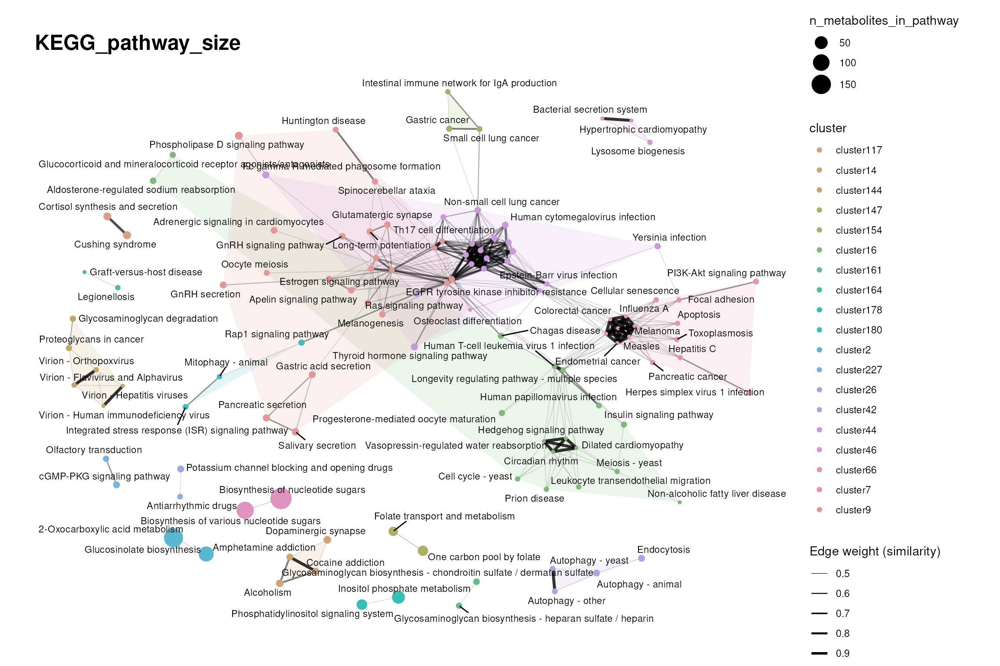

``` r

set.seed(123)
kegg_graph_coverage <- viz_graph(
    similarity_matrix = kegg_clustering$similarity_matrix,
    clusters = kegg_clustering$clusters,
    plot_threshold = 0.5,
    min_degree = 1,
    node_sizes = pathway_coverage_size,
    show_density = TRUE,
    save_plot = NULL,
    print_plot = TRUE,
    plot_name = "KEGG_pathway_coverage_biocrates"
)
```

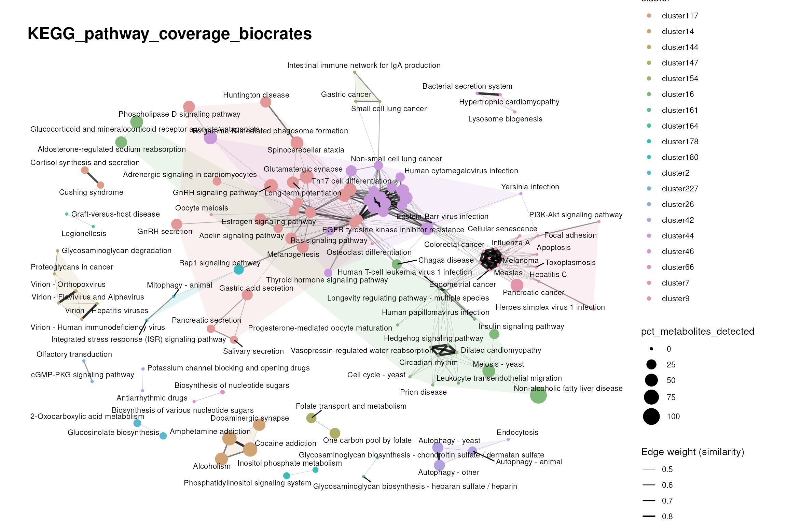

While the clustering stayed the same, the node sizes change, sometimes
drastically. Large nodes in the second plot are pathways that are well
covered by the Biocrates features. Changes in such well-represented
pathways in downstream analyses are more reliable, because a larger
number of metabolites must be changed, whilst small nodes (pathways
poorly represented by the measured features) may appear changed due to a
few outlier metabolites. Comparing both plots also shows that large
pathways are not necessarily well covered: the coverage depends on which
metabolite classes the measurement platform targets.  
Keep in mind that the node size actively changes how we read the graph,
so always state what the node size represents when you show such a plot.

## Next steps

  
Now that the measured data is linked to prior knowledge, there are two
options to run enrichment analysis:  
1. Over Representation Analysis (ORA) that determines if a set of
features (e.g. metabolic pathways) is over-represented in a selection of
features (e.g. metabolites) from the data in comparison to all measured
features, using Fisher’s exact test:
[`cluster_ora()`](https://saezlab.github.io/MetaProViz/reference/cluster_ora.md).
This can be applied to clusters of metabolites, for example the results
of the
[`mca_2cond()`](https://saezlab.github.io/MetaProViz/reference/mca_2cond.md)
or `core()` functions. If you want more details on these clustering
methods, please visit the vignettes [Standard
Metabolomics](https://saezlab.github.io/MetaProViz/articles/pkgdown/standard-metabolomics.html)
or [CoRe
Metabolomics](https://saezlab.github.io/MetaProViz/articles/pkgdown/core-metabolomics.html).  

  
2. Enrichment analysis on standard differential analysis results. We
offer ORA with
[`standard_ora()`](https://saezlab.github.io/MetaProViz/reference/standard_ora.md),
but there are many other statistical tests that can be used for
enrichment analysis. The full scope of different methods is beyond the
scope of MetaProViz, but they are available in the decoupleR
(Badia-I-Mompel et al. 2022) package from our group.  

  
Before choosing a resource for enrichment analysis, it is worth
understanding how the resources differ in size, specificity and
redundancy, since this shapes the enrichment results. This is the topic
of the follow-up vignette
[MetSigDB](https://saezlab.github.io/MetaProViz/articles/pkgdown/metsigdb.html).

  
  

## Session information

    #> R version 4.6.1 (2026-06-24)
    #> Platform: x86_64-pc-linux-gnu
    #> Running under: Ubuntu 24.04.4 LTS
    #> 
    #> Matrix products: default
    #> BLAS:   /usr/lib/x86_64-linux-gnu/openblas-pthread/libblas.so.3 
    #> LAPACK: /usr/lib/x86_64-linux-gnu/openblas-pthread/libopenblasp-r0.3.26.so;  LAPACK version 3.12.0
    #> 
    #> locale:
    #>  [1] LC_CTYPE=en_US.UTF-8       LC_NUMERIC=C               LC_TIME=en_US.UTF-8        LC_COLLATE=en_US.UTF-8    
    #>  [5] LC_MONETARY=en_US.UTF-8    LC_MESSAGES=en_US.UTF-8    LC_PAPER=en_US.UTF-8       LC_NAME=C                 
    #>  [9] LC_ADDRESS=C               LC_TELEPHONE=C             LC_MEASUREMENT=en_US.UTF-8 LC_IDENTIFICATION=C       
    #> 
    #> time zone: Etc/UTC
    #> tzcode source: system (glibc)
    #> 
    #> attached base packages:
    #> [1] stats     graphics  grDevices utils     datasets  methods   base     
    #> 
    #> other attached packages:
    #> [1] tibble_3.3.1      stringr_1.6.0     dplyr_1.2.1       purrr_1.2.2       rlang_1.3.0       magrittr_2.0.5   
    #> [7] MetaProViz_4.99.0 BiocStyle_2.40.0 
    #> 
    #> loaded via a namespace (and not attached):
    #>   [1] splines_4.6.1               later_1.4.8                 R.oo_1.27.1                 cellranger_1.1.0           
    #>   [5] polyclip_1.10-7             XML_3.99-0.25               factoextra_2.2.0            lifecycle_1.0.5            
    #>   [9] httr2_1.3.0                 tcltk_4.6.1                 rstatix_1.1.0               lattice_0.22-9             
    #>  [13] vroom_1.7.1                 MASS_7.3-66                 backports_1.5.1             limma_3.68.5               
    #>  [17] sass_0.4.10                 rmarkdown_2.32              jquerylib_0.1.4             yaml_2.3.12                
    #>  [21] otel_0.2.0                  zip_3.0.2                   sessioninfo_1.2.4           EnhancedVolcano_1.31.0     
    #>  [25] DBI_1.3.0                   RColorBrewer_1.1-3          lubridate_1.9.5             abind_1.4-8                
    #>  [29] rvest_1.0.5                 GenomicRanges_1.64.0        R.utils_2.13.0              ggraph_2.2.2               
    #>  [33] BiocGenerics_0.58.1         hash_2.2.6.4                tweenr_2.0.3                rappdirs_0.3.4             
    #>  [37] IRanges_2.46.0              S4Vectors_0.50.3            ggrepel_0.9.8               pheatmap_1.0.13            
    #>  [41] parallelly_1.48.0           pkgdown_2.2.1               svglite_2.2.2               codetools_0.2-20           
    #>  [45] DelayedArray_0.38.2         xml2_1.6.0                  ggforce_0.5.0               tidyselect_1.2.1           
    #>  [49] farver_2.1.2                viridis_0.6.5               ComplexUpset_1.3.3          matrixStats_1.5.0          
    #>  [53] stats4_4.6.1                Seqinfo_1.2.0               jsonlite_2.0.0              tidygraph_1.3.1            
    #>  [57] Formula_1.2-6               systemfonts_1.3.2           tools_4.6.1                 progress_1.2.3             
    #>  [61] ragg_1.5.2                  Rcpp_1.1.2                  glue_1.8.1                  gridExtra_2.3.1            
    #>  [65] SparseArray_1.12.3          xfun_0.61                   decoupleR_2.17.0            qvalue_2.44.0              
    #>  [69] MatrixGenerics_1.24.0       ggfortify_0.4.24            withr_3.0.3                 BiocManager_1.30.27        
    #>  [73] fastmap_1.2.0               digest_0.6.39               timechange_0.4.0            R6_2.6.1                   
    #>  [77] textshaping_1.0.5           colorspace_2.1-3            lpSolve_5.6.23              gtools_3.9.5               
    #>  [81] RSQLite_3.53.3              R.methodsS3_1.8.2           tidyr_1.3.2                 generics_0.1.4             
    #>  [85] prettyunits_1.2.0           graphlayouts_1.2.5          httr_1.4.9                  htmlwidgets_1.6.4          
    #>  [89] S4Arrays_1.12.1             scatterplot3d_0.3-45        inflection_1.3.7            pkgconfig_2.0.3            
    #>  [93] gtable_0.3.6                blob_1.3.0                  S7_0.2.2                    XVector_0.52.0             
    #>  [97] OmnipathR_4.1.0             htmltools_0.5.9             carData_3.0-6               bookdown_0.48              
    #> [101] scales_1.4.0                kableExtra_1.4.1            Biobase_2.72.0              knitr_1.52                 
    #> [105] rstudioapi_0.19.0           tzdb_0.5.0                  reshape2_1.4.5              rjson_0.2.23               
    #> [109] checkmate_2.3.4             curl_8.0.0                  cachem_1.1.0                Polychrome_1.6.2           
    #> [113] parallel_4.6.1              vipor_0.4.7                 cosmosR_1.20.0              desc_1.4.3                 
    #> [117] pillar_1.11.1               grid_4.6.1                  logger_0.4.3                vctrs_0.7.3                
    #> [121] ggpubr_1.0.0                car_3.1-5                   beeswarm_0.4.0              evaluate_1.0.5             
    #> [125] readr_2.2.0                 cli_3.6.6                   compiler_4.6.1              crayon_1.5.3               
    #> [129] ggsignif_0.6.4              labeling_0.4.3              plyr_1.8.9                  fs_2.1.0                   
    #> [133] ggbeeswarm_0.7.3            writexl_2.0.1               stringi_1.8.9               viridisLite_0.4.3          
    #> [137] BiocParallel_1.46.0         Matrix_1.7-6                hms_1.1.4                   patchwork_1.3.2            
    #> [141] bit64_4.8.6                 ggplot2_4.0.3               statmod_1.5.2               SummarizedExperiment_1.42.0
    #> [145] CARNIVAL_2.22.0             igraph_2.3.4                broom_1.0.13                memoise_2.0.1              
    #> [149] bslib_0.12.0                bit_4.6.0                   readxl_1.5.0.1

## Bibliography

Badia-I-Mompel, Pau, Jesús Vélez Santiago, Jana Braunger, et al. 2022.
“decoupleR: Ensemble of Computational Methods to Infer Biological
Activities from Omics Data.” *Bioinformatics Advances* 2 (1): vbac016.
<https://doi.org/10.1093/bioadv/vbac016>.

Braisted, John, Andrew Patt, Cole Tindall, et al. 2023. “RaMP-DB 2.0: A
Renovated Knowledgebase for Deriving Biological and Chemical Insight
from Metabolites, Proteins, and Genes.” *Bioinformatics*, no. 1
(January). <https://doi.org/10.1093/bioinformatics/btac726>.

Castanza, Anthony Scott, Jill Marie Recla, David Eby, Helga
Thorvaldsdottir, Carol J. Bult, and Jill P Mesirov. 2022. “The Molecular
Signatures Database Revisited: Extending Support for Mouse Data.”
*BioRxiv*, ahead of print, October.
<https://doi.org/10.1101/2022.10.24.513539>.

Dugourd, Aurelien, Christoph Kuppe, Marco Sciacovelli, et al. 2021.
“Causal Integration of Multi-Omics Data with Prior Knowledge to Generate
Mechanistic Hypotheses.” *Molecular Systems Biology*, no. 1 (January):
e9730. <https://doi.org/10.15252/msb.20209730>.

Farr, Elias, Daniel Dimitrov, Christina Schmidt, et al. 2024.
“MetalinksDB: A Flexible and Contextualizable Resource of
Metabolite-Protein Interactions.” *Briefings in Bioinformatics*, no. 4
(May). <https://doi.org/10.1093/bib/bbae347>.

Gaude, Edoardo, and Christian Frezza. 2016. “Tissue-Specific and
Convergent Metabolic Transformation of Cancer Correlates with Metastatic
Potential and Patient Survival.” *Nature Communications* 7 (October):
13041. <https://doi.org/10.1038/ncomms13041>.

Jaccard, Paul. 1901. *Étude Comparative de La Distribution Florale Dans
Une Portion Des Alpes Et Du Jura*.
<https://doi.org/10.5169/SEALS-266450>.

Kanehisa, M, and S Goto. 2000. “KEGG: Kyoto Encyclopedia of Genes and
Genomes.” *Nucleic Acids Research* 28 (1): 27–30.
<https://doi.org/10.1093/nar/28.1.27>.

Liberzon, Arthur, Chet Birger, Helga Thorvaldsdóttir, Mahmoud Ghandi,
Jill P Mesirov, and Pablo Tamayo. 2015. “The Molecular Signatures
Database (MSigDB) Hallmark Gene Set Collection.” *Cell Systems* 1 (6):
417–25. <https://doi.org/10.1016/j.cels.2015.12.004>.

Sciacovelli, Marco, Aurelien Dugourd, Lorea Valcarcel Jimenez, et al.
2022. “Dynamic Partitioning of Branched-Chain Amino Acids-Derived
Nitrogen Supports Renal Cancer Progression.” *Nature Communications* 13
(1): 7830. <https://doi.org/10.1038/s41467-022-35036-4>.
