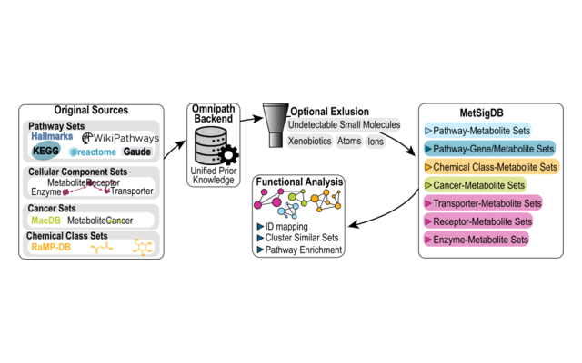

# Tutorials

All tutorials use example data that ship with **MetaProViz**, so you can
run every step yourself. If you are new to MetaProViz, start with
*Getting started*. The other tutorials go into more detail on the
different data types and on metabolite prior knowledge.

## Get started

##### [Getting started](https://saezlab.github.io/MetaProViz/articles/quick-start.md)

A short tour through the main steps on intracellular cell line data:
pre-processing, differential analysis, enrichment analysis, metabolite
clustering and plots.

Bioconductor vignette

## Analysis workflows

##### [Standard Metabolomics](https://saezlab.github.io/MetaProViz/articles/pkgdown/standard-metabolomics.md)

Intracellular metabolomics of kidney cancer cell lines: quality control,
pre-processing, differential analysis, ORA, metabolite clustering and
all visualisations.

Website tutorial

##### [CoRe Metabolomics](https://saezlab.github.io/MetaProViz/articles/pkgdown/core-metabolomics.md)

Consumption-release data from cell culture media: blank and growth
normalisation, differential analysis, clustering together with
intracellular data and metabolite-receptor sets.

Website tutorial

##### [Sample Metadata Analysis](https://saezlab.github.io/MetaProViz/articles/pkgdown/sample-metadata.md)

Tumour and normal tissue of kidney cancer patients: find the metabolites
that separate patient groups, compare patient subsets and improve
metabolite IDs before enrichment analysis.

Website tutorial

##### [Prior Knowledge Networks](https://saezlab.github.io/MetaProViz/articles/pkgdown/pk-networks.md)

Investigate differential analysis results with networks: which
transporters the changed metabolites share, which metabolites drive
enriched pathways and in which cancers they were reported before.

Website tutorial

## Prior knowledge and metabolite IDs

##### [Prior Knowledge - Access & Integration](https://saezlab.github.io/MetaProViz/articles/pkgdown/prior-knowledge.md)

Load metabolite sets from MetSigDB, link them to your measured data,
translate metabolite IDs and check how well your data cover each
pathway.

Website tutorial

##### [ID Processing Workflow](https://saezlab.github.io/MetaProViz/articles/pkgdown/id-processing-workflow.md)

Check the metabolite IDs of your features for consistency and expand
them across HMDB, KEGG, ChEBI and PubChem with
[`id_processing()`](https://saezlab.github.io/MetaProViz/reference/id_processing.md).

Website tutorial

##### [MetSigDB](https://saezlab.github.io/MetaProViz/articles/pkgdown/metsigdb.md)

The resources in MetSigDB compared: their size, overlap and redundancy,
and how their terms cluster.

Website tutorial
