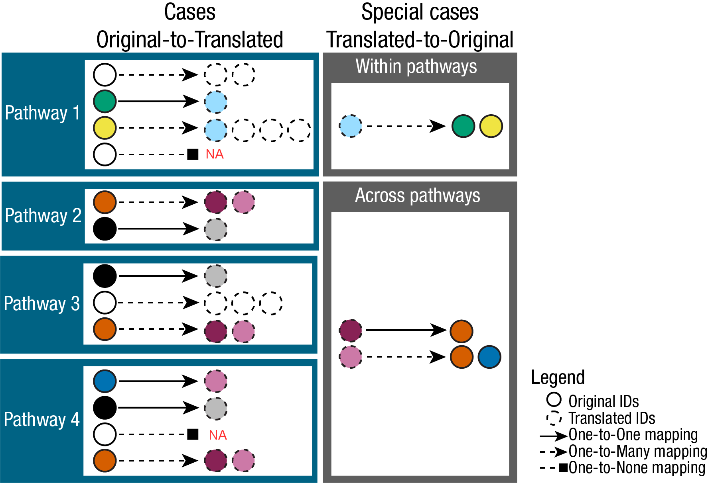
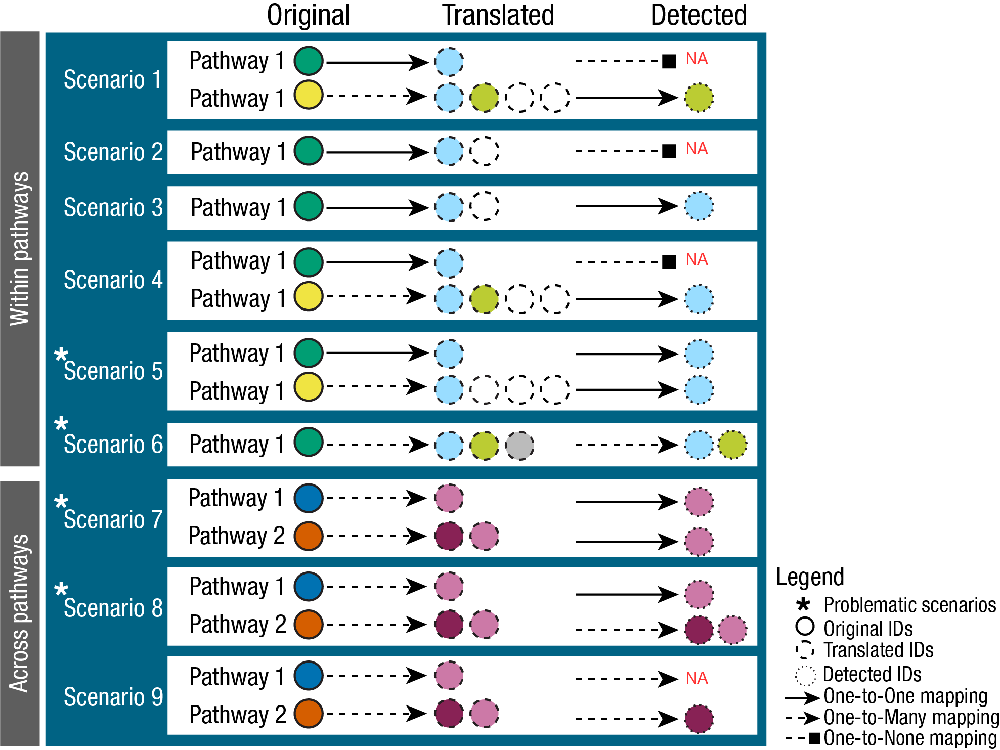

```{=html}
<style>
.vscroll-plot {
    width: 850px;
    height: 500px;
    overflow-y: scroll;
    overflow-x: hidden;
}
</style>
```

```{r chunk_setup, include = FALSE}
knitr::opts_chunk$set(
    collapse = TRUE,
    comment = "#>"
)
```

# 

\
[In this tutorial we showcase how to use **MetaProViz** prior knowledge]{style="text-decoration:underline"}:\
- 1.
[To understand detected metabolite IDs in measured data.](#sect1)

\- 2.
[To access metabolite prior knowledge and metabolite-gene prior knowledge networks.](#sect2)

\- 3.
[To link experimental data to prior knowledge - the Do's and Don'ts.](#sect3)

\- 4.
[To deal with many-to-many mapping in your metabolite identifiers.](#sect4)

\- 5.
[To perform pathway enrichment analysis.](#sect5)\

\
First if you have not done yet, install the required dependencies and load the libraries:

```{r message=FALSE, warning=FALSE}
# 1. Install Rtools if you haven’t done this yet, using the appropriate version (e.g.windows or macOS).
# 2. Install the latest development version from GitHub using devtools
#devtools::install_github("https://github.com/saezlab/MetaProViz")

library(MetaProViz)
library(magrittr)
library(rlang)
library(purrr)
library(dplyr)
library(stringr)

#source("RefactorPriorKnowledge.R") 
#source("R/RefactorPriorKnoweldge.R") # note -typo in Knowledge...
devtools::load_all()

#Please install the Biocmanager Dependencies:
#BiocManager::install("clusterProfiler")
#BiocManager::install("EnhancedVolcano")
#BiocManager::install("cosmosR")
```

\
\

:::: {.progress .progress-striped .active}
::: {.progress-bar .progress-bar-success style="width: 100%"}
:::
::::

# Loading the example data

:::: {.progress .progress-striped .active}
::: {.progress-bar .progress-bar-success style="width: 100%"}
:::
::::

\

[As part of the **MetaProViz** package you can load the example feature metadata using the function `toy_data()`]{style="text-decoration:underline"}:\
`1.` Metadata of cell line experiment **(CellLine)**\
Example datasets is publicly available on [metabolomics workbench project PR001418](https://www.metabolomicsworkbench.org/data/DRCCMetadata.php?Mode=Project&ProjectID=PR001418) including metabolic profiles of human renal epithelial cells HK2 and cell renal cell carcinoma (ccRCC) cell lines cultured in Plasmax cell culture media [@Sciacovelli_Dugourd2022].\

```{r}
#Load the Pre-processed intracellular data:
FeatureMetadata_Cells <- MetaProViz::ToyData(Data="Cells_MetaData")
```

\
`2.` Metadata of patients tissue experiment **(Tissue)**\
Example datasets is publicly available in the [paper](https://www.cell.com/cancer-cell/comments/S1535-6108(15)00468-7#supplementaryMaterial) "An Integrated Metabolic Atlas of Clear Cell Renal Cell Carcinoma", which includes metabolomic profiling on 138 matched clear cell renal cell carcinoma (ccRCC)/normal tissue pairs.\

```{r}
# Load the example data:
FeatureMetadata_Tissue <- MetaProViz::ToyData(Data="Tissue_MetaData")

```

\
`3.` Metadata of Biocrates kit **(Biocrates)**\
This data base is from the MetalinksDB paper [@Farr_Dimitrov2024].
It includes associations between protein and metabolite entities, collated from a variety of different sources.

```{r}
# Load the example data:
FeatureMetadata_Biocrates <- MetaProViz::ToyData(Data="BiocratesFeatureTable")
```

\
\

:::: {.progress .progress-striped .active}
::: {.progress-bar .progress-bar-success style="width: 100%"}
:::
::::

# 1. Metabolite IDs in measured data {#sect1}

:::: {.progress .progress-striped .active}
::: {.progress-bar .progress-bar-success style="width: 100%"}
:::
::::

***Assigning Metabolite IDs to measured data***\
The difficulty with assigning metabolite IDs to measured data is the uncertainty in the detection of metabolites.
Indeed, differentiation of structural isomers (both constitutional isomers and stereoisomers) as for example the distinction between enantiomers.
This leads to loss of information and hence uncertainty is assigning metabolite IDs.\
One example is the metabolite Alanine, which can occur in its L- or D- form.
If in an experiment those enantiomers have not been distinguished, the correct way would be to either assign two metabolite IDs (L- and D-Alanine) or a more general Alanine ID without chiral information.
Yet, in reality this is not as trivial:\

```{r, echo=FALSE}
#Create DF for Alanine:
Alanine <- data.frame(
  TrivialName = c("D-Alanine", "L-Alanine", "Alanine", "Alanine zwitterion"),
  HMDB= c("HMDB0001310",  "HMDB0000161", NA, NA),
  ChEBI = c("15570", "16977", "16449", "66916" ),
  KEGG = c("C00133", "C00041", "C01401", NA ),
  PubChem = c("71080" , "5950", "602", "57383916"),
  stringsAsFactors = FALSE)

# Print table:
Alanine%>%
  kableExtra::kbl(caption = "Available Alanine IDs in HMDB and ChEBI.") %>%
  kableExtra::kable_classic(full_width = F, html_font = "Cambria", font_size = 12)
```

\
Indeed, dependent on the database, the Alanine metabolite can have different IDs available:\

```{r, echo=FALSE}
#Print Plot:
AlaninePlot <- Alanine%>%
  tidyr::pivot_longer(cols = c("HMDB", "ChEBI", "KEGG", "PubChem"),
                               names_to = "Conditions",
                               values_to = "ID")%>%
  tidyr::drop_na()
AlaninePlot$`IDs in Database` <- as.numeric(1)

Plot <- ggplot2::ggplot(AlaninePlot, ggplot2::aes(fill=TrivialName, y=`IDs in Database`, x=Conditions)) +
        ggplot2::geom_bar(position="stack", stat="identity")+
        ggplot2::scale_fill_manual(values = c("D-Alanine" = "#9F0162"  , "L-Alanine" = "#006384", "Alanine" = "grey", "Alanine zwitterion" = "#00735C"))+
        ggplot2::theme_classic()+
        ggplot2::ggtitle("Alanine IDs in in different databases")+
        ggplot2::theme(axis.text.x = ggplot2::element_text(angle = 90, hjust = 1))+
        ggplot2::labs(x = "Database", y = "Number of IDs")

Plot_Sized <-  MetaProViz:::plotGrob_Superplot(InputPlot=Plot, SettingsInfo=c(Conditions="Conditions", Superplot="Conditions"), SettingsFile_Sample=AlaninePlot,  PlotName = "Alanine IDs in in different databases", Subtitle = NULL, PlotType="Bar")

PlotHeight <- grid::convertUnit(Plot_Sized$height, 'cm', valueOnly = TRUE)
PlotWidth <- grid::convertUnit(Plot_Sized$width, 'cm', valueOnly = TRUE)
Plot_Sized %<>%
      {ggplot2::ggplot() + ggplot2::annotation_custom(.)} %>%
      add(ggplot2::theme(panel.background = ggplot2::element_rect(fill = "transparent")))

#ggplot2::ggsave(filename = "AlaninePlot.svg", plot = Plot_Sized, width = PlotWidth,  height = PlotHeight, unit="cm")

Plot_Sized
```

\
For instance, if we want to assign a HMDB ID, we have to assign both "HMDB0001310", "HMDB0000161" to the metabolite Alanine, for ChEBI we could assign only one, "16449", but this may lead to other problems as the ChEBI ID is not specific and may not be part of certain metabolic pathways.
The reason for this is that substrate chirality is critical to enzymatic processes and stereo selectivity of enzymes to be homochiral with predominance of one particular enantiomer (e.g. D-sugars, L-amino acids, etc.).\
To showcase the severity of this problem, we can look at the occurrence of those metabolites in metabolic pathways across different databases.
To do so we searched for those metabolite IDs in the RaMP database [@Braisted2023] and extracted the pathways they are part of:\

```{r, echo=FALSE}
# devtools::install_github("ncats/RAMP-DB")
#rampDB <-  suppressMessages(suppressWarnings(RaMP::RaMP(version = "2.5.4")))
#Pathways <- RaMP::getPathwayFromAnalyte(db = rampDB, c("hmdb:HMDB0001310", "hmdb:HMDB0000161", "chebi:16449", "chebi:66916", "chebi:16977", "chebi:15570", "kegg:C00041", "kegg:C00133", "kegg:C01401", "pubchem:71080","pubchem:5950","pubchem:602","pubchem:57383916" ))
#write.csv(Pathways, "AlaninePathways.csv")
Pathways <- suppressMessages(suppressWarnings(MetaProViz::ToyData("AlaninePathways")))[,2:6]

Count <- Pathways %>%
  tidyr::unite(Pathway, c("pathwaySource", "pathwayName"), sep = ": ")%>%
  dplyr::group_by(inputId) %>%
  dplyr::summarise(PathwayCount = dplyr::n_distinct(Pathway), .groups = 'drop')%>%
  tidyr::separate(inputId, into = c("Database", "ID"), sep = ":", remove = TRUE)

Alanine <- merge(x = AlaninePlot%>%dplyr::rename("Database"="Conditions") ,
                 y= Count[,2:3],
                 by = "ID",
                 all.x=TRUE)%>%
  dplyr::mutate(PathwayCount = replace(PathwayCount, is.na(PathwayCount), 0))%>%
  dplyr::arrange(desc( TrivialName)) %>%
  dplyr::select(TrivialName, ID, Database, PathwayCount)

# Print table:
Alanine%>%
  kableExtra::kbl(caption = "Alanine IDs in HMDB and ChEBI mapped to pathways from wiki, KEGG and Reactome using RamP.") %>%
  kableExtra::kable_classic(full_width = F, html_font = "Cambria", font_size = 12)
```

\

```{r, echo=FALSE}
#BarGraph
Plot <- ggplot2::ggplot(Alanine, ggplot2::aes(fill=TrivialName, y=`PathwayCount`, x=Database)) +
        ggplot2::geom_bar(position="stack", stat="identity")+
        ggplot2::scale_fill_manual(values = c("D-Alanine" = "#9F0162"  , "L-Alanine" = "#006384", "Alanine" = "grey", "Alanine zwitterion" = "#00735C"))+
        ggplot2::theme_classic()+
        ggplot2::ggtitle("Alanine IDs in in different pathway")+
        ggplot2::theme(axis.text.x = ggplot2::element_text(angle = 90, hjust = 1))+
        ggplot2::labs(x = "Database", y = "Number of Pathways")

Plot_Sized <-  MetaProViz:::plotGrob_Superplot(InputPlot=Plot, SettingsInfo=c(Conditions="Conditions", Superplot="Conditions"), SettingsFile_Sample=AlaninePlot,  PlotName = "Alanine IDs in in different databases", Subtitle = NULL, PlotType="Bar")

PlotHeight <- grid::convertUnit(Plot_Sized$height, 'cm', valueOnly = TRUE)
PlotWidth <- grid::convertUnit(Plot_Sized$width, 'cm', valueOnly = TRUE)
Plot_Sized %<>%
      {ggplot2::ggplot() + ggplot2::annotation_custom(.)} %>%
      add(ggplot2::theme(panel.background = ggplot2::element_rect(fill = "transparent")))

#ggplot2::ggsave(filename = "AlaninePlot_Pathways.svg", plot = Plot_Sized, width = PlotWidth,  height = PlotHeight, unit="cm")

Plot_Sized
```

```{r, eval=FALSE, include=FALSE}
# Make BarGraph per pathway and ID type
Alanine_Path <- Pathways%>%
  tidyr::separate(commonName, into = c("commonName", "secondaryName"), sep = ",A", remove = FALSE)%>%
  tidyr::separate(commonName, into = c("commonName", "secondaryName"), sep = ",D", remove = FALSE)%>%
  dplyr::group_by(pathwaySource, commonName) %>%
  dplyr::summarise(PathwayCount = dplyr::n_distinct(pathwayName),
                   commonNames = paste(unique(commonName), collapse = ", "),
                   .groups = 'drop')


#BarGraph
Plot <- ggplot2::ggplot(Alanine_Path, ggplot2::aes(fill=commonNames, y=PathwayCount , x=pathwaySource)) +
        ggplot2::geom_bar(position="stack", stat="identity")+
        ggplot2::scale_fill_manual(values = c("D-Alanine" = "#9F0162"  , "L-Alanine" = "#006384", "Alanine" = "grey", "Alanine zwitterion" = "#00735C"))+
        ggplot2::theme_classic()+
        ggplot2::ggtitle("Alanine IDs in in different databases")+
        ggplot2::theme(axis.text.x = ggplot2::element_text(angle = 90, hjust = 1))+
        ggplot2::labs(x = "Pathway Source", y = "Number of Pathways")


#* https://www.sciencedirect.com/science/article/pii/S0731708521005410
#* This problem is even excarbated in lipidomics, where different levels of residues....
```

\
This showcases if we choose the ChEBI ID for Alanine (ChEBI ID 16449), if experimentally the distinction was not possible, we will not map to any pathway even though the metabolite is part of many pathways.
Hence, we recommend to assign multiple IDs to a measured ID, where specificity in detection is not given.\

\
Yet, many metabolomics studies do not report multiple IDs, but rather one ID per measured peak.
In some cases the chosen ID is correct in representing the degree of ambiguity in the detection, e.g. "Alanine-Zwitterion", whilst in other cases a specific ID, which has not been detected in this specificity, e.g. "L-Alanine".
In both cases this can lead to missed maps to prior knowledge and hence a loss of information as discussed above.\
Hence, we assign multiple IDs to a measured peak, where specificity in detection may not be given (i.e. amino acids).\

```{r}
# Example Cell-line data:
Input_HMDB <- FeatureMetadata_Cells%>%
  dplyr::filter(!HMDB == "NA")%>% # ID in the measured data we want to use, hence we remove NA's
  dplyr::select("HMDB", "Pathway") # only keep relevant columns

# Add equivalent IDs:
FeatureMetadata_Cells_AddIDs <- MetaProViz::EquivalentIDs(InputData= Input_HMDB,
                                                          SettingsInfo = c(InputID="HMDB"),# ID in the measured data, here we use the HMDB ID
                                                          From = "hmdb")
```

```{r, echo=FALSE}
# Check how our data looks like:
FeatureMetadata_Cells_AddIDs [2:8, ]%>%
  kableExtra::kbl(caption = "Preview of the DF `FeatureMetadata_Cells_AddIDs` including new columns with potential additional HMDB IDs assign using MetaProViz::EquivalentIDs() function.") %>%
  kableExtra::kable_classic(full_width = F, html_font = "Cambria", font_size = 12)
```

:::: {.progress .progress-striped .active}
::: {.progress-bar .progress-bar-success style="width: 100%"}
:::
::::

# 2. Accessing Prior Knowledge {#sect2}

:::: {.progress .progress-striped .active}
::: {.progress-bar .progress-bar-success style="width: 100%"}
:::
::::

--\> Christina: Implement terminology of MetSigDB!\
Metabolite prior knowledge (PK) is essential for the interpretation of metabolomics data.
It can be used to perform pathway enrichment analysis, compound class enrichment analysis, and by using specific PK databases, it can be used to study the connection of metabolites and receptors or transporters.Since the quality and content of the PK will dictate the success of the downstream analysis and biological interpretation, it is important to ensure the PK is used correctly.\
Specifically in metabolite PK, the many different PK databases and resources pose several issues.
Indeed, the metabolite identifiers (e.g. KEGG, HMDB, PubChem, etc.) are not standardized across databases, and the same metabolite can have multiple identifiers in different databases.
This is known as the many-to-many mapping problem.\
Moreover, metabolic pathways that are the basis of the PK databases also includes co-factors such as ions or other small molecules that are not only part of most reactions, but can also not be detected in experimentallly acquired data (e.g. H2O, CO2, etc).

## KEGG pathway-metabolite sets

KEGG pathways that are loaded via KEGG API using the package `KEGGREST` and can be used to perform pathway analysis [@Kanehisa2000].
**(KEGG_Pathways)**\

```{r}
#This will use KEGGREST to query the KEGG API to load the pathways:
MetaProViz::LoadKEGG()
```

\

```{r, echo=FALSE}
# Check how our data looks like:
KEGG_Pathways[c(1:3,52:54),]%>%
  kableExtra::kbl(caption = "Preview of the DF `KEGG_Pathways`.") %>%
  kableExtra::kable_classic(full_width = F, html_font = "Cambria", font_size = 12)
```

## Chemical class-metabolite sets

The chemical class-metabolite sets are based on the classification of metabolites into chemical classes, which can be used to perform compound class enrichment analysis.\
The chemical class-metabolite sets were curated by RaMP-DB, which used ClassyFire [@Braisted2023].
Here we access them via OmnipathR.\

```{r}
MetaProViz::LoadRAMP()
```

\

```{r, echo=FALSE}
# Check how our data looks like:
ChemicalClass_MetabSet[c(1:5,80:83, 500:503),]%>%
  kableExtra::kbl(caption = "Preview of the DF `ChemicalClass_MetabSet`.") %>%
  kableExtra::kable_classic(full_width = F, html_font = "Cambria", font_size = 12)
```

## Create pathway-metabolite sets

The function `Make_GeneMetabSet` can be used to translate gene names to metabolite names by using a PK network of metabolic reactions calls CosmosR [@Dugourd2021].
This function is useful if you want to perform pathway enrichment analysis on available gene-sets such as the Hallmarks gene-sets from MSigDB [@Castanza2022].
Moreover, it enables you to perform combined pathway enrichment analysis on metabolite-gene sets, if you have other data types such as proteomics measuring the enzymes expression.\
The Hallmarks [@Liberzon2015] gene-set and Gaude [@Gaude2016] gene-set is available in the package `MetaProViz` and can be loaded using the function `LoadHallmarks()` and `LoadGaude` respectively.\

```{r}
#Load the example gene-sets:
MetaProViz::LoadHallmarks()

MetaProViz::LoadGaude()
```

```{r, echo=FALSE}
# Check how our data looks like:
ChemicalClass_MetabSet[c(997:998,2916:2917, 2916:2918),]%>%
  kableExtra::kbl(caption = "Preview of the DF `Hallmarks_Pathways` including gene-sets usable for pathway enrichment analysis.", row.names=FALSE) %>%
  kableExtra::kable_classic(full_width = F, html_font = "Cambria", font_size = 12)
```

\

```{r, echo=FALSE}
# Check how our data looks like:
Gaude_Pathways[c(486:490, 1504, 1507, 1531, 49:50, 779),]%>%
  kableExtra::kbl(caption = "Preview of the DF `gaude_Pathways` including gene-sets usable for pathway enrichment analysis.", row.names=FALSE) %>%
  kableExtra::kable_classic(full_width = F, html_font = "Cambria", font_size = 12)
```

\
Now we can use the function `Make_GeneMetabSet` to translate the gene names to metabolite names.

```{r}
#Translate gene names to metabolite names
Hallmarks_GeneMetab <- MetaProViz::Make_GeneMetabSet(Input_GeneSet=Hallmark_Pathways,
                                                     SettingsInfo=c(Target="gene"),
                                                     PKName="Hallmarks")

Gaude_GeneMetab <- MetaProViz::Make_GeneMetabSet(Input_GeneSet=Gaude_Pathways,
                                                     SettingsInfo=c(Target="gene"),
                                                     PKName="Gaude")
```

```{r, echo=FALSE}
# Check how our data looks like:
Hallmarks_GeneMetab[["GeneMetabSet"]]%>%
  dplyr::filter(term=="HALLMARK_GLYCOLYSIS")%>%
  dplyr::slice(c(59,142,193, 201:203))%>%
  kableExtra::kbl(caption = "Preview of the DF `Hallmarks_GeneMetab` including gene-sets usable for pathway enrichment analysis.") %>%
  kableExtra::kable_classic(full_width = F, html_font = "Cambria", font_size = 12)

```

```{r, echo=FALSE}
#plot out how the metabolite set size is different from the original gene-set size
#Show bar graph of the size of the gene set versus the metabolite set --> Show both tables (pathways gene names and pathways metabolite names) and show the difference in size (e.g. 10% of the genes are translated to metabolites, 90% are not metabolic enzymes and hence only genes)


```

\
Given that we have the gene-metabolite-sets, we can now also run enrichment analysis on combined data types, once including the metabolite Log2FC and one including gene Log2FC from e.g. transcriptomics or proteomics data.
Yet, it is important to keep in mind that generally we detect less metabolites than genes and hence this may bias the results obtained from combined enrichment analysis.

## MetaLinksDB metabolite-receptor & metabolite-transporter sets

The MetaLinks database is a manually curated database of metabolite-receptor and metabolite-transporter sets that can be used to study the connection of metabolites and receptors or transporters [@Farr_Dimitrov2024].\

```{r}
MetaLinksDB_Res <- MetaProViz::LoadMetalinks()
```

```{r, echo=FALSE}
# Check how our data looks like:
MetaLinksDB_Res[["MetalinksDB"]][c(1:8),]%>%
  kableExtra::kbl(caption = "Preview of the DF `MetaLinksDB` including metabolite-receptor sets.", row.names=FALSE) %>%
  kableExtra::kable_classic(full_width = F, html_font = "Cambria", font_size = 12)

MetaLinksDB_Res[["MetalinksDB_Type"]][c(1,50, 90, 101),]%>%
  kableExtra::kbl(caption = "Preview of the DF `MetaLinksDB_Type` including metabolite-receptor and metabolite-transporter sets.", row.names=FALSE) %>%
  kableExtra::kable_classic(full_width = F, html_font = "Cambria", font_size = 12)
```

## Comparison of PK gene and metabolite coverage

We have now loaded a number of different PK sources: Hallmarks, Gaude, and MetalinksDB.
For some of these (Hallmarks and Gaude), we had to find what metabolites were associated with the genes that they covered using our `Make_GeneMetabSet` function as already described.
The result of these steps mean for each PK source we have a collection of genes and metabolites covered.
But now we might want to ask, what is the overlap in coverage between these PK sources?
Are there certain genes or metabolites covered by one PK resource but not the others?
Or are there genes or metabolites covered by all of them?
This is what we will now turn our attention to doing, using the `GenerateUpset` helper function, which will generate an Upset plot showing the overlap of coverage (similar to how a Venn diagram works, but better able to visualise multiple combinations clearly).

```{r}
# Ensure no NA values and extract unique features
hallmarks_features <- unique(na.omit(Hallmarks_GeneMetab$GeneMetabSet$feature))
gaude_features <- unique(na.omit(Gaude_GeneMetab$GeneMetabSet$feature))
metalinks_features <- unique(c(
  na.omit(MetaLinksDB_Res$MetalinksDB$hmdb),
  na.omit(MetaLinksDB_Res$MetalinksDB$gene_symbol)
))

# Get all unique features across the three sets
all_features <- unique(c(hallmarks_features, gaude_features, metalinks_features))

# Ensure all_features is a vector
all_features <- as.character(all_features)

df_binary <- data.frame(
  Feature = all_features,
  Hallmarks = as.integer(all_features %in% hallmarks_features),
  Gaude = as.integer(all_features %in% gaude_features),
  Metalinks = as.integer(all_features %in% metalinks_features),
  stringsAsFactors = FALSE
)

# Here we categorise the featurs as either metabolites (if the prefix is HMDB) or genes 
df_binary$Type <- ifelse(grepl("^HMDB", df_binary$Feature), "metabolite (HMDB)", "gene")

# Add a 'None' column for features not present in any set
df_upset_pk_comparison <- df_binary %>%
  mutate(None = as.integer(rowSums(select(., -Feature, -Type)) == 0))
```

```{r, echo=FALSE}
# Check how our data looks like:
df_upset_pk_comparison[c(1:8),]%>%
  kableExtra::kbl(caption = "Preview of the DF `df_upset_pk_comparison` showing coverage of features (genes or metabolites) across PK sources.", row.names=FALSE) %>%
  kableExtra::kable_classic(full_width = F, html_font = "Cambria", font_size = 12)
```

```{r, fig.width=8, fig.height=6}
MetaProViz:::GenerateUpset(df = df_upset_pk_comparison,
                          class_col = "Type",
                          intersect_cols = c("Hallmarks", "Gaude", "Metalinks"),
                          plot_title = "Overlap of Prior Knowledge Resources",
                          palette_type = "polychrome",
                          output_file = NULL)
```

From this we can see that MetalinksDB has a number of genes and metabolites not found in either of the other resources.
Hallmarks also has a number of genes not found in either of the other resources.
Gaude on the other hand, has a relatively low number of genes and metabolites unique to it, and conversely has fairly high overlap with MetalinksDB and high overlap with metabolites for Hallmarks.
The similarity between the overlap of metabolites for both Hallmarks and Gaude, despite their considerably different gene coverage, might be explained in part by the shared step that they have in using the `Make_GeneMetabSet` function with the same backend.
This seems to suggest that while it can be helpful to use this function and find metabolites associated with genes, that process is of course limited by the gene-metabolite associations on the PK backend.
So ideally it is best to use a PK with inherent coverage of metabolites if possible, depending on your use case.\

:::: {.progress .progress-striped .active}
::: {.progress-bar .progress-bar-success style="width: 100%"}
:::
::::

# 3. Linking experimental data to prior knowledge {#sect3}

:::: {.progress .progress-striped .active}
::: {.progress-bar .progress-bar-success style="width: 100%"}
:::
::::

\
Now that we have inspected the overlap of genes and metabolites between the different PK resources, let's turn our attention to linking our experimental data to the PK.

The experimental data in this example will be the data loaded from section 1 (Loading the example data).
Whichever resource our experimental data resembles, we want to follow this overall approach:

1.  Determine the identifiers from our experimental data and inspect their coverage
2.  Select the identifiers from our experimental data which can be used to link to our PK of interest
3.  Make the connection to the PK and assess overlap

We could select any combination of experimental data to integrate with the PK.
This will be based on your data and research question.
For this vignette, for now we will focus on:

-   Biocrates experimental data to MetalinksDB PK

## Biocrates data to MetalinksDB

### 1. Determine identifiers and inspect coverage

Let's start by determining the identifiers and inspecting the coverage.

In the Biocrates data the identifiers we could consider linking to PK resources are mostly CHEBI, HMDB, and LIMID.
We can select these columns, count their coverage and look at the combinations of the coverage grouped by the class of metabolite.

```{r}
df_binary_biocft <- data.frame(
  trivname = FeatureMetadata_Biocrates$TrivialName,
  CHEBI = as.integer(!is.na(FeatureMetadata_Biocrates$CHEBI)),
  HMDB  = as.integer(!is.na(FeatureMetadata_Biocrates$HMDB)),
  LIMID = as.integer(!is.na(FeatureMetadata_Biocrates$LIMID))
)

df_upset_biocft <- df_binary_biocft %>%
  mutate(
    None = as.integer(rowSums(across(c(CHEBI, HMDB, LIMID))) == 0),
    Class = FeatureMetadata_Biocrates$Class  # or however you access the Class column
  )
```

```{r, echo=FALSE}
# Check how our data looks like:
df_upset_biocft[c(1:8),]%>%
  kableExtra::kbl(caption = "Preview of the DF `df_upset_biocft` showing coverage of identifiers.", row.names=FALSE) %>%
  kableExtra::kable_classic(full_width = F, html_font = "Cambria", font_size = 12)
```

```{r, fig.width=12, fig.height=9}
MetaProViz:::GenerateUpset(df = df_upset_biocft,
                          class_col = "Class",
                          intersect_cols = c("LIMID", "HMDB", "CHEBI", "None"),
                          plot_title = "Overlap of Prior Knowledge Resources",
                          palette_type = "polychrome",
                          output_file = NULL)
```

These results tell us that:

-   less than half the metabolites had CHEBI+HMDB+LIMID (n=440).
    Which isn't great but probably higher than I might have expected.

-   If you relied only upon -

    -   CHEBI: then you would miss at least 229 metabolites with HMDB+LIMID

    -   HMDB: then you would miss at least 126 metabolites with CHEBI+LIMID

    -   LIMID: then you would miss at least 89 metabolites with CHEBI+HMDB

-   There are two things to note about these observations above:

    -   these numbers are minimums, the real values are a little higher once you add for instance metabolites with just CHEBI or just LIMID, etc.

    -   this process isn't considering what the values of these IDs are exactly; maybe some of the HMDB ids are shared for instance for a single metabolite.

### 2. Select identifiers to link to PK of interest

Now we have inspected the experimental coverage of the IDs from the Biocrates data, we have to consider which can be linked to the PK.
In this case, MetalinksDB uses HMDBs as metabolite identifiers so we are best off using that to link the resources.

Before we go ahead with this however, we should note that in some cases the Biocrates data appears to have multiple HMDB IDs listed per metabolite.
We can visualise this like so.

```{r, fig.width=8, fig.height=6}
# Count entries and record NA information
result_bioc_hmdb_count <- MetaProViz:::CountEntries(FeatureMetadata_Biocrates, "HMDB")
# Access the processed data:
processed_df_bioc_hmdb_count <- result_bioc_hmdb_count$result
# Display the plot:
print(result_bioc_hmdb_count$plot)
```

### 3. Make connection to PK and assess overlap

Now finally we can connect the experimental Biocrates table to the MetalinksDB PK using the HMDB IDs and the `CheckMatchID()` function.

```{r}
Biocrates_to_MetalinksDB <- MetaProViz:::CheckMatchID(InputData = FeatureMetadata_Biocrates,
                     PriorKnowledge = MetaLinksDB_Res$MetalinksDB,
                     SettingsInfo = c(InputID="HMDB", PriorID="hmdb", GroupingVariable=NULL))
```

This returns some warning messages and 4 tables:

-   InputData_Matched: a summary table with links to the prior knowledge.
    This is however with any NA values or duplicates of the InputID (e.g. 'HMDB') removed from the table.

-   InputData_Matched_NA_and_duplicates: the same kind of summary table but with all NA and duplicates included.
    Helpful for plotting.

-   InputData_Matched_only_NA: the same kind of summary table but with only rows where the InputID was NA.
    Helpful for inspecting which rows were NA.

<!-- -->

-   InputData_Matched_only_duplicates: the same kind of summary table but with only rows where the InputID was duplicated (or triplicated, etc).
    Helpful for inspecting which IDs on the input side were duplicated.

In some cases we will expect to have only input ID linked to one entry in the PK.
But this won't always be the case, and as already discussed in the last section above, in many cases here we will have multiple HMDB IDs per single biocrates metabolite cell.
The `CheckMatchID()` has been designed with this in mind, by default splitting any comma separated values in the InputID (or PriorID) into separate entities, counting the number of links between these, and reporting this to the user.

Let's take a look at the InputData_Matched data:

```{r, echo=FALSE}
irrelevant_cols <- c('INCHI','SMILES','Key','IUPAC','Molecule','MESH','TrivialName_Prior2023', 'Detection','CID')

# Check how our data looks like:
Biocrates_to_MetalinksDB$InputData_Matched[c(1:8),] %>%
  dplyr::select(-any_of(irrelevant_cols)) %>%
  kableExtra::kbl(caption = "Preview of the DF `InputData_Matched` showing coverage of identifiers (some columns hidden)", row.names=FALSE) %>%
  kableExtra::kable_classic(full_width = F, html_font = "Cambria", font_size = 12)
```

Now let's take a look here at the duplicated IDs:

```{r, echo=FALSE}
# Check how our data looks like:
table_to_show <- Biocrates_to_MetalinksDB$InputData_Matched_only_duplicates
table_to_show[c(1:nrow(table_to_show)),] %>%
  dplyr::select(-any_of(irrelevant_cols)) %>%
  kableExtra::kbl(caption = "Preview of the DF `InputData_Matched_only_duplicates` showing coverage of identifiers (some columns hidden)", row.names=FALSE) %>%
  kableExtra::kable_classic(full_width = F, html_font = "Cambria", font_size = 12)
```

Now it would be nice to visualise the linkages to get an idea of how well the experimental data (Biocrates in this case) matches to the PK (MetalinksDB in this case).
Note again that we also want to take into account the multiple IDs for each metabolite when assessing coverage.
In the plot below we do this by counting a link to the PK for any of the HMDB IDs for an individual metabolite only once.

```{r, fig.width=10, fig.height=6}
# Define your color scheme and labels
fill_vals <- c("FALSE" = "red", "TRUE" = "#009E73")
fill_lbls <- c("No Match", "Found Match")

# Call the function with desired parameters
p <- MetaProViz:::GenerateStackedBar(
  data = Biocrates_to_MetalinksDB$InputData_Matched_NA_and_duplicates,
  group_col = "Class",
  fill_col = "found_match_in_PK",
  fill_values = fill_vals,
  fill_labels = fill_lbls,
  plot_title = "Mapping status between Biocrates and MetalinksDB \nusing HMDB, grouped by metabolite class",
  x_label = "Frequency",
  y_label = "Class",
  legend_position = c(0.95, 0.05)
)

p
```

From the above plot we see that a few of the metabolite classes from the biocrates kit have every metabolite with a HMDB ID and a corresponding entry in MetalinksDB.
These are represented by bars that are completely green, such as the Amino Acids and Fatty Acids classes.

However for a number of other classes of metabolites, we see that they will not be represented in the MetalinksDB PK at all, either because we do not have a HMDB ID associated with the Biocrates metabolite (represented by grey bars), or because MetalinksDB does not include a HMDB ID for that metabolite (represented by red bars).
This poor coverage of course could be a concern for our analysis if we are interested in analysing many of these classes, since it will mean in this case that our experimental results for Phosphatidylglycerols for instance will not be linked to PK.
In any case we will certainly need to keep this in mind for downstream analysis and the interpretation of results, so that we don't overinterpret results that for instance have a large number of Amino Acids, or falsely assume that the absence of Phosphatidylinositols in our PK integration results means that they are not present or important in our data.

### Bonus: are multiple IDs helpful or a hindrance?

Let's turn back to consider the number of HMDB IDs we have in the Biocrates data and ask ourself a question: is it helpful or detrimental to have multiple IDs?

To answer this, we will take only the first HMDB of each cell with multiple HMDB IDs and test to see this has worked.

```{r}
extract_first_id <- function(id_col) {
  sapply(as.character(id_col), function(x) {
    # Check for NA or empty string
    if (is.na(x) || x == "") {
      return(NA)
    }
    # Split on comma (adjust the delimiter if needed)
    parts <- unlist(strsplit(x, split = ","))
    # Return the first value after trimming any whitespace
    return(trimws(parts[1]))
  })
}

# Create a copy of the df
FeatureMetadata_Biocrates_singleHMDB <- FeatureMetadata_Biocrates
# Get the first entry of each HMDB ID
FeatureMetadata_Biocrates_singleHMDB$HMDB_single <- extract_first_id(FeatureMetadata_Biocrates$HMDB)

# Visually check that the single ID function has worked 
# Count entries and record NA information
result_bioc_hmdb_count_single <- MetaProViz:::CountEntries(FeatureMetadata_Biocrates_singleHMDB, "HMDB_single")
# Access the processed data:
processed_df_bioc_hmdb_count_single <- result_bioc_hmdb_count_single$result
# Display the plot:
print(result_bioc_hmdb_count_single$plot)
```

Now that we can see we only have either NA or singular values for our HMDB IDs, let's map this table to MetalinksDB using the same function as we did earlier, but this time using the `HMDB_single` column.

```{r, fig.width=8, fig.height=6, echo=TRUE}
Biocrates_to_MetalinksDB_singleHMDB <- MetaProViz:::CheckMatchID(InputData = FeatureMetadata_Biocrates_singleHMDB,
                     PriorKnowledge = MetaLinksDB_Res$MetalinksDB,
                     SettingsInfo = c(InputID="HMDB_single", PriorID="hmdb", GroupingVariable=NULL))
```

```{r, echo=FALSE}
# # Call the same function as earlier to 
# p <- MetaProViz:::GenerateStackedBar(
#   data = Biocrates_to_MetalinksDB$InputData_Matched_NA_and_duplicates,
#   group_col = "Class",
#   fill_col = "found_match_in_PK",
#   fill_values = fill_vals,
#   fill_labels = fill_lbls,
#   plot_title = "Mapping status between Biocrates and MetalinksDB \nusing ALL HMDB, grouped by metabolite class",
#   x_label = "Frequency",
#   y_label = "Class",
#   legend_position = c(0.95, 0.05)
# )
# 
# p

# Call the function with desired parameters
p <- MetaProViz:::GenerateStackedBar(
  data = Biocrates_to_MetalinksDB_singleHMDB$InputData_Matched_NA_and_duplicates,
  group_col = "Class",
  fill_col = "found_match_in_PK",
  fill_values = fill_vals,
  fill_labels = fill_lbls,
  plot_title = "Mapping status between Biocrates and MetalinksDB \nusing only FIRST (single) HMDB, grouped by metabolite class",
  x_label = "Frequency",
  y_label = "Class",
  legend_position = c(0.95, 0.05)
)

p
```

This doesn't appear to look that different to before, but if we look closely we can see that some classes have shifted a bit, such as Phosphatidylethanolamines for instance.
To better visualise these differences we will zoom in on these changes by filtering only to the successful matches between the Biocrates kit and MetalinksDB, comparing which metabolites were found using only the single hits versus using both.

```{r, echo=FALSE, fig.width=10, fig.height=6}
Biocrates_to_MetalinksDB_foundPKmatch <- Biocrates_to_MetalinksDB$InputData_Matched_NA_and_duplicates %>%
  filter(found_match_in_PK == TRUE)
Biocrates_to_MetalinksDB_singleHMDB_foundPKmatch <- Biocrates_to_MetalinksDB_singleHMDB$InputData_Matched_NA_and_duplicates %>%
  filter(found_match_in_PK == TRUE)

Biocrates_to_MetalinksDB_foundPKmatch <- Biocrates_to_MetalinksDB_foundPKmatch %>%
  mutate(found_with_singleHMDB = TrivialName %in% Biocrates_to_MetalinksDB_singleHMDB_foundPKmatch$TrivialName)

# Define your color scheme and labels
fill_vals <- c("TRUE" = "#009E73", "FALSE" = "#004A13")
fill_lbls <- c("Biocrates metabolite <---> MetalinksDB: using only multi HMDB","Biocrates metabolite <---> MetalinksDB: using single or multi HMDB")

# Call the function with desired parameters
p <- MetaProViz:::GenerateStackedBar(
  data = Biocrates_to_MetalinksDB_foundPKmatch,
  group_col = "Class",
  fill_col = "found_with_singleHMDB",
  fill_values = fill_vals,
  fill_labels = fill_lbls,
  plot_title = "Comparison of successful mapping status between Biocrates and MetalinksDB \nusing either single or multi HMDB, grouped by metabolite class",
  x_label = "Frequency",
  y_label = "Class",
  legend_position = c(0.95, 0.05)
)

p
```

```{r, echo=FALSE}
single_only <- table(Biocrates_to_MetalinksDB_foundPKmatch$found_with_singleHMDB)
print("Counts of linkages made using only a Single HMDB")
print(single_only)

increase_in_coverage <- (100/single_only['TRUE'])*single_only['FALSE']
cat("\nUsing Multi HMDBs increased coverage over Single HMDBs by:", sprintf("%.2f", unname(increase_in_coverage)), "%\n")
```

This has shown that in this case, although the results were overshadowed by the poor overall linkage of the experimental data to the PK, using Multi HMDBs has resulted in nearly 20% (n=29) more metabolites from Biocrates being able to be linked to MetalinksDB than what would have been possible if we only used the first HMDB available to us.
Hence while having multiple IDs for a single metabolite may add to confusion as a user, we would recommend against prematurely dropping any IDs until you map to the PK or have thoroughly assessed what impact the removal may have.

:::: {.progress .progress-striped .active}
::: {.progress-bar .progress-bar-success style="width: 100%"}
:::
::::

# 4. Translate IDs {#sect4}

:::: {.progress .progress-striped .active}
::: {.progress-bar .progress-bar-success style="width: 100%"}
:::
::::

\

::: {style="border: 1px solid red; padding: 10px; background-color: #ffe6e6;"}
<strong>Important Information:</strong> Translating IDs between formats e.g.
KEGG to HMDB is a non-trivial task, and it is expected for one original ID to link to many translated IDs, and vice versa.
We discuss the implications throughout this vignette and leave it to user discretion to select the most appropriate ID based on their research question and data.
:::

<br>

Across the different prior knowledge resources (see also tables above) specific metabolite IDs are used and hence depending on the prior knowledge resource a specific metabolite ID is required.\
If we want to convert or 'translate' those IDs to another commonly used form of ID, for instance because our measured data uses another type of ID, we can make use of the `MetaProViz::TranslateID()` function.
This is based on [OmniPathR](https://www.bioconductor.org/packages/release/bioc/html/OmnipathR.html) and RaMP-DB [@Braisted2023] on the backend of our function and currently supports ID translation of metabolites to and from the following formats:\
- KEGG\
- HMDB\
- ChEBI\
- PubChem\
\
As an example we are translating the KEGG pathways we loaded with `metaproViz::LoadKEGG` into HMDB ids:\

```{r, echo=TRUE, message=FALSE, warning=FALSE}
KEGG_Pathways_Translated <- MetaProViz::TranslateID(InputData= KEGG_Pathways,
                                                     SettingsInfo = c(InputID="MetaboliteID", GroupingVariable="term"),
                                                     From = c("kegg"),
                                                     To = c("hmdb", "pubchem"))
```

```{r, echo=FALSE, message=FALSE, warning=FALSE, include=TRUE}
KEGG_Pathways_Translated[["TranslatedDF"]][c(1:3, 300:301,600:602),] %>%
  kableExtra::kbl(caption = "Translation of KEGG IDs in KEGG pathways to HMDB & pubchem IDs") %>%
  kableExtra::kable_classic(full_width = F, html_font = "Cambria", font_size = 12)
```

Here we can immediately see that despite the ID translation, some of the translations between the KEGG MetaboliteID and the HMDB or PubChem IDs have failed, resulting in NA values.
To get a better understanding of the combinations of these, let's visualise the translation for each of the ID types.

```{r, echo=FALSE, fig.width=8, fig.height=6}
df_binary_keggmapping <- data.frame(
  trivname = KEGG_Pathways_Translated$TranslatedDF$MetaboliteID,
  HMDB = as.integer(!is.na(KEGG_Pathways_Translated[["TranslatedDF"]]$hmdb)),
  PubChem  = as.integer(!is.na(KEGG_Pathways_Translated[["TranslatedDF"]]$pubchem))
)

df_upset_keggmapping <- df_binary_keggmapping %>%
  mutate(
    None = as.integer(rowSums(across(c(HMDB, PubChem))) == 0),
    Term = KEGG_Pathways_Translated[["TranslatedDF"]]$term 
  )

MetaProViz:::GenerateUpset(df = df_upset_keggmapping,
                          #class_col = "Term",
                          class_col = NULL,
                          intersect_cols = c("HMDB", "PubChem", "None"),
                          plot_title = "IDs available after KEGG ID translation",
                          palette_type = "polychrome",
                          output_file = NULL)
```

We can also note from the previous table that it becomes apparent that the translation of IDs is not a one-to-one mapping, but rather a one-to-many mapping.
In fact it is very common that an ID from one format will have a genuine one-to-many relationship with the other format (e.g. one KEGG ID maps to multiple HMDB IDs) or even a many-to-many relationship, where some of the IDs from the new format link back to multiple IDs in the original format (e.g. two different KEGG IDs map to multiple HMDS IDs, some of which are shared between them).\
This comes with many implications for the analysis that will be discussed in the next section.

## 4.1 Mapping problems

The complexities of translating metabolite IDs are demonstrated here (Fig.2).
The relationships between Original IDs (e.g. KEGG) and Translated IDs (e.g. HMDB), can be quite complex and in fact we encounter `one-to-one` (no matches were found for the ID), `one-to-none` ( direct #relationship was established), `one-to-many` (multiple matches were found for the ID. i.e. it is ambiguously mapped) and `many-to-many` ( considers the relationships between the Translated IDs to Original IDs , where a translated ID ambiguously maps back to multiple different Original IDs) mappings.\
For enrichment analysis the translation from KEGG IDs to HMDB IDs increases the pathways size, i.e. how many metabolites are in the pathway "Glycolysis / Gluconeogenesis - Homo sapiens (human)", which would in turn inflate/deflate the enrichment results and hence it would be desired to keep the number of metabolites in a pathway consistent.\

<center>

{width="50%"}

</center>

<br>

Because of this complexity the output of `MetaProViz::TranslateID()` includes not only the Translation table showcased above, but additionally information about the mapping ambiguity as well as a summary of the relationships between the Original and Translated IDs.\
Indeed, the translation of e.g.
KEGG to hmdb and pubchem includes multiple data frames including a summary of the mapping occurrences:\

```{r}
names(KEGG_Pathways_Translated)
```

```{r, echo=FALSE, message=FALSE, warning=FALSE, include=TRUE}
KEGG_Pathways_Translated[["MappingSummary_hmdb"]][c(1:3, 7:9),] %>%
  kableExtra::kbl(caption = "MappingSummary_hmdb") %>%
  kableExtra::kable_classic(full_width = F, html_font = "Cambria", font_size = 12)
```

\
\
We also have the ability to extract a long version of the DF that includes a row for each mapping occurrence, which can be useful for downstream analysis.
Yet, this can become very large dependent on the amount of many-to-many mappings, hence by default we do not generate this summary.
Within the `MetaProViz::TranslateID()` you can set the parameter `Summary =TRUE` or in case you have a dataframe that includes both, original and translated ID, you can use the function `MetaProViz::MappingAmbiguity()` to generate this long summary as well as the mapping summary in general.\

```{r, eval=FALSE, include=TRUE}
# Option 1:
KEGG_Pathways_TranslatedSum <- MetaProViz::TranslateID(InputData= KEGG_Pathways,
                                                    SettingsInfo = c(InputID="MetaboliteID", GroupingVariable="term"),
                                                    From = c("kegg"),
                                                    To = c("hmdb", "pubchem"),
                                                    Summary =TRUE)
```

```{r}
# Option 2:
MappingProblems <- MetaProViz::MappingAmbiguity(InputData= KEGG_Pathways_Translated[["TranslatedDF"]][,1:5]%>% dplyr::rename("KEGG"="MetaboliteID"),
                                                From = "KEGG",
                                                To = "hmdb",
                                                GroupingVariable = "term",
                                                Summary=TRUE)

```

```{r, echo=FALSE, message=FALSE, warning=FALSE, include=TRUE}
MappingProblems[["Summary"]][c(1:2, 503, 505),c(2:6, 8:9,11)] %>%
  kableExtra::kbl(caption = "Long summary of mapping problems taking into account both directions, From-to-To and To-to-From.", row.names=FALSE) %>%
  kableExtra::kable_classic(full_width = F, html_font = "Cambria", font_size = 12)
```

\
In the table it is shown that the KEGG ID C00002 maps to 3 different HMDB IDs, and it is shown that one of those HMDB IDs HMDB0000538 maps to one KEGG ID, hence this Mapping is one-to-many.
The other two HMDB Ids are also in the table and it is checked to how many KEGG IDs they map.
Additionally, we have passed `GroupingVariable = "term"` as we have pathways, which also means each of those mappings is checked within a pathway and across pathways (e.g. C00002 is shown twice, for two different terms).\

```{r,echo=FALSE, message=FALSE, warning=FALSE, include=TRUE}
Plot <- MappingProblems[["Summary"]]%>%
  filter(term == "Glycolysis / Gluconeogenesis - Homo sapiens (human)")%>%
  filter(!KEGG=="NA")%>%
  distinct(KEGG, .keep_all = TRUE) %>%
  dplyr::select(term, KEGG,  KEGG_to_hmdb, `Count(KEGG_to_hmdb)`, `AcrossGroupMappingIssue(KEGG_to_hmdb)`, hmdb_to_KEGG, `Count(hmdb_to_KEGG)`, `AcrossGroupMappingIssue(hmdb_to_KEGG)`, Mapping)
Plot$Count <- 1

PlotA <- ggplot2::ggplot(Plot, ggplot2::aes(fill=Mapping, y=Count, x=as.character(`Count(KEGG_to_hmdb)`))) + 
        ggplot2::geom_bar(position="stack", stat="identity")+
        ggplot2::scale_fill_manual(values = c("many-to-many" = "#006384"  , "one-to-many" = "#d03293", "one-to-one"= "#630026", "one-to-none" = "#00735C"))+
        ggplot2::theme_classic()+
        ggplot2::ggtitle("KEGG_Glycolysis/Gluconeogenesis")+
        #ggplot2::theme(axis.text.x = ggplot2::element_text(angle = 90, hjust = 1))+
        ggplot2::labs(x = "One KEGG ID to n HMDB IDs", y = "Number of KEGG IDs",  fill ="Mapping")

Plot_Sized <-  MetaProViz:::plotGrob_Superplot(InputPlot=PlotA, SettingsInfo=c(Conditions="Conditions", Superplot="Mapping"), SettingsFile_Sample=Plot%>%dplyr::rename("Conditions"="Count(KEGG_to_hmdb)"),  PlotName = "KEGG_Glycolysis-Gluconeogenesis", Subtitle = NULL, PlotType="Bar")
 
PlotHeight <- grid::convertUnit(Plot_Sized$height, 'cm', valueOnly = TRUE)
PlotWidth <- grid::convertUnit(Plot_Sized$width, 'cm', valueOnly = TRUE)
Plot_Sized %<>%
      {ggplot2::ggplot() + ggplot2::annotation_custom(.)} %>%
       magrittr::add(ggplot2::theme(panel.background = ggplot2::element_rect(fill = "transparent")))
Plot_Sized_A <- Plot_Sized
#ggplot2::ggsave(filename = "KEGG_Glycolysis-Gluconeogenesis_KEGG-to-HMDB.svg", plot = Plot_Sized, width = PlotWidth,  height = PlotHeight, unit="cm")

PlotB <- ggplot2::ggplot(Plot, ggplot2::aes(fill=Mapping, y=Count, x=as.character(`Count(hmdb_to_KEGG)`))) + 
        ggplot2::geom_bar(position="stack", stat="identity")+
        ggplot2::scale_fill_manual(values = c("many-to-many" = "#006384"  , "one-to-many" = "#d03293", "one-to-one"= "#630026", "one-to-none" = "#00735C"))+
        ggplot2::theme_classic()+
        ggplot2::ggtitle("KEGG_Glycolysis/Gluconeogenesis")+
        #ggplot2::theme(axis.text.x = ggplot2::element_text(angle = 90, hjust = 1))+
        ggplot2::labs(x = "HMDB ID to n KEGG IDs", y = "Number of KEGG IDs",  fill ="Mapping")

Plot_Sized <-  MetaProViz:::plotGrob_Superplot(InputPlot=PlotB, SettingsInfo=c(Conditions="Conditions", Superplot="Mapping"), SettingsFile_Sample=Plot%>%dplyr::rename("Conditions"="Count(hmdb_to_KEGG)"),  PlotName = "KEGG_Glycolysis-Gluconeogenesis", Subtitle = NULL, PlotType="Bar")
 
PlotHeight <- grid::convertUnit(Plot_Sized$height, 'cm', valueOnly = TRUE)
PlotWidth <- grid::convertUnit(Plot_Sized$width, 'cm', valueOnly = TRUE)
Plot_Sized %<>%
      {ggplot2::ggplot() + ggplot2::annotation_custom(.)} %>%
       magrittr::add(ggplot2::theme(panel.background = ggplot2::element_rect(fill = "transparent")))

#ggplot2::ggsave(filename = "KEGG_Glycolysis-Gluconeogenesis_HMDB-to-KEGG.svg", plot = Plot_Sized, width = PlotWidth,  height = PlotHeight, unit="cm")

Plot_Sized_B <- Plot_Sized

gridExtra::grid.arrange(Plot_Sized_A, Plot_Sized_B, ncol=2)

```

In fact, to perform enrichment analysis we need a column source (=e.g. term) and we would want to keep the metabolite IDs across pathways consistent, avoid ambiguous mapping as much as possible (many-to-many mapping), and have this metabolite ID selection guided by any IDs we might have available to us in our measured input data (Fig. 3).
This is crucial to circumvent inflation or deflation of metabolite-sets, which in turn will affect the enrichment analysis results.
Hence, we can use measured metabolite IDs to guide the selection of PK IDs.
This is crucial to circumvent inflation or deflation of metabolite-sets, which in turn will affect the enrichment analysis results.\
This is something we are currently working on and hope to provide within the next release, so stay tuned.\

<center>

{width="50%"}

</center>

<br>

:::: {.progress .progress-striped .active}
::: {.progress-bar .progress-bar-success style="width: 100%"}
:::
::::

:::: {.progress .progress-striped .active}
::: {.progress-bar .progress-bar-success style="width: 100%"}
:::
::::

# 5. Run enrichment analysis {#sect5}

:::: {.progress .progress-striped .active}
::: {.progress-bar .progress-bar-success style="width: 100%"}
:::
::::

\
There are two options:\
1.
Over Representation Analysis (ORA) that determines if a set of features (=metabolic pathways) are over-represented in the selection of features (=metabolites) from the data in comparison to all measured features (metabolites) using the Fishers exact test `MetaProViz::ClusterORA`.
This can be applied to clusters of metabolites as for example the results from `MetaProViz::MCA_2Cond()` or `MetaProViz::CoRe()` function.
If you want to have more details on these clustering methods please visit the vignette [Standard Metabolomics](https://saezlab.github.io/MetaProViz/articles/Standard%20Metabolomics.html) or [CoRe Metabolomics](https://saezlab.github.io/MetaProViz/articles/CoRe%20Metabolomics.html).\

\
2.
Enrichment analysis on standard differential analysis results.
We offer ORA `MetaProViz::StandardORA`, but there are many other statistical tests that can be used for enrichment analysis.
The full scope of different methods is beyond the scope of MetaProViz, but are available in decoupleR [@Badia-I-Mompel2022] packages from our group.

```{r, echo=FALSE, eval=FALSE}
# Future

#Run metabolite-gene analysis - Maybe add cosmos data - this also has matched transcriptomics (otherwise there are also the CPTAC data for ccRCC) and Cissys data are to be published soon as well.
#- Maybe add the data from the paper of the 3D cell culture model of ccRCC

#Run footprinting analysis - Maybe move to extra vignette - ocean method --\> MetaProViz::RunOcean

#Reactome - As we already did most of the API retrieval, we can consider to add `MetaProViz::LoadReactome` - Remove unspecific metabolites - Translate ChEBI to HMDB and KEGG - FYI: See code I used to access via API

#ocean PK - Add HMDB and CheBI IDs to the KEGG IDs.
#- Make ocean PK accessible via MetaProViz

#Lipid prediction - This goes into the direction of linex where we will use the lipidPKN and the reaction rules to also use lipids that are not in the prior knowledge when doing downstream analsyis!
#- linex2 PKN is manually curated - instead of using this we may want to make am updateable version.
#- Now we can at least do understand the classes present \* LipidMaps IDs, can we link other ID types?

#Viz: - Showcase specific viz options - Add network plot


#*Discuss chemical class enrichment, clustering before/after enrichment analysis. Also showcase metabolite-protein enrichment. Discuss how adding the additional columns (showcase helper function) will aid interpretability!
#*Also discuss that chemical enrichment can be more informative and what are the disadvantages of pathways (specifically in metabolomics/lipidomics) ---> Makes it even more important to make the right visualisation choices as the feature space is not that big (compared to other omics)


```

\
\
[As part of the **MetaProViz** package you can load the example data using the function `toy_data()`]{style="text-decoration:underline"} to test the enrichment analysis:\
`1.`Cell line experiment **(CellLine)**\
Here we choose an example datasets, which is publicly available on [metabolomics workbench project PR001418](https://www.metabolomicsworkbench.org/data/DRCCMetadata.php?Mode=Project&ProjectID=PR001418) including metabolic profiles of human renal epithelial cells HK2 and cell renal cell carcinoma (ccRCC) cell lines cultured in Plasmax cell culture media [@Sciacovelli_Dugourd2022].
The raw data are available via [metabolomics workbench study ST002224](https://www.metabolomicsworkbench.org/data/DRCCMetadata.php?Mode=Study&StudyID=ST002224&StudyType=MS&ResultType=1) were intracellular metabolomics of HK2 and ccRCC cell lines 786-O, 786-M1A and 786-M2A were performed.\
We have performed pre-processing and differential analysis (details can be found in the vignette vignette [Standard Metabolomics](https://saezlab.github.io/MetaProViz/articles/Standard%20Metabolomics.html)) and and here we load the differential metabolite analysis results for the comparison of 786M-1A versus HK2.\

```{r}
#Load the Pre-processed intracellular data:
Intra_DMA_786M1A_vs_HK2<- MetaProViz::ToyData(Data="IntraCells_DMA")
```

`2.` Tissue experiment **(Tissue)**\
Here we chose publicly available data from the [paper](https://www.cell.com/cancer-cell/comments/S1535-6108(15)00468-7#supplementaryMaterial) "An Integrated Metabolic Atlas of Clear Cell Renal Cell Carcinoma", which includes metabolomic profiling on 138 matched clear cell renal cell carcinoma (ccRCC)/normal tissue pairs.\
We have performed differential analysis (details can be found in the vignette [Metadata Analysis](https://saezlab.github.io/MetaProViz/articles/Metadata%20Analysis.html)) and and here we load the differential metabolite analysis results for the comparison of Tumour versus Normal.\

```{r}
# Load the example data:
Tissue_TvsN <- MetaProViz::ToyData(Data="Tissue_DMA")
Tissue_TvsN_Old <- MetaProViz::ToyData(Data="Tissue_DMA_Old")
Tissue_TvsN_Young <- MetaProViz::ToyData(Data="Tissue_DMA_Young")
```

\
\

:::: {.progress .progress-striped .active}
::: {.progress-bar .progress-bar-success style="width: 100%"}
:::
::::

# Session information

```{r session_info, echo=FALSE}
options(width = 120)
sessionInfo()
```

# Bibliography
