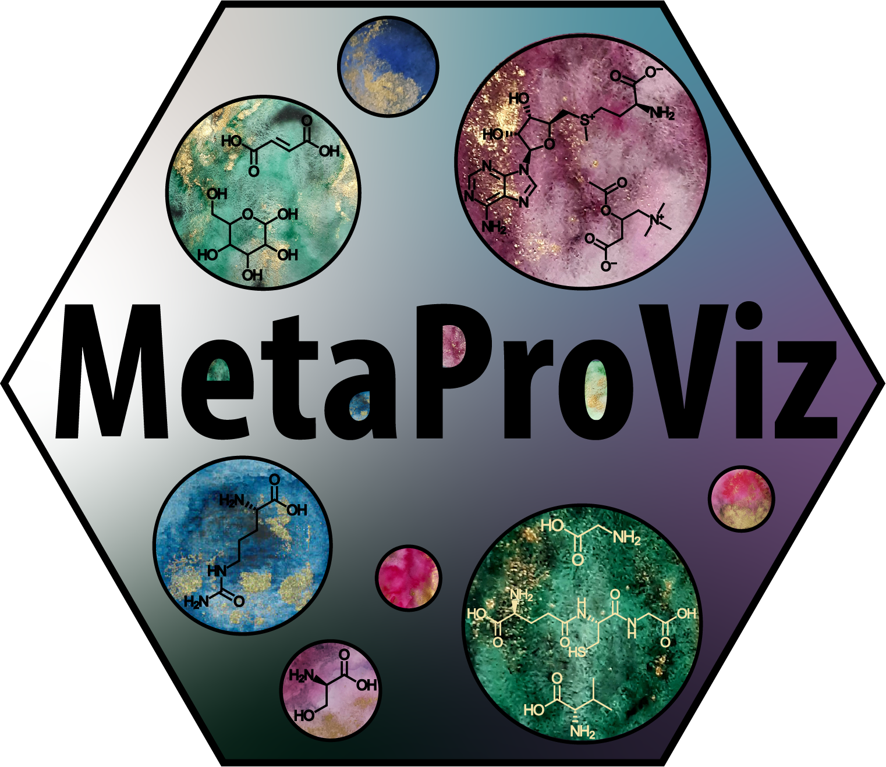

```{=html}
<style>
@media (min-width: 992px) { .container, .main-container { width: 82vw !important; max-width: 82vw !important; } }
pre, pre code { max-width: 100%; font-size: 0.95rem; }
table { display: block; width: fit-content; max-width: 100%; overflow-x: auto; margin: 1.25rem auto !important; white-space: nowrap; }
table caption { caption-side: top; text-align: center; font-weight: 600; white-space: normal; }
</style>
```


```{r chunk_setup, include = FALSE}
knitr::opts_chunk$set(
    collapse = TRUE,
    comment = "#>"
)
```

# 

This vignette demonstrates the `id_processing()` workflow for feature metadata in **MetaProViz**. The function can quantify the current ID space, perform automatic seed-ID compatibility handling, and expand the ID space through graph traversal.

The vignette uses the packaged `tissue_meta` example. This dataset is the package-safe equivalent of the older Revision-branch feature-metadata workflow, but the workflow shown here intentionally replaces the previously manual ID handling with the automatic compatibility handling now available through `seed_id_compatibility_check()`.

```{r load-packages, message=FALSE, warning=FALSE}
library(MetaProViz)
library(dplyr)
library(tibble)
library(knitr)

data(tissue_meta)

Tissue_MetaData <- tissue_meta %>%
    filter(!grepl("^X\\s*-\\s*\\d+$", Metabolite))
```

The workflow-managed identifier namespaces are currently `HMDB`, `KEGG`, `CHEBI`, and `PUBCHEM`. These columns are treated as the canonical ID-space columns, while other metadata columns such as names, pathway classes, or platform information are preserved across all workflow stages.

## Inspection-only workflow

An inspection-only run quantifies the current identifier coverage and overlap structure without changing the feature metadata. The call and its result-inspection code are shown below for reference, but are not evaluated in this vignette.

```{r id-processing-default, eval=FALSE}
id_default <- id_processing(
    data = Tissue_MetaData,
    id_types = c("HMDB", "KEGG", "CHEBI", "PUBCHEM"),
    delimiter = c(";", ","),
    run_compatibility_check = FALSE,
    handle_partially_compatible = TRUE,
    handle_completely_incompatible = TRUE,
    completely_incompatible_priority = c("HMDB", "CHEBI", "PUBCHEM", "KEGG"),
    run_translation = FALSE,
    translation_from = NULL,
    translation_to = NULL,
    translation_summary = FALSE,
    run_traversal = FALSE,
    edge_table = NULL,
    compare_name_col = "Metabolite",
    save_plot = NULL,
    save_table = NULL,
    print_plot = FALSE,
    verbose = FALSE,
    path = NULL
)

names(id_default)
names(id_default$Data)
names(id_default$Plot)
names(id_default$Workflow)
knitr::kable(utils::head(id_default$Data$id_count_summary, 10L), format = "html")
knitr::kable(utils::head(id_default$Data$compare_pk_summary_by_stage$input, 10L), format = "html")
knitr::kable(utils::head(id_default$Data$count_id_tables_by_stage$input$HMDB, 10L), format = "html")
```

## Compatibility-check workflow

The compatibility-only workflow can assess and handle partially or completely incompatible IDs without traversal. It is shown, but not evaluated, here.

```{r id-processing-qc, eval=FALSE}
id_qc <- id_processing(
    data = Tissue_MetaData,
    id_types = c("HMDB", "KEGG", "CHEBI", "PUBCHEM"),
    delimiter = c(";", ","),
    run_compatibility_check = TRUE,
    handle_partially_compatible = TRUE,
    handle_completely_incompatible = TRUE,
    completely_incompatible_priority = c("HMDB", "CHEBI", "PUBCHEM", "KEGG"),
    run_translation = FALSE,
    translation_from = NULL,
    translation_to = NULL,
    translation_summary = FALSE,
    run_traversal = FALSE,
    edge_table = NULL,
    compare_name_col = "Metabolite",
    save_plot = NULL,
    save_table = NULL,
    print_plot = FALSE,
    verbose = FALSE,
    path = NULL
)

knitr::kable(utils::head(id_qc$Data$input[, c("Metabolite", "HMDB", "KEGG", "CHEBI", "PUBCHEM")], 10L), format = "html")
knitr::kable(utils::head(id_qc$Data$after_compatibility[, c("Metabolite", "HMDB", "KEGG", "CHEBI", "PUBCHEM")], 10L), format = "html")
knitr::kable(utils::head(id_qc$Data$id_count_summary, 10L), format = "html")
id_qc$Workflow$steps_run
names(id_qc$Data$compatibility)
id_qc$Workflow$result_overview_text
```

## Translation workflow

Translation can map one identifier namespace to one or more others. It is also shown but not evaluated; translation and traversal are mutually exclusive within one call.

```{r id-processing-translation, eval=FALSE}
id_translation <- id_processing(
    data = Tissue_MetaData,
    id_types = c("HMDB", "KEGG", "CHEBI", "PUBCHEM"),
    delimiter = c(";", ","),
    run_compatibility_check = TRUE,
    handle_partially_compatible = TRUE,
    handle_completely_incompatible = TRUE,
    completely_incompatible_priority = c("HMDB", "CHEBI", "PUBCHEM", "KEGG"),
    run_translation = TRUE,
    translation_from = "PUBCHEM",
    translation_to = c("HMDB", "KEGG"),
    translation_summary = FALSE,
    run_traversal = FALSE,
    edge_table = NULL,
    compare_name_col = "Metabolite",
    save_plot = NULL,
    save_table = NULL,
    print_plot = FALSE,
    verbose = FALSE,
    path = NULL
)

knitr::kable(utils::head(id_translation$Data$after_translation[, c("Metabolite", "PUBCHEM", "HMDB", "KEGG")], 10L), format = "html")
knitr::kable(id_translation$Data$id_count_summary, format = "html", caption = "Translation ID-count summary")
names(id_translation$Data$translation)
knitr::kable(utils::head(id_translation$Data$translation$input, 10L), format = "html")
knitr::kable(utils::head(id_translation$Data$translation$translated_ids, 10L), format = "html")
```

## Traversal workflow

This vignette runs the traversal workflow because it includes the initial ID-space inspection and compatibility handling before expanding the seed ID space through the RaMP mapping graph. The default inspection-only workflow and the translation workflow remain available through `id_processing()` when those focused analyses are needed, but are not run here. Translation and traversal are mutually exclusive within one call.

```{r id-processing-traversal, eval=TRUE}
id_traversal <- id_processing(
    data = Tissue_MetaData,
    id_types = c("HMDB", "KEGG", "CHEBI", "PUBCHEM"),
    delimiter = c(";", ","),
    run_compatibility_check = TRUE,
    handle_partially_compatible = TRUE,
    handle_completely_incompatible = TRUE,
    completely_incompatible_priority = c("HMDB", "CHEBI", "PUBCHEM", "KEGG"),
    run_translation = FALSE,
    translation_from = NULL,
    translation_to = NULL,
    translation_summary = FALSE,
    run_traversal = TRUE,
    edge_table = NULL,
    compare_name_col = "Metabolite",
    save_plot = NULL,
    save_table = NULL,
    print_plot = FALSE,
    verbose = FALSE,
    path = NULL
)
```

### Inspecting traversal results

The traversal return object retains the data, summaries, and traversal artifacts needed to inspect each stage of the workflow.

```{r id-processing-traversal-structure, eval=TRUE}
names(id_traversal)
names(id_traversal$Data)
names(id_traversal$Plot)
names(id_traversal$Workflow)
names(id_traversal$Data$traversal)
```

The `Data` section contains the input metadata and the metadata produced by the compatibility and traversal stages:

```{r id-processing-traversal-data-1, eval=TRUE}
knitr::kable(utils::head(id_traversal$Data$input[, c("Metabolite", "HMDB", "KEGG", "CHEBI", "PUBCHEM")], 10L), format = "html")
knitr::kable(utils::head(id_traversal$Data$after_compatibility[, c("Metabolite", "HMDB", "KEGG", "CHEBI", "PUBCHEM")], 10L), format = "html")
knitr::kable(utils::head(id_traversal$Data$after_traversal[, c("Metabolite", "HMDB", "KEGG", "CHEBI", "PUBCHEM")], 10L), format = "html")
```

```{r id-processing-traversal-data-2, eval=TRUE}
knitr::kable(id_traversal$Data$id_count_summary, format = "html", caption = "ID-count summary across traversal stages")
```

The `compare_pk()` summaries and `count_id()` tables are retained for every stage and namespace:

```{r id-processing-traversal-data-3, eval=TRUE}
knitr::kable(utils::head(id_traversal$Data$compare_pk_summary_by_stage$input, 10L), format = "html")
knitr::kable(utils::head(id_traversal$Data$compare_pk_summary_by_stage$after_compatibility, 10L), format = "html")
knitr::kable(utils::head(id_traversal$Data$compare_pk_summary_by_stage$after_traversal, 10L), format = "html")
```

```{r id-processing-traversal-data-4, eval=TRUE}
knitr::kable(utils::head(id_traversal$Data$count_id_tables_by_stage$input$HMDB, 10L), format = "html")
knitr::kable(utils::head(id_traversal$Data$count_id_tables_by_stage$after_traversal$HMDB, 10L), format = "html")
knitr::kable(utils::head(id_traversal$Data$count_id_tables_by_stage$after_traversal$KEGG, 10L), format = "html")
knitr::kable(utils::head(id_traversal$Data$count_id_tables_by_stage$after_traversal$CHEBI, 10L), format = "html")
knitr::kable(utils::head(id_traversal$Data$count_id_tables_by_stage$after_traversal$PUBCHEM, 10L), format = "html")
```

The traversal-specific pair-compatibility and edge tables provide the underlying mapping information:

```{r id-processing-traversal-raw, eval=TRUE}
knitr::kable(utils::head(id_traversal$Data$traversal$pair_compatibility, 10L), format = "html")
knitr::kable(utils::head(id_traversal$Data$traversal$prior_knowledge_edges, 10L), format = "html")
```

```{r id-processing-traversal-workflow, eval=TRUE}
knitr::kable(
    tibble::enframe(id_traversal$Workflow$settings, name = "Setting", value = "Value") |>
        mutate(Value = vapply(Value, function(x) paste(unlist(x), collapse = ", "), character(1)), .keep = "unused"),
    format = "html", caption = "Workflow settings"
)
knitr::kable(tibble::tibble(Order = seq_along(id_traversal$Workflow$steps_run), Step = id_traversal$Workflow$steps_run), format = "html", caption = "Enabled workflow steps")
knitr::kable(tibble::enframe(id_traversal$Workflow$stage_messages, name = "Stage", value = "Message"), format = "html", caption = "Stage messages")
knitr::kable(tibble::tibble(Result = id_traversal$Workflow$result_overview_text), format = "html", caption = "Workflow result overview")
```

## Traversal workflow: comparison across stages

The following plots compare the input, compatibility-handled, and traversal-expanded ID spaces. For each available stage, `compare_pk()` shows the identifier overlap and `count_id()` shows the number of IDs per feature for all four managed namespaces.

```{r traversal-stage-visual-summary, results='asis', fig.width=8, fig.height=4.5, out.width='85%', fig.show='asis'}
stages <- names(id_traversal$Plot$compare_pk_by_stage)
for (stage in stages) {
    stage_label <- tools::toTitleCase(gsub("_", " ", stage))
    cat("\n\n### ", stage_label, "\n\n", sep = "")
    cat("\n\n#### Identifier overlap (`compare_pk()`)\n\n")
    print(id_traversal$Plot$compare_pk_by_stage[[stage]])
    for (id_type in c("HMDB", "KEGG", "CHEBI", "PUBCHEM")) {
        cat("\n\n#### ", id_type, " IDs per feature (`count_id()`)\n\n", sep = "")
        print(id_traversal$Plot$count_id_by_stage[[stage]][[id_type]])
    }
}
```
