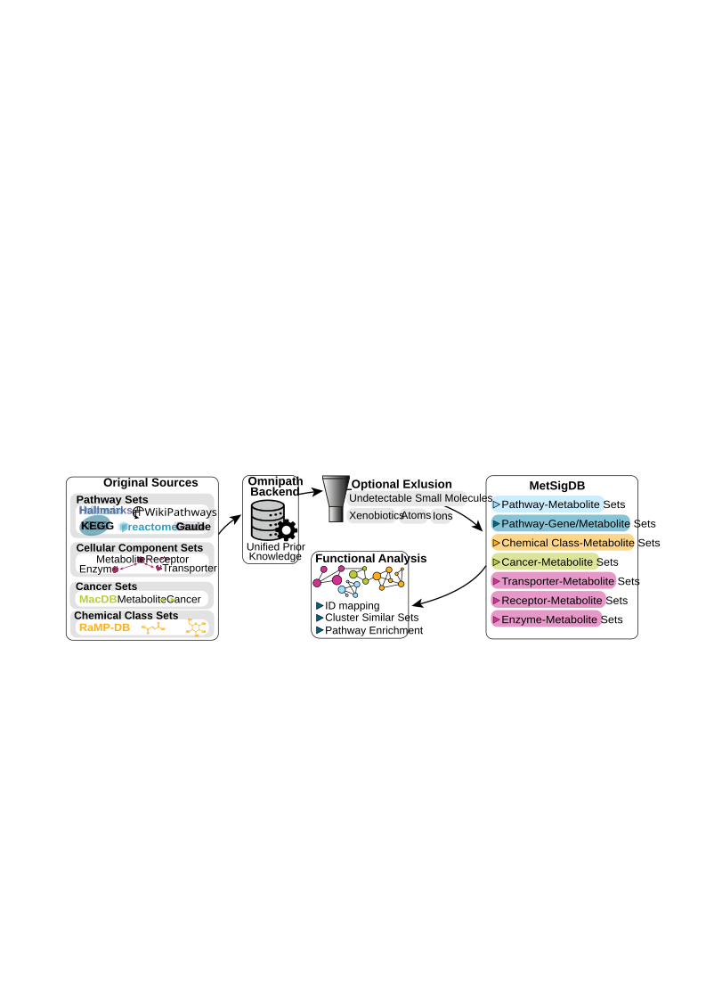

```{r setup, include=FALSE}
knitr::opts_chunk$set(collapse = TRUE, comment = "#>", message = FALSE, warning = FALSE)
```

#  {-}

\
[In this tutorial we take a closer look at the prior knowledge resources collected in **MetSigDB**]{style="text-decoration:underline"}:\
- 1.
[to retrieve all MetSigDB resources and bring them into one common format.](#sect1)

\- 2.
[to compare the resources by size, specificity and redundancy.](#sect2)

\- 3.
[to cluster the terms within each resource and understand its internal structure.](#sect3)

\- 4.
[to choose a resource that fits your data and research question.](#sect4)

\
MetSigDB (Metabolite signature database) is the collection of metabolite sets accessible via the `metsigdb_*()` functions of **MetaProViz**.
How to load single resources, link them to your measured data and translate metabolite IDs is shown in the vignette [Prior Knowledge - Access & Integration](https://saezlab.github.io/MetaProViz/articles/pkgdown/prior-knowledge.html), which we recommend to read first.
Here, we focus on the resources themselves: before using a resource for enrichment analysis, it is worth knowing how large its terms are, how often the same metabolite appears in different terms, and which terms are (nearly) redundant, since all of this shapes the enrichment results.

Fig. 1 summarises how MetSigDB is built and used.
The original sources are accessed via OmniPath and RaMP-DB in the backend and turned into unified sets of pathway-, chemical class-, cancer- and protein-metabolite sets.
Metabolites that carry little biological information (ions, undetectable small molecules, atoms and xenobiotics) can optionally be excluded.
The resulting prior knowledge is then used for ID mapping, clustering of similar sets and pathway enrichment.

<center>

{width="100%"}

</center>

<br>

::: {style="border: 1px solid red; padding: 10px; background-color: #ffe6e6;"}
<strong>Important Information:</strong> All resources are retrieved live at the time this vignette is built.
Since the upstream resources are updated over time, the exact numbers in the tables and plots below can change between versions of this vignette.
:::

<br>

## Terminology {-}

Every MetSigDB resource can be described as a set of *terms* and their *targets*:\

-   A **term** is the set name: a pathway (KEGG, Reactome, WikiPathways, Gaude, Hallmarks), a chemical class (ClassyFire), a protein (MetaLinks) or a cancer association (MACdb).
-   A **target** is a member of the set: a metabolite, or, for the gene-metabolite sets of Gaude and Hallmarks, also a metabolic enzyme.
-   An **interaction** is a unique term-target pair.

From these, we derive two properties that we use throughout this tutorial:\

-   **Term size** is the number of targets per term. Broad terms have many targets and high coverage, but are less specific.
-   **Recurrence** is the number of terms that contain a target. Highly recurrent targets (e.g. ATP or NADH) link many terms with each other and can produce overlapping enrichment results.

\
The benchmark includes KEGG [@kegg], Reactome [@reactome], WikiPathways [@wikipathways], ClassyFire [@classyfire], MetaLinks [@metalinks], MACdb [@macdb], Gaude [@gaude], and Hallmarks [@hallmarks].

First if you have not done yet, install the required dependencies and load the libraries:

```{r libraries}
# 1. Install MetaProViz from Bioconductor devel:
# if (!requireNamespace("BiocManager", quietly = TRUE)) install.packages("BiocManager")
# BiocManager::install(version = "devel")
# BiocManager::install("MetaProViz")

suppressPackageStartupMessages({
    library(MetaProViz)
    library(dplyr)
    library(tidyr)
    library(purrr)
    library(tibble)
    library(ggplot2)
    library(knitr)
    library(scales)
})

# Helper to show long tables in a scrollable box:
scrollable_table <- function(x, ...) {
    kableExtra::scroll_box(knitr::kable(x, format = "html", ...), height = "400px", width = "100%")
}
```

:::: {.progress .progress-striped .active}
::: {.progress-bar .progress-bar-success style="width: 100%"}
:::
::::

# Retrieve and harmonise the resources {#sect1}

:::: {.progress .progress-striped .active}
::: {.progress-bar .progress-bar-success style="width: 100%"}
:::
::::

## Harmonise the metabolite IDs

Each resource uses its own metabolite ID type, and even the same ID type is not always written the same way (e.g. "HMDB0000161" versus "HMDB00161", or "16977" versus "CHEBI:16977").
To count unique targets correctly, we first define small helpers that bring every ID into one canonical form.

```{r id-normalisation}
normalise_id <- function(x, prefix, width = 0L) {
    x <- trimws(as.character(x))
    digits <- gsub("[^0-9]", "", x)
    digits[is.na(x) | x == "" | digits == ""] <- NA_character_
    if (width > 0L) {
        digits <- ifelse(
            is.na(digits),
            NA_character_,
            sprintf(paste0("%0", width, "d"), as.integer(digits))
        )
    }
    paste0(prefix, digits)
}

normalise_hmdb <- function(x) normalise_id(x, "HMDB", 7L)    # HMDB0000161
normalise_kegg <- function(x) normalise_id(x, "C", 5L)       # C00041
normalise_chebi <- function(x) normalise_id(x, "CHEBI:")     # CHEBI:16977
normalise_pubchem <- function(x) normalise_id(x, "CID")      # CID5950
```

## Load all resources

Next, we load every resource with its `metsigdb_*()` function.
The table below summarises what each resource contains and which ID type it uses:

| Resource | Function | Term | Target (ID type) |
|---|---|---|---|
| KEGG | `metsigdb_kegg()` | Pathway | Metabolite (KEGG) |
| Reactome | `metsigdb_reactome()` | Pathway | Metabolite (ChEBI) |
| WikiPathways | `metsigdb_wikipathways()` | Pathway | Metabolite (mixed, harmonised to HMDB) |
| MACdb | `metsigdb_macdb()` | Cancer association | Metabolite (PubChem) |
| ClassyFire | `metsigdb_chemicalclass()` | Chemical class | Metabolite |
| MetaLinks | `metsigdb_metalinks()` | Protein (receptor, enzyme, transporter) | Metabolite (HMDB) |
| Gaude | `data(gaude_pathways)` + `make_gene_metab_set()` | Pathway | Metabolite (HMDB) and metabolic enzyme |
| Hallmarks | `data(hallmarks)` + `make_gene_metab_set()` | Pathway | Metabolite (HMDB) and metabolic enzyme |

\
All `metsigdb_*()` functions and `make_gene_metab_set()` have the parameter `exclude_metabolites`, which removes metabolites that are part of many reactions but carry little biological information.
By default (`exclude_metabolites = "all"`) the classes "ions", "small_molecules" (e.g. water, CO2), "xenobiotics" and "atoms" are removed; with `exclude_metabolites = NULL` nothing is removed.
The exclusion should match the metabolite universe you use for enrichment, and we will quantify its effect in section [2.4](#sect2_4).\
\
Gaude and Hallmarks are gene-sets. `make_gene_metab_set()` adds the metabolites of the reactions catalysed by the enzymes in each gene-set, so these resources contain both metabolites and genes as targets.
We wrap their creation in a small helper and label each target as metabolite or enzyme:

```{r fetch-derived}
fetch_derived <- function(dataset, name, exclusion) {
    data(list = dataset, package = "MetaProViz", envir = environment())
    make_gene_metab_set(
        get(dataset, envir = environment()),
        metadata_info = c(Target = "gene"),
        pk_name = name,
        save_table = NULL,
        exclude_metabolites = exclusion
    )$GeneMetabSet |>
        mutate(interaction_type = if_else(
            grepl("^HMDB", feature),
            "pathway-metabolite",
            "pathway-metabolic_enzyme"
        ))
}
```

Now we can load all resources in one go.
MetaLinks is split by its `interaction_family` column into receptor-, enzyme- and transporter-metabolite interactions, as these answer different biological questions.

```{r live-resources}
live_resources <- function(exclusion = "all") {
    metalinks <- metsigdb_metalinks(exclude_metabolites = exclusion) |>
        collect() |>
        mutate(hmdb = normalise_hmdb(hmdb))

    list(
        kegg = metsigdb_kegg(exclude_metabolites = exclusion) |>
            mutate(MetaboliteID = normalise_kegg(MetaboliteID)),
        reactome = metsigdb_reactome(species = "Homo sapiens", exclude_metabolites = exclusion) |>
            mutate(chebi_id = normalise_chebi(chebi_id)),
        wikipathways = metsigdb_wikipathways(species = "Homo sapiens", exclude_metabolites = exclusion),
        macdb = metsigdb_macdb(exclude_metabolites = exclusion) |>
            mutate(Metabolite_PubchemID = normalise_pubchem(Metabolite_PubchemID)),
        chemicalclass = metsigdb_chemicalclass(exclude_metabolites = exclusion),
        receptor = filter(metalinks, interaction_family == "Receptor-metabolite"),
        enzyme = filter(metalinks, interaction_family == "Enzyme-metabolite"),
        transporter = filter(metalinks, interaction_family == "Transporter-metabolite"),
        gaude = fetch_derived("gaude_pathways", "gaude_pathways", exclusion),
        hallmarks = fetch_derived("hallmarks", "hallmarks", exclusion)
    )
}
```

## Harmonise WikiPathways

WikiPathways is curated by a community and contains a mix of identifier types (HMDB, ChEBI and PubChem) within the same column.
To make it comparable to the other resources, we keep the HMDB IDs as they are and translate ChEBI and PubChem IDs to HMDB via RaMP-DB using `OmnipathR::translate_ids()`.
Metabolites that cannot be translated keep `hmdb = NA`.

```{r harmonise-wikipathways}
harmonise_wikipathways <- function(wp) {
    wp <- wp |>
        mutate(
            .row = row_number(),
            raw = trimws(as.character(metabolite_id)),
            hmdb = if_else(grepl("^HMDB[0-9]+$", raw, ignore.case = TRUE), normalise_hmdb(raw), NA_character_),
            chebi = if_else(grepl("^CHEBI[:_][0-9]+$", raw, ignore.case = TRUE), gsub("[^0-9]", "", raw), NA_character_),
            pubchem = if_else(grepl("^(CID|PUBCHEM[:_])[0-9]+$", raw, ignore.case = TRUE), gsub("[^0-9]", "", raw), NA_character_)
        )

    translate <- function(column, type, output) {
        x <- wp |> filter(!is.na(.data[[column]])) |> select(.row, value = all_of(column))
        if (!nrow(x)) return(tibble(.row = integer(), !!output := character()))
        OmnipathR::translate_ids(
            x, value = type, !!output := "hmdb", ramp = TRUE,
            entity_type = "smol", keep_untranslated = TRUE, return_df = TRUE
        ) |>
            select(.row, all_of(output))
    }

    wp |>
        left_join(translate("chebi", "chebi", "hmdb_chebi"), by = ".row") |>
        left_join(translate("pubchem", "pubchem", "hmdb_pubchem"), by = ".row") |>
        mutate(hmdb = coalesce(hmdb, normalise_hmdb(hmdb_chebi), normalise_hmdb(hmdb_pubchem))) |>
        select(-.row, -raw, -chebi, -pubchem, -hmdb_chebi, -hmdb_pubchem)
}
```

## Combine everything into one table

Finally, we bring all resources into one long table with the columns `resource`, `group`, `type`, `term` and `target`.
Each row is one interaction.
Gaude and Hallmarks are split into their metabolite-pathway and metabolite-enzyme parts, since metabolites and genes have very different set sizes.

```{r as-edges}
as_edges <- function(x) {
    bind_rows(
        transmute(x$kegg, resource = "KEGG", group = "Pathway", type = "pathway-metabolite",
            term = term, target = MetaboliteID),
        transmute(x$reactome, resource = "Reactome", group = "Pathway", type = "pathway-metabolite",
            term = pathway_name, target = chebi_id),
        transmute(x$wikipathways, resource = "WikiPathways", group = "Pathway", type = "pathway-metabolite",
            term = pathway_name, target = hmdb),
        transmute(x$macdb, resource = "MACdb", group = "Cancer association", type = "metabolite-cancer",
            term = term, target = Metabolite_PubchemID),
        transmute(x$chemicalclass, resource = "ClassyFire", group = "Annotation", type = "metabolite-annotation",
            term = ClassyFire_class, target = class_source_id),
        imap_dfr(x[c("receptor", "enzyme", "transporter")], ~ transmute(.x,
            resource = paste("MetaLinks", .y), group = "Interaction", type = "metabolite-protein",
            term = gene_symbol, target = hmdb)),
        imap_dfr(x[c("gaude", "hallmarks")], ~ transmute(.x,
            resource = .y, group = "Derived pathway", type = interaction_type,
            term = term, target = feature))
    ) |>
        mutate(resource = case_when(
            resource == "gaude" & type == "pathway-metabolite" ~ "Gaude: metabolite-pathway",
            resource == "gaude" & type == "pathway-metabolic_enzyme" ~ "Gaude: metabolite-enzyme",
            resource == "hallmarks" & type == "pathway-metabolite" ~ "Hallmarks: metabolite-pathway",
            resource == "hallmarks" & type == "pathway-metabolic_enzyme" ~ "Hallmarks: metabolite-enzyme",
            TRUE ~ resource
        )) |>
        filter(!is.na(term), term != "", !is.na(target), target != "") |>
        distinct()
}
```

We retrieve all resources twice: once with the default exclusion (`"all"`) and once without any exclusion (`NULL`), so we can quantify the effect of the exclusion later on.

```{r retrieve}
default_raw <- live_resources("all")
default_raw$wikipathways <- harmonise_wikipathways(default_raw$wikipathways)

none_raw <- live_resources(NULL)
none_raw$wikipathways <- harmonise_wikipathways(none_raw$wikipathways)

edges <- as_edges(default_raw)
edges_none <- as_edges(none_raw)
```

```{r edges-preview, echo=FALSE}
edges |>
    group_by(resource) |>
    slice_head(n = 1) |>
    ungroup() |>
    kableExtra::kbl(caption = "Preview of the combined table `edges`: one example interaction per resource.", row.names = FALSE) |>
    kableExtra::kable_classic(full_width = FALSE, html_font = "Cambria", font_size = 12)
```

:::: {.progress .progress-striped .active}
::: {.progress-bar .progress-bar-success style="width: 100%"}
:::
::::

# Resource composition {#sect2}

:::: {.progress .progress-striped .active}
::: {.progress-bar .progress-bar-success style="width: 100%"}
:::
::::

With all resources in one table, we can describe each of them with the same set of numbers.
The function below computes three summaries per resource: the **footprint** (how many terms, targets and interactions), the **term size** distribution and the target **recurrence**.

```{r composition}
composition <- function(edges) {
    footprint <- edges |>
        group_by(resource, group, type) |>
        summarise(
            terms = n_distinct(term),
            targets = n_distinct(target),
            interactions = n(),
            mean_targets_per_term = interactions / terms,
            mean_terms_per_target = interactions / targets,
            .groups = "drop"
        )

    term_size <- edges |>
        count(resource, group, type, term, name = "targets_per_term") |>
        group_by(resource, group, type) |>
        summarise(
            min_targets = min(targets_per_term),
            median_targets = median(targets_per_term),
            mean_targets = mean(targets_per_term),
            max_targets = max(targets_per_term),
            .groups = "drop"
        )

    recurrence <- edges |>
        count(resource, group, type, target, name = "terms_per_target") |>
        mutate(bucket = cut(terms_per_target, c(0, 1, 2, 5, Inf), labels = c("1", "2", "3-5", "6+"))) |>
        count(resource, group, type, bucket, name = "targets") |>
        group_by(resource, group, type) |>
        mutate(share = targets / sum(targets)) |>
        ungroup()

    list(footprint = footprint, term_size = term_size, recurrence = recurrence)
}

bench <- composition(edges)
bench_none <- composition(edges_none)
```

## Footprint

The footprint tells us how much of the metabolite (and gene) space a resource covers.
A resource with many targets is more likely to cover your measured metabolites, whilst the number of terms determines how many tests an enrichment analysis performs.

```{r footprint, fig.width=13, fig.height=7}
scrollable_table(bench$footprint, digits = 2, caption = "Resource footprint (default exclusion)")

footprint_long <- pivot_longer(bench$footprint, c(terms, targets, interactions), names_to = "metric", values_to = "count")
ggplot(footprint_long, aes(resource, count, fill = metric)) +
    geom_col(position = "dodge") +
    coord_flip() +
    labs(title = "Resource footprint", x = NULL, y = "Count") +
    theme_minimal()
```

When reading the footprint, compare `mean_targets_per_term` and `mean_terms_per_target`: the first is a rough measure of how broad the terms are, the second of how much the terms share their targets.

## Term size

The mean term size can be dominated by a few very large terms, hence we look at the full distribution and plot the median.

```{r term-size, fig.width=13, fig.height=7}
scrollable_table(bench$term_size, digits = 2, caption = "Term-size distribution")

ggplot(bench$term_size, aes(reorder(resource, median_targets), median_targets, fill = type)) +
    geom_col() +
    coord_flip() +
    labs(title = "Median targets per term", x = NULL, y = "Median") +
    theme_minimal()
```

Resources with small median term sizes (e.g. single proteins in MetaLinks) give very specific, but sparse results: with only a handful of targets per term, few of them may be measured in your data.
Resources with large terms (e.g. broad chemical classes or large pathways) will nearly always overlap with your data, but an enriched term is then less informative.
Many enrichment methods also filter terms by size, so check which terms of a resource survive your size cut-offs.

## Target recurrence

Recurrence shows which share of targets is unique to one term ("1") and which share is found in many terms ("6+").

```{r recurrence, fig.width=13, fig.height=7}
ggplot(bench$recurrence, aes(resource, share, fill = bucket)) +
    geom_col() +
    coord_flip() +
    scale_y_continuous(labels = percent) +
    labs(title = "Target recurrence", x = NULL, y = "Share of targets", fill = "Terms per target") +
    theme_minimal()
```

ClassyFire assigns every metabolite to its chemical classes, so recurrence there reflects the class hierarchy rather than biological redundancy.
In pathway resources, a high share of recurrent targets means that a single changed metabolite can make several terms appear enriched at the same time.
These are exactly the resources in which clustering the terms (section [3](#sect3)) helps to group redundant results.

## Effect of excluding metabolites {#sect2_4}

Finally, we compare the default exclusion (`"all"`) with no exclusion (`NULL`).
For each resource we compute the change in targets and interactions:

```{r exclusion, fig.width=13, fig.height=7}
exclusion <- full_join(
    bench_none$footprint, bench$footprint,
    by = c("resource", "group", "type"),
    suffix = c("_none", "_default")
) |>
    mutate(
        across(where(is.numeric), ~ replace_na(.x, 0)),
        delta_targets = targets_default - targets_none,
        delta_interactions = interactions_default - interactions_none,
        pct_delta_targets = if_else(targets_none > 0, delta_targets / targets_none, NA_real_),
        pct_delta_interactions = if_else(interactions_none > 0, delta_interactions / interactions_none, NA_real_)
    )

scrollable_table(
    select(exclusion, resource, type, targets_none, targets_default, delta_targets, pct_delta_targets,
        interactions_none, interactions_default, delta_interactions, pct_delta_interactions),
    digits = 3, caption = "Effect of the default exclusion"
)

ggplot(exclusion, aes(resource, pct_delta_targets, fill = type)) +
    geom_col() +
    coord_flip() +
    scale_y_continuous(labels = percent) +
    labs(title = "Target change after default exclusion", x = NULL, y = "Change") +
    theme_minimal()

ggplot(exclusion, aes(resource, pct_delta_interactions, fill = type)) +
    geom_col() +
    coord_flip() +
    scale_y_continuous(labels = percent) +
    labs(title = "Interaction change after default exclusion", x = NULL, y = "Change") +
    theme_minimal()
```

The excluded metabolites are few, but they are typically very recurrent (e.g. water or protons are part of almost every pathway).
Hence, a small change in targets can come with a much larger change in interactions.
Resources without a metabolite-level change, such as the enzyme parts of Gaude and Hallmarks, serve as a reference.

:::: {.progress .progress-striped .active}
::: {.progress-bar .progress-bar-success style="width: 100%"}
:::
::::

# Clustering complete resources {#sect3}

:::: {.progress .progress-striped .active}
::: {.progress-bar .progress-bar-success style="width: 100%"}
:::
::::

The composition summaries describe each resource as a whole.
To see *which* terms are redundant, we cluster the terms of each resource based on their shared targets using `cluster_pk()`.

## How `cluster_pk()` works

`cluster_pk()` computes a similarity between all pairs of terms, removes weak similarities, assigns the terms to clusters and draws the result as a graph with `viz_graph()`.
In the graph each node is a term, each edge connects two terms with shared targets, and the coloured background marks a cluster.
The most important parameters are:\

| Parameter | What it does |
|---|---|
| `similarity` | How similar two terms are. `"jaccard"` = shared targets / all targets of both terms; strict for terms of very different size. `"overlap_coefficient"` = shared targets / targets of the smaller term; permissive, so a small term nested in a large one gets a similarity of 1. |
| `threshold` | Similarities below this value are ignored when building the clusters. A high threshold yields few, tight clusters; a low threshold yields large, loose clusters. |
| `clust` | Clustering method. `"community"` uses Louvain community detection on the weighted graph, `"components"` uses connected components, `"hierarchical"` uses hierarchical clustering. |
| `min` | Minimum cluster size; terms in smaller clusters are labelled "None". |
| `plot_threshold` | Similarities below this value are not drawn as edges. This only affects the plot, not the clusters. |
| `min_degree` | Terms with fewer edges than this are not drawn. This only affects the plot, not the clusters. |
| `node_size_column` | Column used to scale the nodes; here the number of targets per term. |

\
The clustering and the plot are therefore controlled separately: `threshold` and `min` decide the clusters, whilst `plot_threshold` and `min_degree` decide what is shown.

::: {style="border: 1px solid red; padding: 10px; background-color: #ffe6e6;"}
<strong>Important Information:</strong> There is no correct threshold.
The values used below are arbitrary and were chosen per resource to show a mix of clustering strengths, from strict (few, tight clusters) to loose (large clusters with weaker connections).
The similarity metric, thresholds, degree filter and layout can change the graph substantially, so treat them as starting points and vary them for your own question.
A seed is set before each call to make the community detection and the graph layout reproducible.
:::

<br>

ClassyFire is not clustered: it is a hierarchical annotation, in which overlap between classes reflects the class hierarchy rather than redundancy.

## Prepare the inputs

`cluster_pk()` takes a long table with one term-target pair per row.
For each resource we add the number of targets per term, which we use as node size.\
Two resources are too large to render as a full graph in this vignette, so we cluster an illustrative subset (the composition results in section [2](#sect2) still use the complete resources):\

-   **Reactome**: the 44 pathways that descend from the Reactome pathway *Metabolism of amino acids and derivatives*.
-   **WikiPathways**: there is no equivalent parent-child hierarchy, hence we select pathways by name: amino acid metabolism pathways, including directly connected one-carbon, glutathione, urea cycle, creatine and amino-acid-derived neurotransmitter routes. General signalling, transport-only and disease-only pathways are excluded.

```{r cluster-subsets}
reactome_rendering_pathways <- c(
    "R-HSA-1237112", "R-HSA-1614517", "R-HSA-1614558", "R-HSA-1614603",
    "R-HSA-1614635", "R-HSA-209776", "R-HSA-209905", "R-HSA-209931",
    "R-HSA-209968", "R-HSA-2408499", "R-HSA-2408508", "R-HSA-2408522",
    "R-HSA-2408550", "R-HSA-2408552", "R-HSA-2408557", "R-HSA-350562",
    "R-HSA-350864", "R-HSA-351143", "R-HSA-351200", "R-HSA-351202",
    "R-HSA-389661", "R-HSA-5263617", "R-HSA-5662702", "R-HSA-6783984",
    "R-HSA-6798163", "R-HSA-70635", "R-HSA-70688", "R-HSA-70895",
    "R-HSA-70921", "R-HSA-71064", "R-HSA-71240", "R-HSA-71262",
    "R-HSA-71288", "R-HSA-8849175", "R-HSA-8963684", "R-HSA-8963691",
    "R-HSA-8963693", "R-HSA-8964208", "R-HSA-8964539", "R-HSA-8964540",
    "R-HSA-977347", "R-HSA-9858328", "R-HSA-9859138", "R-HSA-9988426"
)

wikipathways_rendering_pathways <- c(
    "Amino acid metabolism",
    "Alanine and aspartate metabolism",
    "Glycine metabolism",
    "Glycine metabolism, including IMDs",
    "Serine metabolism",
    "Proline and hydroxyproline pathways",
    "Leucine, isoleucine and valine metabolism",
    "Methionine de novo and salvage pathway",
    "Methionine metabolism leading to sulfur amino acids and related disorders",
    "Cysteine and methionine catabolism",
    "Trans-sulfuration pathway",
    "Trans-sulfuration, one-carbon metabolism and related pathways",
    "One-carbon metabolism",
    "Biosynthesis and regeneration of tetrahydrobiopterin and catabolism of phenylalanine",
    "Tyrosine metabolism and related disorders",
    "Tryptophan metabolism",
    "Tryptophan catabolism leading to NAD+ production",
    "Tryptophan kynurenine pathway in post-COVID syndrome",
    "Kynurenine pathway and links to cell senescence",
    "IDO metabolic pathway",
    "NAD biosynthesis II from tryptophan",
    "Gut-liver indole metabolism ",
    "Amino acid metabolism pathway excerpt: histidine catabolism extension",
    "Urea cycle and metabolism of amino groups",
    "Urea cycle and associated pathways",
    "Urea cycle and related diseases",
    "Glutathione metabolism",
    "Gamma-glutamyl cycle for the biosynthesis and degradation of glutathione",
    "Creatine pathway",
    "GABA metabolism (aka GHB)",
    "Biogenic amine synthesis",
    "Carnosine metabolism of glial cells",
    "Amino acid conjugation",
    "Amino acid conjugation of benzoic acid",
    "Amino acid metabolism in triple-negative breast cancer cells"
)
```

```{r cluster-inputs}
# Add the number of targets per term, used as node size:
add_term_size <- function(x, term_column) {
    x |>
        group_by(.data[[term_column]]) |>
        mutate(n_metabolites_in_pathway = n()) |>
        ungroup()
}

kegg <- add_term_size(default_raw$kegg, "term")
reactome <- default_raw$reactome |>
    filter(pathway_id %in% reactome_rendering_pathways) |>
    add_term_size("pathway_name")
wikipathways <- default_raw$wikipathways |>
    filter(pathway_name %in% wikipathways_rendering_pathways, !is.na(hmdb)) |>
    add_term_size("pathway_name")
macdb <- add_term_size(default_raw$macdb, "term")
receptor <- add_term_size(default_raw$receptor, "gene_symbol")
enzyme <- add_term_size(default_raw$enzyme, "gene_symbol")
transporter <- add_term_size(default_raw$transporter, "gene_symbol")

# Gaude and Hallmarks: split into the metabolite and the enzyme part
derived <- function(x, kind) {
    filtered <- filter(x, interaction_type == kind)
    target <- if (identical(kind, "pathway-metabolite")) {
        normalise_hmdb(filtered$feature)
    } else {
        as.character(filtered$feature)
    }
    filtered |>
        mutate(target = target) |>
        select(term, target) |>
        add_term_size("term")
}

gaude_metabolite <- derived(default_raw$gaude, "pathway-metabolite")
gaude_enzyme <- derived(default_raw$gaude, "pathway-metabolic_enzyme")
hallmarks_metabolite <- derived(default_raw$hallmarks, "pathway-metabolite")
hallmarks_enzyme <- derived(default_raw$hallmarks, "pathway-metabolic_enzyme")
```

## KEGG

In KEGG, each node is a KEGG pathway and the targets are metabolites (KEGG IDs).
KEGG pathways are defined as maps of metabolic reactions, and neighbouring maps share metabolites at their borders, e.g. amino acid degradation pathways that feed into the TCA cycle.
We use a strict setting: the Jaccard similarity must be at least 0.4 to form a cluster, and only edges with a similarity of at least 0.5 are drawn.
This keeps only pathways that share a large part of their metabolites.

```{r kegg, fig.width=12, fig.height=8}
set.seed(123)
kegg_cluster <- cluster_pk(
    kegg,
    metadata_info = c(metabolite_column = "MetaboliteID", pathway_column = "term"),
    similarity = "jaccard",
    input_format = "long",
    threshold = 0.4,
    plot_threshold = 0.5,
    clust = "community",
    min = 2,
    min_degree = 2,
    node_size_column = "n_metabolites_in_pathway",
    show_density = TRUE,
    save_plot = NULL,
    print_plot = TRUE,
    plot_name = "KEGG"
)
scrollable_table(kegg_cluster$cluster_summary, digits = 2, caption = "KEGG cluster summary")
```

The clusters show groups of pathways that share a large part of their metabolites. In an enrichment analysis, pathways of the same cluster are likely to be enriched together, so they should be interpreted as one signal rather than as independent findings.
If your data is linked to KEGG, the [Prior Knowledge vignette](https://saezlab.github.io/MetaProViz/articles/pkgdown/prior-knowledge.html#sect5) shows how to scale the nodes by the coverage of your measured metabolites instead of the pathway size.

## Reactome

Reactome is organised as a hierarchy: a parent pathway contains all metabolites of its child pathways.
Hence, terms of the same branch are nested and similar by design.
For the amino acid metabolism subset, we use a looser clustering threshold (0.3), draw weak edges (`plot_threshold = 0.1`), and only show pathways with at least three connections (`min_degree = 3`) and clusters of at least four pathways (`min = 4`) to focus on the densely connected core.

```{r reactome, fig.width=12, fig.height=8}
set.seed(123)
reactome_cluster <- cluster_pk(
    reactome,
    metadata_info = c(metabolite_column = "chebi_id", pathway_column = "pathway_name"),
    similarity = "jaccard",
    input_format = "long",
    threshold = 0.3,
    plot_threshold = 0.1,
    clust = "community",
    min = 3,
    min_degree = 4,
    node_size_column = "n_metabolites_in_pathway",
    show_density = TRUE,
    save_plot = NULL,
    print_plot = TRUE,
    plot_name = "Reactome"
)
scrollable_table(reactome_cluster$cluster_summary, digits = 2, caption = "Reactome cluster summary")
```

Since parent and child pathways share most of their metabolites, Reactome enrichment results often list a pathway together with its parents.
Clusters help to spot these hierarchies; alternatively, you can restrict the enrichment to one level of the hierarchy.

## WikiPathways

WikiPathways is community curated, and pathways about the same process are often contributed several times with a different focus (e.g. the three urea cycle pathways in our subset).
We use a moderate clustering threshold (0.3) and draw edges from a similarity of 0.2.

```{r wikipathways, fig.width=12, fig.height=8}
set.seed(123)
wikipathways_cluster <- cluster_pk(
    wikipathways,
    metadata_info = c(metabolite_column = "hmdb", pathway_column = "pathway_name"),
    similarity = "jaccard",
    input_format = "long",
    threshold = 0.3,
    plot_threshold = 0.2,
    clust = "community",
    min = 2,
    min_degree = 1,
    node_size_column = "n_metabolites_in_pathway",
    show_density = TRUE,
    save_plot = NULL,
    print_plot = TRUE,
    plot_name = "WikiPathways"
)
scrollable_table(wikipathways_cluster$cluster_summary, digits = 2, caption = "WikiPathways cluster summary")
```

Pathways describing the same process end up in the same cluster, whilst pathways with a disease or tissue focus can stand apart, since they contain additional or fewer metabolites.
Keep in mind that only metabolites with an HMDB ID after harmonisation (section [1.3](#sect1)) are part of this graph.

## MACdb

In MACdb, the terms are not pathways but metabolite-cancer associations collected from the literature, and the targets are metabolites (PubChem IDs).
Two terms are similar if the same metabolites have been reported as altered in both.
We use a strict clustering threshold (0.4) and draw edges from a similarity of 0.3.

```{r macdb, fig.width=12, fig.height=8}
set.seed(123)
macdb_cluster <- cluster_pk(
    macdb,
    metadata_info = c(metabolite_column = "Metabolite_PubchemID", pathway_column = "term"),
    similarity = "jaccard",
    input_format = "long",
    threshold = 0.4,
    plot_threshold = 0.3,
    clust = "community",
    min = 2,
    min_degree = 2,
    node_size_column = "n_metabolites_in_pathway",
    show_density = TRUE,
    save_plot = NULL,
    print_plot = TRUE,
    plot_name = "MACdb"
)
scrollable_table(macdb_cluster$cluster_summary, digits = 2, caption = "MACdb cluster summary")
```

Clusters can point to cancers with similar reported metabolic alterations.
However, the associations depend on which metabolites were measured in the underlying studies, so a cluster can also reflect a shared measurement platform rather than shared biology.

## MetaLinks receptor-metabolite

For the MetaLinks subsets, each node is a protein (gene symbol), and the targets are the metabolites it interacts with (HMDB IDs).
Two proteins are similar if they interact with the same metabolites, e.g. receptors of the same family that bind the same ligands.
This chunk is not evaluated when the vignette is built, because the clustering takes substantially longer than for the other resources.
To run it locally, change `eval = FALSE` to `eval = TRUE`.

```{r receptor, eval=FALSE, fig.width=12, fig.height=8}
set.seed(123)
receptor_cluster <- cluster_pk(
    receptor,
    metadata_info = c(metabolite_column = "hmdb", pathway_column = "gene_symbol"),
    similarity = "jaccard",
    input_format = "long",
    threshold = 0.4,
    plot_threshold = 0.3,
    clust = "community",
    min = 2,
    min_degree = 2,
    node_size_column = "n_metabolites_in_pathway",
    show_density = TRUE,
    save_plot = NULL,
    print_plot = TRUE,
    plot_name = "MetaLinks receptor"
)
scrollable_table(receptor_cluster$cluster_summary, digits = 2, caption = "MetaLinks receptor cluster summary")
```

## MetaLinks enzyme-metabolite

Here the nodes are metabolic enzymes and the targets are their substrates and products.
Enzymes cluster if they act on the same metabolites, e.g. isoenzymes or consecutive steps of a pathway.
As for the receptors, this chunk is not evaluated when the vignette is built; change `eval = FALSE` to `eval = TRUE` to run it locally.

```{r enzyme, eval=FALSE, fig.width=12, fig.height=8}
set.seed(123)
enzyme_cluster <- cluster_pk(
    enzyme,
    metadata_info = c(metabolite_column = "hmdb", pathway_column = "gene_symbol"),
    similarity = "jaccard",
    input_format = "long",
    threshold = 0.4,
    plot_threshold = 0.3,
    clust = "community",
    min = 2,
    min_degree = 2,
    node_size_column = "n_metabolites_in_pathway",
    show_density = TRUE,
    save_plot = NULL,
    print_plot = TRUE,
    plot_name = "MetaLinks enzyme"
)
scrollable_table(enzyme_cluster$cluster_summary, digits = 2, caption = "MetaLinks enzyme cluster summary")
```

## MetaLinks transporter-metabolite

Here the nodes are transporters and the targets are the metabolites they transport.
Transporters of the same family often have overlapping substrate profiles, e.g. amino acid transporters.

```{r transporter, fig.width=12, fig.height=8}
set.seed(123)
transporter_cluster <- cluster_pk(
    transporter,
    metadata_info = c(metabolite_column = "hmdb", pathway_column = "gene_symbol"),
    similarity = "jaccard",
    input_format = "long",
    threshold = 0.4,
    plot_threshold = 0.3,
    clust = "community",
    min = 2,
    min_degree = 2,
    node_size_column = "n_metabolites_in_pathway",
    show_density = TRUE,
    save_plot = NULL,
    print_plot = TRUE,
    plot_name = "MetaLinks transporter"
)
scrollable_table(transporter_cluster$cluster_summary, digits = 2, caption = "MetaLinks transporter cluster summary")
```

Clusters group transporters with similar substrate profiles.
In an enrichment analysis on MetaLinks, these transporters would be reported together, since the result is driven by the same metabolites.

## Gaude metabolite-pathway and metabolite-enzyme

Gaude is a collection of metabolic pathways defined by their enzymes [@gaude].
Through `make_gene_metab_set()`, each pathway also contains the metabolites of the reactions its enzymes catalyse, and we cluster both parts separately.\
For the metabolite part, we use a moderate threshold (0.3).
As the metabolites are assigned via a shared reaction network, metabolites taking part in many reactions connect otherwise different pathways.
For the enzyme part, we use a looser threshold (0.2), since pathways defined by enzymes share fewer members.

```{r gaude, fig.width=12, fig.height=8}
set.seed(123)
gaude_metabolite_cluster <- cluster_pk(
    gaude_metabolite,
    metadata_info = c(metabolite_column = "target", pathway_column = "term"),
    similarity = "jaccard",
    input_format = "long",
    threshold = 0.3,
    plot_threshold = 0.2,
    clust = "community",
    min = 1,
    min_degree = 1,
    node_size_column = "n_metabolites_in_pathway",
    show_density = TRUE,
    save_plot = NULL,
    print_plot = TRUE,
    plot_name = "Gaude metabolite-pathway"
)
scrollable_table(gaude_metabolite_cluster$cluster_summary, digits = 2, caption = "Gaude metabolite-pathway cluster summary")

set.seed(123)
gaude_enzyme_cluster <- cluster_pk(
    gaude_enzyme,
    metadata_info = c(metabolite_column = "target", pathway_column = "term"),
    similarity = "jaccard",
    input_format = "long",
    threshold = 0.2,
    plot_threshold = 0.2,
    clust = "community",
    min = 1,
    min_degree = 1,
    node_size_column = "n_metabolites_in_pathway",
    show_density = TRUE,
    save_plot = NULL,
    print_plot = TRUE,
    plot_name = "Gaude metabolite-enzyme"
)
scrollable_table(gaude_enzyme_cluster$cluster_summary, digits = 2, caption = "Gaude metabolite-enzyme cluster summary")
```

Comparing both graphs shows how much of the redundancy is introduced by the metabolite assignment: pathways that are separate on the enzyme level can be connected on the metabolite level.

## Hallmarks metabolite-pathway and metabolite-enzyme

The Hallmarks are 50 gene-sets that summarise well-defined biological states or processes [@hallmarks]. Most of them are not metabolic, so only the metabolic enzymes of each gene-set (and their metabolites) remain after `make_gene_metab_set()`.\
For the metabolite part, we use a loose threshold (0.2).
For the enzyme part, the remaining enzyme sets are small and partially nested, hence we use the overlap coefficient instead of the Jaccard similarity, with a threshold of 0.25, and draw edges from a similarity of 0.1.
This is the loosest setting in this vignette.

```{r hallmarks, fig.width=12, fig.height=8}
set.seed(123)
hallmarks_metabolite_cluster <- cluster_pk(
    hallmarks_metabolite,
    metadata_info = c(metabolite_column = "target", pathway_column = "term"),
    similarity = "jaccard",
    input_format = "long",
    threshold = 0.2,
    plot_threshold = 0.2,
    clust = "community",
    min = 1,
    min_degree = 1,
    node_size_column = "n_metabolites_in_pathway",
    show_density = TRUE,
    save_plot = NULL,
    print_plot = TRUE,
    plot_name = "Hallmarks metabolite-pathway"
)
scrollable_table(hallmarks_metabolite_cluster$cluster_summary, digits = 2, caption = "Hallmarks metabolite-pathway cluster summary")

set.seed(123)
hallmarks_enzyme_cluster <- cluster_pk(
    hallmarks_enzyme,
    metadata_info = c(metabolite_column = "target", pathway_column = "term"),
    similarity = "overlap_coefficient",
    input_format = "long",
    threshold = 0.25,
    plot_threshold = 0.1,
    clust = "community",
    min = 1,
    min_degree = 1,
    node_size_column = "n_metabolites_in_pathway",
    show_density = TRUE,
    save_plot = NULL,
    print_plot = TRUE,
    plot_name = "Hallmarks metabolite-enzyme"
)
scrollable_table(hallmarks_enzyme_cluster$cluster_summary, digits = 2, caption = "Hallmarks metabolite-enzyme cluster summary")
```

Hallmarks that share metabolic enzymes (e.g. glycolysis and hypoxia) end up close to each other.
Since the overlap coefficient rates a small set nested in a larger one as fully similar, these clusters should be read as "shares its metabolic part with" rather than "is the same as".

:::: {.progress .progress-striped .active}
::: {.progress-bar .progress-bar-success style="width: 100%"}
:::
::::

# Choosing a resource {#sect4}

:::: {.progress .progress-striped .active}
::: {.progress-bar .progress-bar-success style="width: 100%"}
:::
::::

There is no single best resource.
Based on the composition and clustering results, we suggest to consider the following questions:\

-   **Which question do you ask?** Pathways (KEGG, Reactome, WikiPathways) for metabolic processes, ClassyFire for chemical classes, MetaLinks for metabolite-protein interactions, MACdb for comparison to reported cancer alterations, and Gaude or Hallmarks for a joint analysis with transcriptomics or proteomics data.
-   **Which IDs do you have?** Each resource uses one ID type (section [1.2](#sect1)). If your data uses another type, use `translate_id()` and check the mapping ambiguity, as shown in the [Prior Knowledge vignette](https://saezlab.github.io/MetaProViz/articles/pkgdown/prior-knowledge.html#sect4).
-   **How large are the terms?** Small terms are specific but may not be covered by your measured metabolites; large terms are nearly always covered but less informative (section [2.2](#sect2)).
-   **How redundant are the terms?** In resources with recurrent targets and dense clusters, expect groups of enriched terms that describe the same signal (sections [2.3](#sect2) and [3](#sect3)).
-   **Which metabolites are excluded?** Use the same exclusion for the resource and for the metabolite universe of your enrichment analysis (section [2.4](#sect2_4)).

:::: {.progress .progress-striped .active}
::: {.progress-bar .progress-bar-success style="width: 100%"}
:::
::::

# Session information {-}

```{r session-info, echo=FALSE}
options(width = 120)
sessionInfo()
```

# Bibliography {-}
