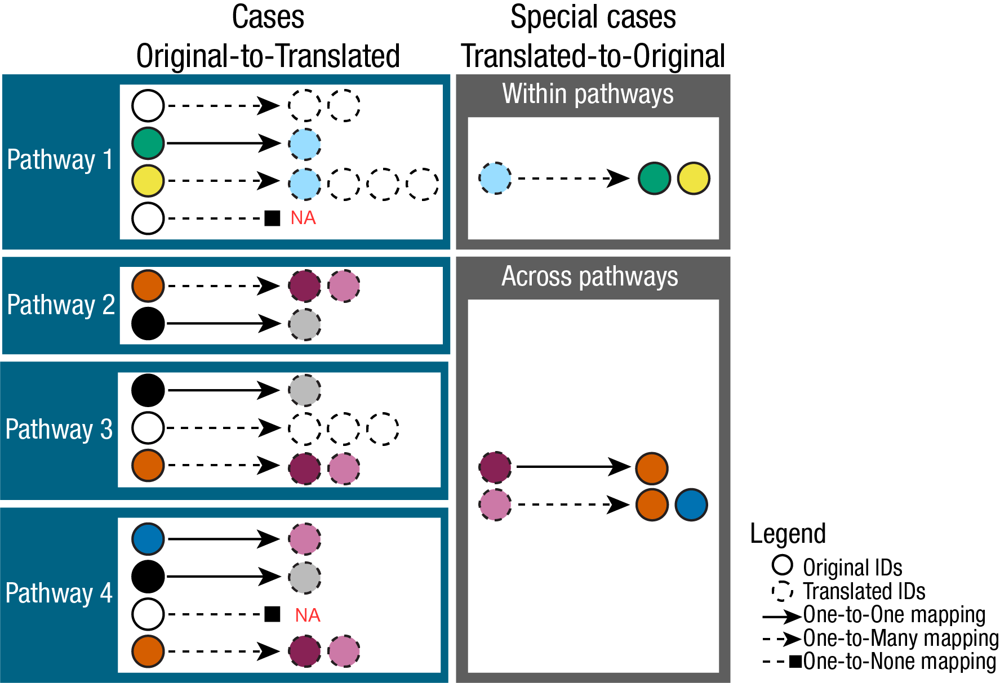
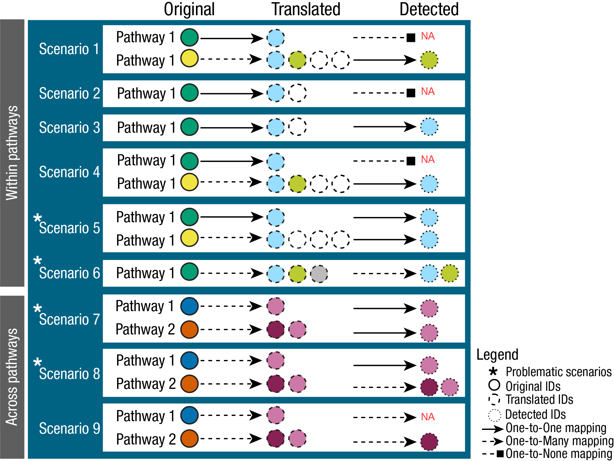

```{=html}
<style>
.vscroll-plot {
    width: 850px;
    height: 500px;
    overflow-y: scroll;
    overflow-x: hidden;
}
</style>
```

```{r chunk_setup, include = FALSE}
knitr::opts_chunk$set(
    collapse = TRUE,
    comment = "#>"
)

# Preview tables: wide tables scroll horizontally instead of stretching the page
preview_table <- function(x, ...) {
    kableExtra::scroll_box(
        kableExtra::kable_classic(
            kableExtra::kbl(x, ...),
            full_width = FALSE, html_font = "Cambria", font_size = 12
        ),
        width = "100%"
    )
}
```

\
[In this tutorial we showcase how to use **MetaProViz** prior knowledge]{style="text-decoration:underline"}:\
- 1.
[to understand the metabolite IDs assigned to measured data.](#sect1)

\- 2.
[to access metabolite prior knowledge and metabolite-gene prior knowledge.](#sect2)

\- 3.
[to link experimental data to prior knowledge - the Do's and Don'ts.](#sect3)

\- 4.
[to translate metabolite IDs and assess the resulting mapping ambiguities.](#sect4)

\- 5.
[to assess how well your measured metabolites cover the pathways of a prior knowledge resource.](#sect5)

\
This tutorial is focused on *your data*: how to connect measured metabolites to prior knowledge and what can go wrong on the way.
If you are interested in the prior knowledge resources themselves, e.g. how large and redundant they are and how their terms cluster, have a look at the follow-up vignette [MetSigDB](https://saezlab.github.io/MetaProViz/articles/pkgdown/metsigdb.html).\
\
First if you have not done yet, install the required dependencies and load the libraries:

```{r load-packages, message=FALSE, warning=FALSE}
# 1. Install MetaProViz from Bioconductor devel:
# if (!requireNamespace("BiocManager", quietly = TRUE)) install.packages("BiocManager")
# BiocManager::install(version = "devel")
# BiocManager::install("MetaProViz")
# 2. Install the latest development version from GitHub using devtools
# remotes::install_github("saezlab/MetaProViz") # Install Rtools if you haven’t done this yet, using the appropriate version (e.g.windows or macOS).

library(MetaProViz)

library(magrittr)
library(rlang)
library(purrr)
library(dplyr)
library(stringr)
library(tibble)

# Please install the Biocmanager Dependencies:
# BiocManager::install("clusterProfiler")
# BiocManager::install("EnhancedVolcano")
# BiocManager::install("cosmosR")
```

:::: {.progress .progress-striped .active}
::: {.progress-bar .progress-bar-success style="width: 100%"}
:::
::::

# Loading the example data {-}

:::: {.progress .progress-striped .active}
::: {.progress-bar .progress-bar-success style="width: 100%"}
:::
::::

\

[As part of the **MetaProViz** package you can load the example feature metadata using `data()`]{style="text-decoration:underline"}:\
`1.` Metadata of cell line experiment **(CellLine)**\
This example dataset is publicly available on [metabolomics workbench project PR001418](https://www.metabolomicsworkbench.org/data/DRCCMetadata.php?Mode=Project&ProjectID=PR001418) and includes metabolic profiles of human renal epithelial cells HK2 and clear cell renal cell carcinoma (ccRCC) cell lines cultured in Plasmax cell culture media [@Sciacovelli_Dugourd2022].\

```{r load-data}
# Load the feature metadata of the cell line experiment:
data(cellular_meta)

FeatureMetadata_Cells <- cellular_meta %>%
    column_to_rownames("Metabolite")
```

\
`2.` Metadata of Biocrates kit **(Biocrates)**\
Here we use the Biocrates kit feature information of the ["MxP® Quant 500 XL kit"](https://biocrates.com/mxp-quant-500-xl/) that covers more than 1,000 metabolites from various biochemical classes.

```{r load-data-3}
# Load the feature metadata of the Biocrates kit:
data(biocrates_features)
FeatureMetadata_Biocrates <- biocrates_features
```

\
\

:::: {.progress .progress-striped .active}
::: {.progress-bar .progress-bar-success style="width: 100%"}
:::
::::

# Metabolite IDs in measured data {#sect1}

:::: {.progress .progress-striped .active}
::: {.progress-bar .progress-bar-success style="width: 100%"}
:::
::::

***Assigning Metabolite IDs to measured data***\
The difficulty with assigning metabolite IDs to measured data is the uncertainty in the detection of metabolites.
Indeed, structural isomers (both constitutional isomers and stereoisomers), as for example enantiomers, are often not differentiated during detection.
This leads to loss of information and hence uncertainty in assigning metabolite IDs.\
One example is the metabolite Alanine, which can occur in its L- or D- form.
If in an experiment those enantiomers have not been distinguished, the correct way would be to either assign two metabolite IDs (L- and D-Alanine) or a more general Alanine ID without chiral information.
Yet, in reality this is not as trivial:\

```{r code, echo=FALSE}
# Create DF for Alanine:
Alanine <- data.frame(
    TrivialName = c("D-Alanine", "L-Alanine", "Alanine", "Alanine zwitterion"),
    HMDB= c("HMDB0001310",  "HMDB0000161", NA, NA),
    ChEBI = c("15570", "16977", "16449", "66916" ),
    KEGG = c("C00133", "C00041", "C01401", NA ),
    PubChem = c("71080" , "5950", "602", "57383916"),
    stringsAsFactors = FALSE)

# Print table:
Alanine%>%
preview_table(caption = "Available Alanine IDs in HMDB, ChEBI, KEGG and PubChem.")
```

\
Indeed, depending on the database, the Alanine metabolite can have different IDs available:\

```{r plot, echo=FALSE}
# Print Plot:
AlaninePlot <- Alanine%>%
tidyr::pivot_longer(cols = c("HMDB", "ChEBI", "KEGG", "PubChem"),
names_to = "Conditions",
values_to = "ID")%>%
tidyr::drop_na()
AlaninePlot$`IDs in Database` <- as.numeric(1)

Plot <- ggplot2::ggplot(AlaninePlot, ggplot2::aes(fill=TrivialName, y=`IDs in Database`, x=Conditions)) +
        ggplot2::geom_bar(position="stack", stat="identity")+
        ggplot2::scale_fill_manual(values = c("D-Alanine" = "#9F0162"  , "L-Alanine" = "#006384", "Alanine" = "grey", "Alanine zwitterion" = "#00735C"))+
        ggplot2::theme_classic()+
        ggplot2::ggtitle("Alanine IDs in different databases")+
        ggplot2::theme(axis.text.x = ggplot2::element_text(angle = 90, hjust = 1))+
        ggplot2::labs(x = "Database", y = "Number of IDs")

Plot_Sized <-  MetaProViz:::plot_grob_superplot(input_plot=Plot, metadata_info=c(Conditions="Conditions", Superplot="Conditions"), metadata_sample=AlaninePlot, plot_name = "Alanine IDs in different databases", subtitle = NULL, plot_type="Bar")

plot_height <- grid::convertUnit(Plot_Sized$height, 'cm', valueOnly = TRUE)
plot_width <- grid::convertUnit(Plot_Sized$width, 'cm', valueOnly = TRUE)
Plot_Sized %<>%
{ggplot2::ggplot() + ggplot2::annotation_custom(.)} %>%
add(ggplot2::theme(panel.background = ggplot2::element_rect(fill = "transparent")))

Plot_Sized
```

\
For instance, if we want to assign a HMDB ID, we have to assign both "HMDB0001310" and "HMDB0000161" to the metabolite Alanine. For ChEBI we could assign only one, "16449", but this may lead to other problems as this ChEBI ID is not specific and may not be part of certain metabolic pathways.
The reason for this is that substrate chirality is critical to enzymatic processes, and enzymes are stereoselective, favouring one particular enantiomer (e.g. D-sugars, L-amino acids, etc.).\
To showcase the severity of this problem, we can look at the occurrence of those metabolite IDs in metabolic pathways across different databases.
To do so, we searched for those metabolite IDs in the RaMP database [@Braisted2023] and extracted the pathways they are part of:\

```{r data-prep, echo=FALSE}
data(alanine_pathways)

Pathways <- alanine_pathways

Count <- Pathways %>%
tidyr::unite(Pathway, c("pathwaySource", "pathwayName"), sep = ": ")%>%
dplyr::group_by(inputId) %>%
dplyr::summarise(PathwayCount = dplyr::n_distinct(Pathway), .groups = 'drop')%>%
tidyr::separate(inputId, into = c("Database", "ID"), sep = ":", remove = TRUE)

Alanine <- merge(x = AlaninePlot%>%dplyr::rename("Database"="Conditions") ,
y= Count[,2:3],
by = "ID",
all.x=TRUE)%>%
dplyr::mutate(PathwayCount = replace(PathwayCount, is.na(PathwayCount), 0))%>%
dplyr::arrange(desc( TrivialName)) %>%
dplyr::select(TrivialName, ID, Database, PathwayCount)

# Print table:
Alanine%>%
preview_table(caption = "Alanine IDs mapped to pathways from WikiPathways, KEGG and Reactome using RaMP.")
```

\

```{r plot-2, echo=FALSE}
# BarGraph
Plot <- ggplot2::ggplot(Alanine, ggplot2::aes(fill=TrivialName, y=`PathwayCount`, x=Database)) +
        ggplot2::geom_bar(position="stack", stat="identity")+
        ggplot2::scale_fill_manual(values = c("D-Alanine" = "#9F0162"  , "L-Alanine" = "#006384", "Alanine" = "grey", "Alanine zwitterion" = "#00735C"))+
        ggplot2::theme_classic()+
        ggplot2::ggtitle("Alanine IDs in different pathways")+
        ggplot2::theme(axis.text.x = ggplot2::element_text(angle = 90, hjust = 1))+
        ggplot2::labs(x = "Database", y = "Number of Pathways")

Plot_Sized <-  MetaProViz:::plot_grob_superplot(input_plot=Plot, metadata_info=c(Conditions="Conditions", Superplot="Conditions"), metadata_sample=AlaninePlot, plot_name = "Alanine IDs in different pathways", subtitle = NULL, plot_type="Bar")

plot_height <- grid::convertUnit(Plot_Sized$height, 'cm', valueOnly = TRUE)
plot_width <- grid::convertUnit(Plot_Sized$width, 'cm', valueOnly = TRUE)
Plot_Sized %<>%
{ggplot2::ggplot() + ggplot2::annotation_custom(.)} %>%
add(ggplot2::theme(panel.background = ggplot2::element_rect(fill = "transparent")))

Plot_Sized
```

\
This showcases that if we choose the unspecific ChEBI ID for Alanine (ChEBI ID 16449), because experimentally the distinction was not possible, we will not map to any pathway, even though the metabolite is part of many pathways.
Hence, we recommend to assign multiple IDs to a measured peak where specificity in detection is not given.\

\
Yet, many metabolomics studies do not report multiple IDs, but rather one ID per measured peak.
In some cases the chosen ID correctly represents the degree of ambiguity in the detection, e.g. "Alanine zwitterion", whilst in other cases a specific ID is chosen that has not been detected with this specificity, e.g. "L-Alanine".
In both cases this can lead to missed mappings to prior knowledge and hence a loss of information as discussed above.\
The function `equivalent_id()` helps with this: for each measured ID it adds the IDs of equivalent metabolites (e.g. other enantiomers) that may not have been distinguished in the measurement.\

```{r data-prep-2}
# Example Cell-line data:
Input_HMDB <- FeatureMetadata_Cells %>%
    dplyr::filter(!HMDB == "NA") %>% # ID in the measured data we want to use, hence we remove NA's
    dplyr::select("HMDB", "Pathway") # only keep relevant columns

# Add equivalent IDs:
FeatureMetadata_Cells_AddIDs <- equivalent_id(
    data = Input_HMDB,
    metadata_info = c(InputID = "HMDB"), # ID in the measured data, here we use the HMDB ID
    from = "hmdb"
)
```

```{r code-2, echo=FALSE}
# Check how our data looks like:
FeatureMetadata_Cells_AddIDs [2:8, 1:3]%>%
preview_table(caption = "Preview of the DF `FeatureMetadata_Cells_AddIDs` including new columns with potential additional HMDB IDs assigned using the equivalent_id() function.")
```

\
The Biocrates kit, which we will use in the rest of this tutorial, has already done this for us: where the measurement is not specific, multiple HMDB IDs are assigned to one feature (e.g. the two HMDB IDs of L- and D-Alanine).

:::: {.progress .progress-striped .active}
::: {.progress-bar .progress-bar-success style="width: 100%"}
:::
::::

# Accessing Prior Knowledge {#sect2}

:::: {.progress .progress-striped .active}
::: {.progress-bar .progress-bar-success style="width: 100%"}
:::
::::

Metabolite prior knowledge (PK) is essential for the interpretation of metabolomics data.
It can be used to perform pathway enrichment analysis and compound class enrichment analysis, and specific PK databases can be used to study the connection of metabolites to receptors or transporters.
Since the quality and content of the PK will dictate the success of the downstream analysis and biological interpretation, it is important to ensure the PK is used correctly.\
Specifically in metabolite PK, the many different PK databases and resources pose several issues.
Indeed, the metabolite identifiers (e.g. KEGG, HMDB, PubChem, etc.) are not standardized across databases, and the same metabolite can have multiple identifiers in different databases.
This is known as the many-to-many mapping problem.
Moreover, metabolic pathways that are the basis of the PK databases also include co-factors such as ions or other small molecules that are not only part of most reactions, but often cannot be detected in experimentally acquired data (e.g. H2O, CO2, etc).\
To address these issues and provide a standardized way to access and integrate metabolite PK, we provide access to several prior knowledge resources from which molecules such as water have been removed.
We term this collection of metabolite sets MetSigDB (Metabolite signature database).\
In this section we load the resources we need for this tutorial. MetSigDB contains further resources (Reactome, WikiPathways, MACdb), which are introduced and compared in the [MetSigDB vignette](https://saezlab.github.io/MetaProViz/articles/pkgdown/metsigdb.html).

## KEGG pathway-metabolite sets

KEGG pathways are loaded via the KEGG API using the package `KEGGREST` and can be used to perform pathway analysis [@Kanehisa2000].
**(KEGG_Pathways)**\

```{r metsigdb-kegg}
# This will use KEGGREST to query the KEGG API to load the pathways:
KEGG_Pathways <- metsigdb_kegg()
```

\

```{r code-3, echo=FALSE}
# Check how our data looks like:
KEGG_Pathways[c(1:3,52:54),]%>%
preview_table(caption = "Preview of the DF `KEGG_Pathways`.")
```

## Chemical class-metabolite sets

The chemical class-metabolite sets are based on the classification of metabolites into chemical classes, which can be used to perform compound class enrichment analysis.\
The chemical class-metabolite sets were curated by RaMP-DB, which used ClassyFire [@Braisted2023].
Here we access them via OmnipathR.\

```{r metsigdb-chemicalclass}
ChemicalClass_MetabSet <- metsigdb_chemicalclass()
```

\

```{r code-4, echo=FALSE}
# Check how our data looks like:
ChemicalClass_MetabSet[c(1:5,80:83, 500:503),]%>%
preview_table(caption = "Preview of the DF `ChemicalClass_MetabSet`.")
```

## Create pathway-metabolite sets

The function `make_gene_metab_set()` can be used to convert gene names to metabolite names by using a PK network of metabolic reactions called CosmosR [@Dugourd2021].
This function is useful if you want to perform pathway enrichment analysis on available gene-sets such as the Hallmarks gene-sets from MSigDB [@Castanza2022].
Moreover, it enables you to perform combined pathway enrichment analysis on metabolite-gene sets, if you have other data types such as proteomics measuring the enzyme expression.\
The Hallmarks [@Liberzon2015] gene-sets and the Gaude [@Gaude2016] gene-sets are available in the package `MetaProViz` and can be loaded using `data(hallmarks)` and `data(gaude_pathways)` respectively.\

```{r load-data-4}
# Load the example gene-sets:
data(hallmarks)
Hallmark_Pathways <- hallmarks

data(gaude_pathways)
Gaude_Pathways <- gaude_pathways
```

\

```{r code-5, echo=FALSE}
# Check how our data looks like:
Hallmark_Pathways[c(997:998,2916:2917, 2916:2918),]%>%
preview_table(caption = "Preview of the DF `Hallmark_Pathways` including gene-sets usable for pathway enrichment analysis.", row.names=FALSE)
```

\

```{r code-6, echo=FALSE}
# Check how our data looks like:
Gaude_Pathways[c(486:490, 1504, 1507, 1531, 49:50, 779),]%>%
preview_table(caption = "Preview of the DF `Gaude_Pathways` including gene-sets usable for pathway enrichment analysis.", row.names=FALSE)
```

\
Now we can use the function `make_gene_metab_set()` to translate the gene names to metabolite names.

```{r make-gene-metab-set}
# Translate gene names to metabolite names
Hallmarks_GeneMetab <- make_gene_metab_set(
    input_pk = Hallmark_Pathways,
    metadata_info = c(Target = "gene"),
    pk_name = "Hallmarks"
)

Gaude_GeneMetab <- make_gene_metab_set(
    input_pk = Gaude_Pathways,
    metadata_info = c(Target = "gene"),
    pk_name = "Gaude"
)
```

\

```{r data-prep-3, echo=FALSE}
# Check how our data looks like:
Hallmarks_GeneMetab[["GeneMetabSet"]]%>%
dplyr::filter(term=="HALLMARK_GLYCOLYSIS")%>%
dplyr::slice(c(59,142,193, 201:203))%>%
preview_table(caption = "Preview of the DF `Hallmarks_GeneMetab` including gene-metabolite-sets usable for pathway enrichment analysis.")
```

\
Given that we have the gene-metabolite-sets, we can now also run enrichment analysis on combined data types, including both the metabolite Log2FC and the gene Log2FC from e.g. transcriptomics or proteomics data.
Yet, it is important to keep in mind that generally we detect fewer metabolites than genes and hence this may bias the results obtained from combined enrichment analysis.

## MetaLinksDB metabolite-receptor & metabolite-transporter sets

The MetaLinks database is a manually curated database of metabolite-receptor and metabolite-transporter sets that can be used to study the connection of metabolites and receptors or transporters [@Farr_Dimitrov2024].\

```{r metsigdb-metalinks}
MetaLinksDB <- metsigdb_metalinks()
```

\

```{r data-prep-4, echo=FALSE}
# Check how our data looks like:
MetaLinksDB[
    c(12:13,17:18,432,466),
    c(1:2,6:8, 12:15)
    ] %>%
    preview_table(caption = "Preview of the DF `MetaLinksDB` including metabolite-receptor sets.", row.names=FALSE)

dplyr::filter(MetaLinksDB, !is.na(term_specific))[c(1,50, 90, 101),] %>%
preview_table(caption = "Preview of the metabolite-receptor and metabolite-transporter sets.", row.names=FALSE)
```

## Comparison of PK coverage

We have now loaded a number of different PK sources (details above) and aim to compare the overlap in coverage between these PK sources to understand if there are certain genes or metabolites covered by one PK resource but not the others.
As an example, we will compare the resources containing gene-metabolite sets (Hallmarks, Gaude, MetaLinksDB) using the `compare_pk()` function, which generates a combined data table and visualises it as an upset plot. The upset plot shows the overlap of coverage, similar to how a Venn diagram works, but enables us to visualise many combinations clearly.

```{r compare-pk, eval=TRUE, echo=TRUE, results="hide", fig.show="hide"}
# Compare the PK resources
pk_comp_res <- compare_pk(
    data = list(
        Hallmarks = as.data.frame(Hallmarks_GeneMetab[["GeneMetabSet"]]),
        Gaude = as.data.frame(Gaude_GeneMetab[["GeneMetabSet"]]),
        MetalinksDB = as.data.frame(MetaLinksDB)
    )
)
```

```{r, echo=FALSE, results="asis"}
cat(sprintf(
    '',
    "prior-knowledge.Rmd_compare-pk.svg"
))
```

\
The table includes all features of the three PK resources we decided to compare. Additionally, it includes a column for each PK resource with value 1 if the feature is present in the PK resource and 0 if it is not. The column "Type" specifies which ID type the feature corresponds to, here either metabolite (HMDB) or gene, which is used for visualisation purposes in the upset plot.\

```{r code-8, echo=FALSE}
# Check how our data looks like:
pk_comp_res$summary_table[c(1:8),]%>%
preview_table(caption = "Preview of the DF `pk_comp_res$summary_table` showing coverage of features (genes or metabolites) across PK sources.", row.names=FALSE)
```

\
The upset plot shows that MetaLinksDB has unique genes and metabolites not present in the other resources. This is to be expected, since MetaLinksDB focuses on receptors, transporters and metabolic enzymes, whilst Gaude and Hallmarks focus on pathways.\
Since Gaude only focuses on metabolic enzymes of pathways, it contains a low number of genes and hence has a small amount of unique genes and metabolites. In this regard it makes sense that Hallmarks includes many unique genes, since Hallmarks also includes other genes and pathways not related to metabolism.
Between Hallmarks and Gaude we observe a high overlap of metabolites. This can be explained since both gene-sets are assigned metabolites by using the same metabolic reaction network in the backend of `make_gene_metab_set()`, and it is important to keep in mind that this network dictates the gene-metabolite associations added.

:::: {.progress .progress-striped .active}
::: {.progress-bar .progress-bar-success style="width: 100%"}
:::
::::

# Linking experimental data to prior knowledge {#sect3}

:::: {.progress .progress-striped .active}
::: {.progress-bar .progress-bar-success style="width: 100%"}
:::
::::

Now that we have loaded the prior knowledge and inspected the overlap of genes and metabolites between the different PK resources, in this section we want to link our experimental data to the PK.\
Whichever resource the experimental data resembles, we recommend to follow this overall approach:\
\
1.
Determine the metabolite identifiers from the experimental data and inspect their coverage.\
2.
Select the metabolite identifiers from the experimental data, which can be used to link to the PK of interest.\
3.
Connect the metabolite identifiers to the PK and assess the overlap.\

\
Here one can select any combination of experimental data and PK.
This selection should be based on the experimental data at hand and the biological research question.\
For this tutorial, we will focus on the combination of the Biocrates experimental data and the MetaLinksDB PK. The reason for using the landscape of metabolites included in the Biocrates kit is that Biocrates has assigned multiple types of metabolite IDs to each measurement (LIPID MAPS, HMDB, ChEBI) and, where needed, multiple IDs of one type to one measurement (e.g. the two HMDB IDs of L- and D-Alanine).

## Determine identifiers and inspect coverage

First we determine the identifiers and inspect the coverage.\
In experimentally acquired data, different metabolite IDs can be used to describe a metabolite.
In the Biocrates data the available metabolite identifiers that could be linked to PK resources are mostly ChEBI, HMDB, and LIPID MAPS (LIMID).
We now select these metabolite identifier columns to count the coverage and look at the combinations of the coverage grouped by the class of metabolite.
This helps us to understand what to expect when linking the data to prior knowledge.\

```{r compare-pk-2, eval=TRUE, echo=TRUE, results="hide"}
pk_comp_res_biocft <- compare_pk(
    data = list(Biocft = FeatureMetadata_Biocrates),
    metadata_info = list(Biocft = c("CHEBI", "HMDB", "LIMID")),
    plot_name = "Overlap of BioCrates Columns",
    print_plot = FALSE
)
```

```{r, echo=FALSE, results="asis"}
cat(sprintf(
    '',
    "prior-knowledge.Rmd_compare-pk-2.svg"
))
```

\

```{r code-10, echo=FALSE}
# Check how our data looks like:
pk_comp_res_biocft$summary_table[c(1:8),]%>%
preview_table(caption = "Preview of the DF `pk_comp_res_biocft$summary_table` showing coverage of identifiers.", row.names=FALSE)
```

\
These results tell us that:\

-   Less than half of the metabolites have ***CHEBI+HMDB+LIMID (n=413)***, which isn't great, but probably higher than we would have expected.\

-   If you relied only upon:\

    -   CHEBI: then you would miss at least 256 metabolites with HMDB+LIMID

    -   HMDB: then you would miss at least 54 metabolites with CHEBI+LIMID

    -   LIMID: then you would miss at least 89 metabolites with CHEBI+HMDB

However, there are two things to note about these observations.

The first is that these numbers are minimums; the real values are a little higher once you add, for instance, metabolites with just CHEBI or just LIMID.
So actually, relying upon only LIMID means we miss 151 Biocrates metabolites (89 with only HMDB/ChEBI + 15 with only CHEBI + 8 with only HMDB and 39 with no LIMID/CHEBI/HMDB identifiers).

The second point is more nuanced but just as important: there is no direct 1:1 relationship between the number of Biocrates metabolites with, for instance, a ChEBI ID, and the number of unique ChEBI IDs that they map to.
The upset plot treats each Biocrates metabolite as an individual entry and categorises whether it has a ChEBI, HMDB, LIMID ID, etc.
However, it does not consider what those ChEBI, HMDB or LIMID IDs actually are.
So it is possible that the number of metabolites is higher, or lower, than the number of unique IDs due to multi-mapping.

For example, assume we have 3 Biocrates metabolites with only HMDB IDs. These count as 3 entries in the upset plot.
But two of these Biocrates metabolites could both map to the same HMDB ID, whereas the third Biocrates metabolite could map to 6 different HMDB IDs.
In this case, there are 3 Biocrates metabolites with HMDB IDs but 7 unique HMDB IDs.
Hence, it is important to keep this in mind when interpreting the upset plot.

## Select identifiers to link to PK of interest

We have inspected the experimental coverage of the metabolite IDs from the Biocrates kit.
Next, we have to choose which metabolite identifier to use to link to the PK of choice.
Often this choice is dictated by the prior knowledge resource, as most of them use a specific identifier.\
Here we will use MetaLinksDB, which uses HMDB IDs as metabolite identifiers, hence it is best to use the HMDB IDs to link the Biocrates features to the resource.
Noteworthy, in some cases the Biocrates metabolites have multiple HMDB IDs listed per metabolite. We can count them using `count_id()`:\

```{r code-11, fig.width=8, fig.height=6}
# Count entries and record NA information
result_bioc_hmdb_count <- count_id(FeatureMetadata_Biocrates, "HMDB", delimiter = ", ")
# Access the processed data:
processed_df_bioc_hmdb_count <- result_bioc_hmdb_count$Table
```

From this plot we can make a few observations:\
1. The number of Biocrates features without any HMDB ID is very high (n=253).\
2. Whilst a number of Biocrates features have only a single HMDB ID associated with them (n=314), the majority of Biocrates metabolites actually have multiple entries (n=452).\
3. For those with multiple, this ranges from 2-20 HMDB IDs per Biocrates feature!\

With so many Biocrates features linked to multiple HMDB IDs there are different ways to deal with this (e.g. select a single HMDB ID in cases where we have multiple). We discuss the pros and cons of this in section [3.4 Are multiple metabolite IDs helpful or a hindrance?](#sect3_4).
For now, we proceed with making the connections to the PK using all HMDB IDs, which the MetaProViz function `checkmatch_pk_to_data()` has been designed to handle.

## Make connection to PK and assess overlap

Here we connect the experimental Biocrates table to the MetaLinksDB PK via the HMDB IDs using the `checkmatch_pk_to_data()` function.\

```{r load-data-5}
Biocrates_to_MetalinksDB <- checkmatch_pk_to_data(
    data = FeatureMetadata_Biocrates,
    input_pk = MetaLinksDB,
    metadata_info = c(InputID = "HMDB", PriorID = "hmdb", grouping_variable = NULL)
)
```

\
This returns some warning messages and three tables:\

-   `data_summary`: a summary table with the links to the prior knowledge, including pointers if any action is required.
    Any NA values or duplicates of the InputID (e.g. 'HMDB') are removed from this table.

-   `GroupingVariable_summary`: an extended version of the summary, where the grouping variable is taken into account, e.g. for pathway-metabolite sets this would include duplicated InputIDs as they are in multiple pathways.

-   `data_long`: an all-versus-all comparison to enable checking on a case-by-case basis.

In some cases we expect only one input ID to be linked to one entry in the PK.
But this won't always be the case, and as already discussed in the last section, in many cases here we have multiple HMDB IDs per single Biocrates feature.
`checkmatch_pk_to_data()` has been designed with this in mind: by default it splits any comma separated values in the InputID (or PriorID) into separate entities, counts the number of links between these, and reports this to the user.

Let's take a look at the results:

```{r data-prep-5, echo=FALSE}
irrelevant_cols <- c('INCHI','SMILES','Key','IUPAC','Molecule','MESH','TrivialName_Prior2023', 'Detection','CID')

# Check how our data looks like:
Biocrates_to_MetalinksDB$data_summary[c(1:8),-c(2,4)] %>%
dplyr::select(-any_of(irrelevant_cols)) %>%
preview_table(caption = "Preview of the DF `data_summary` showing coverage of identifiers (some columns hidden)", row.names=FALSE)
```

\
For a few metabolite classes of the Biocrates kit, every metabolite has a HMDB ID and a corresponding entry in MetaLinksDB. For a number of other classes, however, we see that they are not represented in the MetaLinksDB PK at all, either because there is no HMDB ID associated with the Biocrates metabolite, or because MetaLinksDB does not include the HMDB ID of that metabolite.\
This poor coverage could be a concern if we are interested in analysing many of these classes, since it means that our experimental results for e.g. Phosphatidylglycerols will not be linked to PK.
In any case we need to keep this in mind for downstream analysis and the interpretation of results, so that we don't overinterpret results that, for instance, include a large number of amino acids, or falsely assume that the absence of Phosphatidylinositols in our PK integration results means that they are not present or important in our data.

## Are multiple metabolite IDs helpful or a hindrance? {#sect3_4}

Let's turn back to the number of HMDB IDs we have in the Biocrates data and ask ourselves: is it helpful or detrimental to have multiple IDs?
To answer this, we take only the first HMDB ID of each feature with multiple HMDB IDs, repeat the matching and compare the number of matches.

```{r data-prep-6}
# Number of matches using all HMDB IDs:
MultipleIDs <- Biocrates_to_MetalinksDB$data_summary %>%
    summarise(total_matches_count = sum(matches_count, na.rm = TRUE)) %>%
    mutate(Name = "MultipleIDs")

# Extract first ID:
extract_first_id <- function(id_col) {
    map_chr(as.character(id_col), function(x) {
        # Check for NA or empty string
        if (is.na(x) || x == "") {
            return(NA)
        }
        # Split on comma (adjust the delimiter if needed)
        parts <- unlist(strsplit(x, split = ","))
        # Return the first value after trimming any whitespace
        return(trimws(parts[1]))
    })
}

# Create a copy of the df
FeatureMetadata_Biocrates_singleHMDB <- FeatureMetadata_Biocrates
# Get the first entry of each HMDB ID
FeatureMetadata_Biocrates_singleHMDB$HMDB_single <- extract_first_id(FeatureMetadata_Biocrates$HMDB)

# Visually check that the single ID function has worked:
result_bioc_hmdb_count_single <- count_id(FeatureMetadata_Biocrates_singleHMDB, "HMDB_single")

# Check the matches:
Biocrates_to_MetalinksDB_singleHMDB <- checkmatch_pk_to_data(
    data = FeatureMetadata_Biocrates_singleHMDB,
    input_pk = MetaLinksDB,
    metadata_info = c(InputID = "HMDB_single", PriorID = "hmdb", grouping_variable = NULL)
)

# Number of matches using a single HMDB ID:
SingleIDs <- Biocrates_to_MetalinksDB_singleHMDB$data_summary %>%
    summarise(total_matches_count = sum(matches_count, na.rm = TRUE)) %>%
    mutate(Name = "SingleID")

# Compare:
bind_rows(MultipleIDs, SingleIDs) %>%
    preview_table(caption = "Comparison of IDs found in the MetaLinksDB PK when having multiple versus a single HMDB ID in the measured data.", row.names = FALSE)
```

This shows that using multiple HMDB IDs has resulted in more metabolites from Biocrates being linked to MetaLinksDB than would have been possible if we only used the first HMDB ID available to us.
Hence, while having multiple IDs for a single detected peak may add complexity, we recommend against prematurely dropping any IDs until you have mapped to the PK or have thoroughly assessed what impact the removal may have.

## Deeper investigation of MetaLinksDB metabolite-protein interactions

Now that we have investigated the coverage of metabolite ID annotations and their matches to prior knowledge, we can go a step further and look into the interactions of the measured metabolites with transporters, receptors and metabolic enzymes.
For that, we subset MetaLinksDB by the "interaction_family" column, which contains one of the following categories: "Other protein-metabolite", "Transporter-metabolite", "Receptor-metabolite", and "Enzyme-metabolite", and visualise each subset using the `viz_metabolite_protein_network()` function.

Due to the number of Biocrates features and the size of MetaLinksDB, these visualisations quickly become convoluted. Hence, we only investigate the amino acid subset of the Biocrates features.

```{r}
# Get MetaLinksDB subsets based on interaction_family:
metalinks_receptor <- MetaLinksDB %>% filter(interaction_family == "Receptor-metabolite")
metalinks_transporter <- MetaLinksDB %>% filter(interaction_family == "Transporter-metabolite")
metalinks_metabolic_enzyme <- MetaLinksDB %>% filter(interaction_family == "Enzyme-metabolite")

# Subset biocrates_features to amino acids:
biocrates_amino_acids <- biocrates_features %>%
    filter(
        Class %in% c("Aminoacids Related", "Aminoacids")
    )
```

Plot the metabolite-protein interaction network of the Biocrates amino acids and MetaLinksDB receptors:

```{r}
# receptor-network
biocrates_metalinks_receptor <- viz_metabolite_protein_network(
    feature_metadata = biocrates_amino_acids,
    metalinks_df = metalinks_receptor,
    metabolite_col = "TrivialName",
    hmdb_col = "HMDB",
    save_plot = NULL,
    plot_name = "biocrates_aminoacids_to_metalinks_receptor_network",
    hmdb_sep = ",",  # biocrates_features has possibly multiple HMDB IDs per feature, separated by ", "
    label_mode = "reduced",
    plot_metabolite_interaction_overlap = TRUE
)
```

Plot the metabolite-protein interaction network of the Biocrates amino acids and MetaLinksDB transporters:

```{r}
# transporter-network
biocrates_metalinks_transporter <- viz_metabolite_protein_network(
    feature_metadata = biocrates_amino_acids,
    metalinks_df = metalinks_transporter,
    metabolite_col = "TrivialName",
    hmdb_col = "HMDB",
    save_plot = NULL,
    plot_name = "biocrates_aminoacids_to_metalinks_transporter_network",
    hmdb_sep = ",",
    label_mode = "reduced",
    plot_metabolite_interaction_overlap = TRUE
)
```

Plot the metabolite-protein interaction network of the Biocrates amino acids and MetaLinksDB metabolic enzymes:

```{r}
# metabolic-enzyme-network
biocrates_metalinks_metabolic_enzyme <- viz_metabolite_protein_network(
    feature_metadata = biocrates_amino_acids,
    metalinks_df = metalinks_metabolic_enzyme,
    metabolite_col = "TrivialName",
    hmdb_col = "HMDB",
    save_plot = NULL,
    plot_name = "biocrates_aminoacids_to_metalinks_metabolic_enzyme_network",
    hmdb_sep = ",",
    label_mode = "reduced",
    plot_metabolite_interaction_overlap = TRUE
)
```

Note that we enabled the parameter `plot_metabolite_interaction_overlap`, which additionally plots a graph of the interaction overlap on the metabolite level.
While the metabolite-protein network plots show the specific interactions of metabolites with proteins, the overlap graph shows how metabolites share interactions with the same proteins.

For example, in the receptor subset of MetaLinksDB, we observe many interactions for Glutamic acid (Glu) and Glycine (Gly). Indeed, the corresponding overlap plot shows that Gly and Glu share 6 proteins which they interact with. Additionally, we see that Glu and Asp (Aspartic acid) share 13 receptors, while Asp has 17 in total and Glu has 110 in total, hinting at a possibly higher receptor specificity of Aspartic acid in comparison to a more versatile interaction profile of Glutamic acid.
Note, however, that metabolite-protein interactions have various interaction properties and binding mechanisms, and that prior knowledge resources are always biased towards well-studied small molecules and proteins. Therefore, the overlap graph hints at shared protein interactions, but does not show that two metabolites interact with those proteins in the same way.

:::: {.progress .progress-striped .active}
::: {.progress-bar .progress-bar-success style="width: 100%"}
:::
::::

# Translate IDs {#sect4}

:::: {.progress .progress-striped .active}
::: {.progress-bar .progress-bar-success style="width: 100%"}
:::
::::

\

::: {style="border: 1px solid red; padding: 10px; background-color: #ffe6e6;"}
<strong>Important Information:</strong> Translating IDs between databases, e.g.
KEGG to HMDB, is a non-trivial task, and it is expected for one original ID to link to many translated IDs, and vice versa.
We discuss the implications throughout this section and leave it to user discretion to select the most appropriate ID based on their research question and data.
:::

<br>

In section 3 we could connect the Biocrates features to MetaLinksDB directly, because both use HMDB IDs.
This is not always the case: the KEGG pathways we loaded in section 2 use KEGG IDs, which the Biocrates kit does not provide.
Across the different prior knowledge resources (see also tables above) specific metabolite IDs are used, and hence, depending on the prior knowledge resource, a specific metabolite ID is required.\
If we want to convert or 'translate' those IDs to another commonly used type of ID, for instance because our measured data uses another type of ID, we can make use of the `translate_id()` function.
This is based on [OmnipathR](https://www.bioconductor.org/packages/release/bioc/html/OmnipathR.html) and RaMP-DB [@Braisted2023] in the backend and currently supports ID translation of metabolites to and from the following formats:\
- KEGG\
- HMDB\
- ChEBI\
- PubChem\
\
As an example, we translate the KEGG pathways we loaded with `metsigdb_kegg()` into HMDB and PubChem IDs:\

```{r code-12, echo=TRUE, message=FALSE, warning=FALSE}
KEGG_Pathways_Translated <- translate_id(
    data = KEGG_Pathways,
    metadata_info = c(InputID = "MetaboliteID", grouping_variable = "term"),
    from = c("kegg"),
    to = c("hmdb", "pubchem")
)
```

\

```{r code-13, echo=FALSE, message=FALSE, warning=FALSE, include=TRUE}
KEGG_Pathways_Translated[["TranslatedDF"]][c(1:3, 300:301,600:602),] %>%
preview_table(caption = "Translation of KEGG IDs in KEGG pathways to HMDB & PubChem IDs")
```

\
Here we can immediately see that, despite the ID translation, some of the translations between the KEGG MetaboliteID and the HMDB or PubChem IDs have failed, resulting in NA values.
To get a better understanding of the combinations of these, let's visualise the translation for each of the ID types.\

```{r compare-pk-3, eval=FALSE}
pk_comp_res_keggtrans <- compare_pk(
    data = list(kegg_translated = KEGG_Pathways_Translated$TranslatedDF),
    metadata_info = list(kegg_translated = c("hmdb", "pubchem")),
    plot_name = "IDs available after KEGG ID Translation"
)
```

```{r, echo=FALSE, results="asis"}
cat(sprintf(
    '',
    "prior-knowledge.Rmd_compare-pk-3.svg"
))
```

\
From the previous table it also becomes apparent that the translation of IDs is not a one-to-one mapping, but rather a one-to-many mapping.
In fact, it is very common that an ID from one format has a genuine one-to-many relationship with the other format (e.g. one KEGG ID maps to multiple HMDB IDs) or even a many-to-many relationship, where some of the IDs of the new format link back to multiple IDs of the original format (e.g. two different KEGG IDs map to multiple HMDB IDs, some of which are shared between them).\
This comes with many implications for the analysis, which are discussed in the next section.

## Mapping problems

The complexities of translating metabolite IDs are demonstrated here (Fig. 2).
The relationships between original IDs (e.g. KEGG) and translated IDs (e.g. HMDB) can be quite complex, and in fact we encounter the following mappings:\

-   `one-to-none`: no match was found for the original ID.
-   `one-to-one`: a single, unique match was found for the original ID.
-   `one-to-many`: multiple matches were found for the original ID, i.e. it is ambiguously mapped.
-   `many-to-many`: considers the relationship from the translated IDs back to the original IDs, where a translated ID ambiguously maps back to multiple different original IDs.

For enrichment analysis, the translation from KEGG IDs to HMDB IDs increases the pathway size, i.e. how many metabolites are in the pathway "Glycolysis / Gluconeogenesis - Homo sapiens (human)", which would in turn inflate/deflate the enrichment results. Hence, it is desirable to keep the number of metabolites in a pathway consistent.\

<center>

{width="80%"}

</center>

<br>

Because of this complexity, the output of `translate_id()` includes not only the translation table showcased above, but also information about the mapping ambiguity as well as a summary of the relationships between the original and translated IDs.\
Indeed, the translation of KEGG to HMDB and PubChem includes multiple data frames, including a summary of the mapping occurrences:\

```{r code-14}
names(KEGG_Pathways_Translated)
```

\

```{r code-15, echo=FALSE, message=FALSE, warning=FALSE, include=TRUE}
KEGG_Pathways_Translated[["Mappingsummary_hmdb"]][c(1:3, 7:9),] %>%
preview_table(caption = "Mappingsummary_hmdb")
```

\
\
We can also extract a long version of the summary that includes a row for each mapping occurrence, which can be useful for downstream analysis.
Yet, this can become very large depending on the amount of many-to-many mappings, hence it is not generated by default.
Within `translate_id()` you can set the parameter `summary = TRUE`, or, in case you have a data frame that includes both the original and the translated ID, you can use the function `mapping_ambiguity()` to generate this long summary as well as the mapping summary in general.\

```{r code-16, eval=FALSE, include=TRUE}
# Option 1:
KEGG_Pathways_TranslatedSum <- translate_id(
    data = KEGG_Pathways,
    metadata_info = c(InputID = "MetaboliteID", grouping_variable = "term"),
    from = c("kegg"),
    to = c("hmdb", "pubchem"),
    summary = TRUE
)
```

\

```{r data-prep-7}
# Option 2:
MappingProblems <- mapping_ambiguity(
    data =
        KEGG_Pathways_Translated[["TranslatedDF"]] %>%
        dplyr::rename("KEGG" = "MetaboliteID") %>%
        dplyr::select(Description, KEGG, term, Metabolite, hmdb),
    from = "KEGG",
    to = "hmdb",
    grouping_variable = "term",
    summary = TRUE
)
```

\

```{r code-17, echo=FALSE, message=FALSE, warning=FALSE, include=TRUE}
MappingProblems[["summary"]][c(1:2, 503, 505),c(2:6, 8:9,11)] %>%
preview_table(caption = "Long summary of mapping problems taking into account both directions, from-to-to and to-to-from.", row.names=FALSE)
```

\
The table shows that the KEGG ID C00002 maps to 3 different HMDB IDs, and that one of those HMDB IDs, HMDB0000538, maps back to one KEGG ID; hence this mapping is one-to-many.
The other two HMDB IDs are also in the table, together with the number of KEGG IDs they map to.
Additionally, we have passed `grouping_variable = "term"` as we have pathways, which means each of those mappings is checked within a pathway and across pathways (e.g. C00002 is shown twice, for two different terms).\

```{r plot-4,echo=FALSE, message=FALSE, warning=FALSE, include=TRUE}
Plot <- MappingProblems[["summary"]]%>%
filter(term == "Glycolysis / Gluconeogenesis")%>%
filter(!KEGG=="NA")%>%
distinct(KEGG, .keep_all = TRUE) %>%
dplyr::select(term, KEGG,  KEGG_to_hmdb, `Count(KEGG_to_hmdb)`, `AcrossGroupMappingIssue(KEGG_to_hmdb)`, hmdb_to_KEGG, `Count(hmdb_to_KEGG)`, `AcrossGroupMappingIssue(hmdb_to_KEGG)`, Mapping)
Plot$Count <- 1

PlotA <- ggplot2::ggplot(Plot, ggplot2::aes(fill=Mapping, y=Count, x=as.character(`Count(KEGG_to_hmdb)`))) +
        ggplot2::geom_bar(position="stack", stat="identity")+
        ggplot2::scale_fill_manual(values = c("many-to-many" = "#006384"  , "one-to-many" = "#d03293", "one-to-one"= "#630026", "one-to-none" = "#00735C"))+
        ggplot2::theme_classic()+
        ggplot2::ggtitle("KEGG_Glycolysis/Gluconeogenesis")+
        ggplot2::labs(x = "One KEGG ID to n HMDB IDs", y = "Number of KEGG IDs",  fill ="Mapping")

Plot_Sized <-  MetaProViz:::plot_grob_superplot(input_plot=PlotA, metadata_info=c(Conditions="Conditions", Superplot="Mapping"), metadata_sample=Plot%>%dplyr::rename("Conditions"="Count(KEGG_to_hmdb)"), plot_name = "KEGG_Glycolysis-Gluconeogenesis", subtitle = NULL, plot_type="Bar")

plot_height <- grid::convertUnit(Plot_Sized$height, 'cm', valueOnly = TRUE)
plot_width <- grid::convertUnit(Plot_Sized$width, 'cm', valueOnly = TRUE)
Plot_Sized %<>%
{ggplot2::ggplot() + ggplot2::annotation_custom(.)} %>%
magrittr::add(ggplot2::theme(panel.background = ggplot2::element_rect(fill = "transparent")))
Plot_Sized_A <- Plot_Sized

PlotB <- ggplot2::ggplot(Plot, ggplot2::aes(fill=Mapping, y=Count, x=as.character(`Count(hmdb_to_KEGG)`))) +
        ggplot2::geom_bar(position="stack", stat="identity")+
        ggplot2::scale_fill_manual(values = c("many-to-many" = "#006384"  , "one-to-many" = "#d03293", "one-to-one"= "#630026", "one-to-none" = "#00735C"))+
        ggplot2::theme_classic()+
        ggplot2::ggtitle("KEGG_Glycolysis/Gluconeogenesis")+
        ggplot2::labs(x = "HMDB ID to n KEGG IDs", y = "Number of KEGG IDs",  fill ="Mapping")

Plot_Sized <-  MetaProViz:::plot_grob_superplot(input_plot=PlotB, metadata_info=c(Conditions="Conditions", Superplot="Mapping"), metadata_sample=Plot%>%dplyr::rename("Conditions"="Count(hmdb_to_KEGG)"), plot_name = "KEGG_Glycolysis-Gluconeogenesis", subtitle = NULL, plot_type="Bar")

plot_height <- grid::convertUnit(Plot_Sized$height, 'cm', valueOnly = TRUE)
plot_width <- grid::convertUnit(Plot_Sized$width, 'cm', valueOnly = TRUE)
Plot_Sized %<>%
{ggplot2::ggplot() + ggplot2::annotation_custom(.)} %>%
magrittr::add(ggplot2::theme(panel.background = ggplot2::element_rect(fill = "transparent")))

Plot_Sized_B <- Plot_Sized

gridExtra::grid.arrange(Plot_Sized_A, Plot_Sized_B, ncol=2)
```

\
In fact, to perform enrichment analysis we need a column source (e.g. term), and we want to keep the metabolite IDs across pathways consistent, avoid ambiguous mapping (many-to-many mapping) as much as possible, and have this metabolite ID selection guided by the IDs available in our measured input data (Fig. 3).
Hence, we can use the measured metabolite IDs to guide the selection of PK IDs.
This is crucial to circumvent inflation or deflation of metabolite-sets, which in turn affects the enrichment analysis results.\
This is something we are currently working on and hope to provide within the next release, so stay tuned.\

<center>

{width="80%"}

</center>

<br>

:::: {.progress .progress-striped .active}
::: {.progress-bar .progress-bar-success style="width: 100%"}
:::
::::

# Pathway coverage of the measured data {#sect5}

:::: {.progress .progress-striped .active}
::: {.progress-bar .progress-bar-success style="width: 100%"}
:::
::::

Thanks to the translation, the KEGG pathways now carry HMDB IDs, which means we can finally connect them to the Biocrates features.
A useful question before any enrichment analysis is: *how well does my measured feature space cover each pathway?*
A pathway of which we measure only a small fraction of metabolites may appear changed because of a single outlier metabolite, whilst a well-covered pathway requires many metabolites to change.\
\
To answer this question in the context of the whole resource, we use `cluster_pk()`.
It computes the similarity between all pairs of pathways based on their shared metabolites, clusters similar pathways, and shows the result as a graph in which each node is a pathway and each edge connects two pathways that share metabolites.
Here we only use it as a canvas for our coverage information; the parameters and the interpretation of these graphs for all MetSigDB resources are explained in detail in the [MetSigDB vignette](https://saezlab.github.io/MetaProViz/articles/pkgdown/metsigdb.html).

## Compute the pathway coverage

First, we count the metabolites per pathway and determine for each KEGG metabolite whether at least one of its translated HMDB IDs is measured on the Biocrates kit.
In line with section [3.4](#sect3_4), we use all HMDB IDs of the Biocrates features, not only the first one.

```{r pathway-coverage}
kegg_translated <- KEGG_Pathways_Translated[["TranslatedDF"]] %>%
    group_by(term) %>%
    mutate(n_metabolites_in_pathway = n()) %>% # number of metabolites per pathway term
    ungroup()

# All HMDB IDs measured on the Biocrates kit (multiple IDs per feature are split):
biocrates_hmdb <- FeatureMetadata_Biocrates %>%
    dplyr::filter(!is.na(HMDB), HMDB != "") %>%
    tidyr::separate_rows(HMDB, sep = ",") %>%
    dplyr::mutate(HMDB = stringr::str_trim(HMDB)) %>%
    dplyr::pull(HMDB) %>%
    unique()

# Is each KEGG metabolite detected via any of its translated HMDB IDs?
kegg_metabolite_matches <- kegg_translated %>%
    dplyr::mutate(kegg_row_id = dplyr::row_number()) %>%
    dplyr::select(kegg_row_id, term, n_metabolites_in_pathway, hmdb) %>%
    tidyr::separate_rows(hmdb, sep = ",") %>%
    dplyr::mutate(hmdb = stringr::str_trim(hmdb)) %>%
    dplyr::group_by(kegg_row_id, term, n_metabolites_in_pathway) %>%
    dplyr::summarise(detected_in_biocrates = any(hmdb %in% biocrates_hmdb), .groups = "drop")

# Pathway coverage: what percentage of the metabolites of each KEGG pathway is measured?
pathway_coverage <- kegg_metabolite_matches %>%
    dplyr::group_by(term) %>%
    dplyr::summarise(
        pct_metabolites_detected = 100 * sum(detected_in_biocrates) / dplyr::first(n_metabolites_in_pathway),
        .groups = "drop"
    )
```

```{r pathway-coverage-table, echo=FALSE}
pathway_coverage %>%
    dplyr::arrange(dplyr::desc(pct_metabolites_detected)) %>%
    head(10) %>%
    preview_table(caption = "KEGG pathways with the highest coverage by the Biocrates kit.", digits = 1, row.names = FALSE)
```

## Visualise the coverage in the pathway graph

Next, we cluster the KEGG pathways once with `cluster_pk()`.
We then draw the same graph twice with `viz_graph()`: first with node sizes representing the pathway size (number of metabolites), then with node sizes representing the coverage by the Biocrates kit.
As the clustering is identical, only the node sizes differ between the two plots.

```{r pathway-clustering}
set.seed(123)
kegg_clustering <- cluster_pk(
    kegg_translated,
    metadata_info = c(metabolite_column = "MetaboliteID", pathway_column = "term"),
    similarity = "jaccard",
    input_format = "long",
    threshold = 0.4, # only pathways with a similarity above 0.4 are considered for clustering
    clust = "community", # Louvain community detection determines which pathways form a cluster
    save_plot = NULL,
    print_plot = FALSE
)

# Node sizes: pathway size
pathway_size <- kegg_translated %>% dplyr::distinct(term, n_metabolites_in_pathway)
pathway_size <- setNames(pathway_size$n_metabolites_in_pathway, pathway_size$term)
attr(pathway_size, "label") <- "n_metabolites_in_pathway"

# Node sizes: coverage by the Biocrates kit
pathway_coverage_size <- setNames(pathway_coverage$pct_metabolites_detected, pathway_coverage$term)
attr(pathway_coverage_size, "label") <- "pct_metabolites_detected"
```

```{r pathway-graph-size, fig.width=12, fig.height=8}
set.seed(123)
kegg_graph_size <- viz_graph(
    similarity_matrix = kegg_clustering$similarity_matrix,
    clusters = kegg_clustering$clusters,
    plot_threshold = 0.5, # only pathway-pathway edges with at least 0.5 similarity are plotted
    min_degree = 1,
    node_sizes = pathway_size,
    show_density = TRUE, # coloured background behind clusters
    save_plot = NULL,
    print_plot = TRUE,
    plot_name = "KEGG_pathway_size"
)
```

```{r pathway-graph-coverage, fig.width=12, fig.height=8}
set.seed(123)
kegg_graph_coverage <- viz_graph(
    similarity_matrix = kegg_clustering$similarity_matrix,
    clusters = kegg_clustering$clusters,
    plot_threshold = 0.5,
    min_degree = 1,
    node_sizes = pathway_coverage_size,
    show_density = TRUE,
    save_plot = NULL,
    print_plot = TRUE,
    plot_name = "KEGG_pathway_coverage_biocrates"
)
```

While the clustering stayed the same, the node sizes change, sometimes drastically.
Large nodes in the second plot are pathways that are well covered by the Biocrates features. Changes in such well-represented pathways in downstream analyses are more reliable, because a larger number of metabolites must be changed, whilst small nodes (pathways poorly represented by the measured features) may appear changed due to a few outlier metabolites.
Comparing both plots also shows that large pathways are not necessarily well covered: the coverage depends on which metabolite classes the measurement platform targets.\
Keep in mind that the node size actively changes how we read the graph, so always state what the node size represents when you show such a plot.

:::: {.progress .progress-striped .active}
::: {.progress-bar .progress-bar-success style="width: 100%"}
:::
::::

# Next steps {#sect6}

:::: {.progress .progress-striped .active}
::: {.progress-bar .progress-bar-success style="width: 100%"}
:::
::::

\
Now that the measured data is linked to prior knowledge, there are two options to run enrichment analysis:\
1.
Over Representation Analysis (ORA) that determines if a set of features (e.g. metabolic pathways) is over-represented in a selection of features (e.g. metabolites) from the data in comparison to all measured features, using Fisher's exact test: `cluster_ora()`.
This can be applied to clusters of metabolites, for example the results of the `mca_2cond()` or `core()` functions.
If you want more details on these clustering methods, please visit the vignettes [Standard Metabolomics](https://saezlab.github.io/MetaProViz/articles/pkgdown/standard-metabolomics.html) or [CoRe Metabolomics](https://saezlab.github.io/MetaProViz/articles/pkgdown/core-metabolomics.html).\

\
2.
Enrichment analysis on standard differential analysis results.
We offer ORA with `standard_ora()`, but there are many other statistical tests that can be used for enrichment analysis.
The full scope of different methods is beyond the scope of MetaProViz, but they are available in the decoupleR [@Badia-I-Mompel2022] package from our group.\

\
Before choosing a resource for enrichment analysis, it is worth understanding how the resources differ in size, specificity and redundancy, since this shapes the enrichment results.
This is the topic of the follow-up vignette [MetSigDB](https://saezlab.github.io/MetaProViz/articles/pkgdown/metsigdb.html).

\
\

:::: {.progress .progress-striped .active}
::: {.progress-bar .progress-bar-success style="width: 100%"}
:::
::::

# Session information {-}

```{r session_info, echo=FALSE}
options(width = 120)
sessionInfo()
```

# Bibliography {-}
