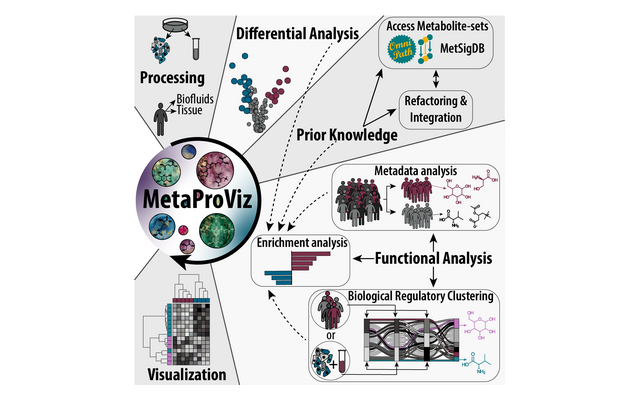
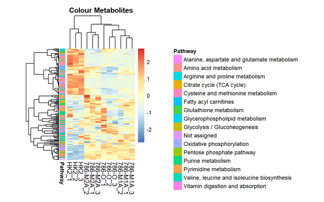
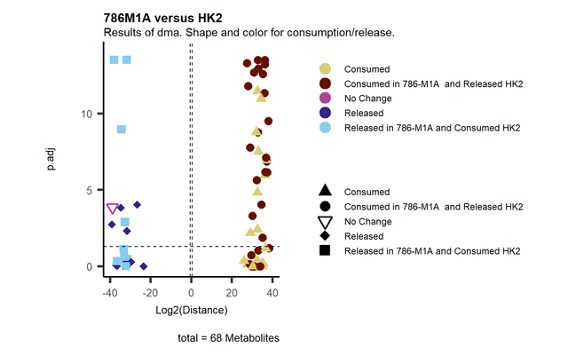
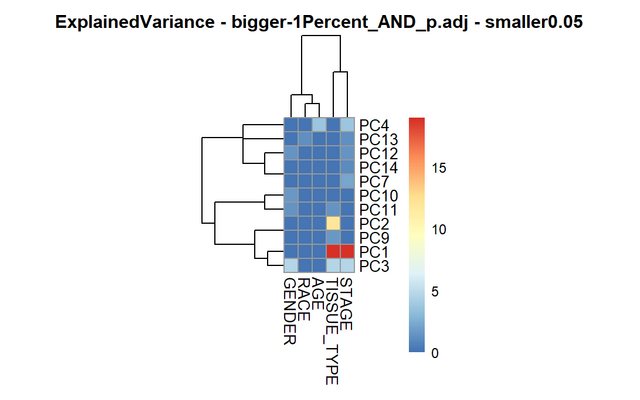
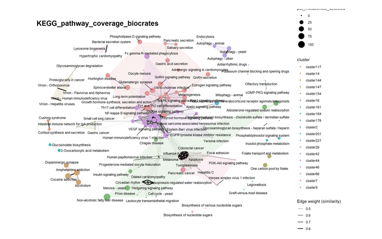
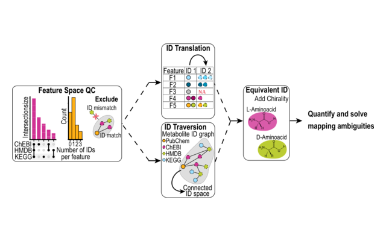

```{=html}
<style>
.tutorial-card img {
    aspect-ratio: 8 / 5;
    object-fit: contain;
    background: white;
    border-bottom: 1px solid rgba(0, 0, 0, 0.125);
}
.tutorial-card {
    transition: box-shadow 0.15s ease-in-out;
}
.tutorial-card:hover {
    box-shadow: 0 0.5rem 1rem rgba(0, 0, 0, 0.15);
}
.tutorial-card .card-title,
.tutorial-card .card-text {
    text-align: left !important;
}
.tutorial-card .card-title {
    font-size: 1.15rem;
    font-weight: 600;
}
</style>
```

All tutorials use example data that ship with **MetaProViz**, so you can run every step yourself. If you are new to MetaProViz, start with *Getting started*. The other tutorials go into more detail on the different data types and on metabolite prior knowledge.

## Get started

```{=html}
<div class="row row-cols-1 row-cols-md-2 row-cols-lg-3 g-4 mb-5">
  <div class="col">
    <div class="card h-100 tutorial-card">
      
      <div class="card-body">
        <h5 class="card-title"><a href="../quick-start.html" class="stretched-link">Getting started</a></h5>
        <p class="card-text">A short tour through the main steps on intracellular cell line data: pre-processing, differential analysis, enrichment analysis, metabolite clustering and plots.</p>
      </div>
      <div class="card-footer"><span class="badge bg-primary">Bioconductor vignette</span></div>
    </div>
  </div>
</div>
```

## Analysis workflows

```{=html}
<div class="row row-cols-1 row-cols-md-2 row-cols-lg-3 g-4 mb-5">
  <div class="col">
    <div class="card h-100 tutorial-card">
      
      <div class="card-body">
        <h5 class="card-title"><a href="standard-metabolomics.html" class="stretched-link">Standard Metabolomics</a></h5>
        <p class="card-text">Intracellular metabolomics of kidney cancer cell lines: quality control, pre-processing, differential analysis, ORA, metabolite clustering and all visualisations.</p>
      </div>
      <div class="card-footer"><span class="badge bg-secondary">Website tutorial</span></div>
    </div>
  </div>
  <div class="col">
    <div class="card h-100 tutorial-card">
      
      <div class="card-body">
        <h5 class="card-title"><a href="core-metabolomics.html" class="stretched-link">CoRe Metabolomics</a></h5>
        <p class="card-text">Consumption-release data from cell culture media: blank and growth normalisation, differential analysis, clustering together with intracellular data and metabolite-receptor sets.</p>
      </div>
      <div class="card-footer"><span class="badge bg-secondary">Website tutorial</span></div>
    </div>
  </div>
  <div class="col">
    <div class="card h-100 tutorial-card">
      
      <div class="card-body">
        <h5 class="card-title"><a href="sample-metadata.html" class="stretched-link">Sample Metadata Analysis</a></h5>
        <p class="card-text">Tumour and normal tissue of kidney cancer patients: find the metabolites that separate patient groups, compare patient subsets and improve metabolite IDs before enrichment analysis.</p>
      </div>
      <div class="card-footer"><span class="badge bg-secondary">Website tutorial</span></div>
    </div>
  </div>
</div>
```

## Prior knowledge and metabolite IDs

```{=html}
<div class="row row-cols-1 row-cols-md-2 row-cols-lg-3 g-4 mb-5">
  <div class="col">
    <div class="card h-100 tutorial-card">
      
      <div class="card-body">
        <h5 class="card-title"><a href="prior-knowledge.html" class="stretched-link">Prior Knowledge - Access &amp; Integration</a></h5>
        <p class="card-text">Load metabolite sets from MetSigDB, link them to your measured data, translate metabolite IDs and check how well your data cover each pathway.</p>
      </div>
      <div class="card-footer"><span class="badge bg-secondary">Website tutorial</span></div>
    </div>
  </div>
  <div class="col">
    <div class="card h-100 tutorial-card">
      
      <div class="card-body">
        <h5 class="card-title"><a href="id-processing-workflow.html" class="stretched-link">ID Processing Workflow</a></h5>
        <p class="card-text">Check the metabolite IDs of your features for consistency and expand them across HMDB, KEGG, ChEBI and PubChem with <code>id_processing()</code>.</p>
      </div>
      <div class="card-footer"><span class="badge bg-secondary">Website tutorial</span></div>
    </div>
  </div>
  <div class="col">
    <div class="card h-100 tutorial-card">
      
      <div class="card-body">
        <h5 class="card-title"><a href="metsigdb.html" class="stretched-link">MetSigDB</a></h5>
        <p class="card-text">The resources in MetSigDB compared: their size, overlap and redundancy, and how their terms cluster.</p>
      </div>
      <div class="card-footer"><span class="badge bg-secondary">Website tutorial</span></div>
    </div>
  </div>
</div>
```
